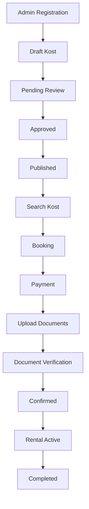

# Business Analysis Document

## Cover

| Item | Value |
| --- | --- |
| Document Name | Business Analysis Document |
| Project Name | SewaKost — Web Marketplace Kost Management &amp; Rental System |
| Project Type | Web Application \(Marketplace\) |
| Version | 1\.0\.0 |
| Document Status | Draft |
| Author | Lauhul Ridwan |
| Date | August 4, 2026 |

## Document Control

### Revision History

| Version | Date | Author | Description |
| --- | --- | --- | --- |
| 1\.0\.0 | August 4, 2026 | Lauhul Ridwan | Initial Business Analysis Document |

### Approval

| Role | Name | Status |
| --- | --- | --- |
| Project Owner | Lauhul Ridwan | Pending |
| Reviewer \(Optional\) | — | Pending |

### Distribution

| Role | Purpose |
| --- | --- |
| Project Owner | Business reference |
| System Analyst | Requirement analysis |
| Software Architect | System design |
| Full\-stack Developer | Development reference |
| UI/UX Designer | Design reference |
| QA Engineer | Testing reference |

## 1\. Business Problem Analysis

### 1\.1 Purpose

Business Problem Analysis bertujuan mengidentifikasi permasalahan bisnis yang mendasari pengembangan SewaKost, menganalisis penyebab utamanya, mengevaluasi dampaknya terhadap operasional, serta mendefinisikan solusi bisnis yang akan diimplementasikan\. Analisis ini menjadi dasar dalam penyusunan kebutuhan sistem pada fase Requirement Engineering\.

### 1\.2 Business Context

Pengelolaan kost skala kecil hingga menengah masih banyak dilakukan menggunakan proses manual atau aplikasi yang tidak terintegrasi\. Aktivitas seperti publikasi informasi kost, pengelolaan kamar, pencatatan penyewa, pembayaran, dan administrasi dokumen sering dilakukan melalui berbagai media yang terpisah\.

Di sisi lain, calon penyewa membutuhkan akses terhadap informasi kost yang akurat, proses pemesanan yang jelas, serta pembayaran yang praktis tanpa harus melalui komunikasi yang berulang dengan pengelola\.

SewaKost dikembangkan sebagai marketplace berbasis web yang menghubungkan penyewa dan pengelola kost melalui satu platform terintegrasi, dengan mekanisme verifikasi publikasi kost oleh Super Admin untuk menjaga kualitas informasi yang ditampilkan\.

### 1\.3 Current Business Process

#### A\. Registrasi Admin Kost

1. Calon Admin menghubungi Super Admin\.
2. Super Admin melakukan verifikasi administrasi secara manual\.
3. Jika memenuhi persyaratan, akun Admin dibuat\.
4. Kredensial akun diberikan kepada Admin\.

#### B\. Publikasi Kost

1. Admin membuat data kost sebagai **Draft**\.
2. Draft diajukan kepada Super Admin\.
3. Super Admin melakukan verifikasi administrasi dan lapangan secara manual\.
4. Jika disetujui, status berubah menjadi **Approved**\.
5. Admin mempublikasikan kost menjadi **Active**\.

#### C\. Proses Penyewaan

1. Penyewa mencari kost\.
2. Penyewa memilih kamar\.
3. Penyewa membuat booking\.
4. Penyewa melakukan pembayaran\.
5. Penyewa mengunggah dokumen administrasi\.
6. Admin memverifikasi dokumen\.
7. Status rental menjadi **Confirmed**\.
8. Penyewa menyerahkan dokumen fisik saat kedatangan\.
9. Masa sewa dimulai \(**Active**\)\.
10. Masa sewa selesai \(**Completed**\)\.

### 1\.4 Existing Problems

| ID | Problem | Description |
| --- | --- | --- |
| P\-01 | Pengelolaan operasional kost belum terintegrasi | Pengelolaan data kost, kamar, harga, penyewa, pembayaran, dan administrasi masih dilakukan secara manual atau menggunakan media yang terpisah sehingga proses operasional kurang efisien dan sulit dipantau\. |
| P\-02 | Kualitas dan validitas informasi kost belum terjamin | Belum terdapat mekanisme verifikasi sebelum kost dipublikasikan sehingga kualitas informasi yang ditampilkan berpotensi tidak konsisten\. |
| P\-03 | Proses administrasi penyewa belum terdokumentasi dengan baik | Verifikasi dokumen penyewa dan riwayat administrasi masih sulit ditelusuri serta belum terdokumentasi secara sistematis\. |
| P\-04 | Monitoring proses penyewaan belum terpusat | Status booking, pembayaran, verifikasi dokumen, hingga masa sewa belum dapat dipantau dalam satu alur yang terintegrasi\. |

### 1\.5 Root Cause Analysis

| Problem | Root Cause |
| --- | --- |
| P\-01 | Belum tersedia sistem terintegrasi yang mendukung pengelolaan operasional kost secara end\-to\-end\. |
| P\-02 | Belum terdapat workflow verifikasi publikasi kost yang terdokumentasi dalam sistem\. |
| P\-03 | Administrasi penyewa masih mengandalkan proses manual dan penyimpanan dokumen yang tidak terpusat\. |
| P\-04 | Seluruh tahapan penyewaan belum dikelola dalam satu workflow yang terintegrasi\. |

### 1\.6 Business Impact

| Area | Impact |
| --- | --- |
| Operational Efficiency | Proses operasional kost menjadi lebih lambat, membutuhkan pekerjaan administratif berulang, dan meningkatkan potensi kesalahan pencatatan\. |
| Data Quality | Risiko inkonsistensi dan kehilangan data meningkat\. |
| Service Quality | Pengalaman penyewa menjadi kurang optimal\. |
| Decision Making | Sulit memperoleh informasi operasional secara cepat dan akurat\. |
| Business Credibility | Validitas informasi kost sulit dijamin tanpa proses verifikasi\. |

### 1\.7 Proposed Solution

SewaKost diusulkan sebagai aplikasi web marketplace yang tidak hanya menyediakan media publikasi kost, tetapi juga mengintegrasikan seluruh proses operasional dan siklus penyewaan kost dalam satu platform\.

Solusi yang diterapkan meliputi:

- Marketplace kost dengan fitur pencarian dan filter\.
- Pengelolaan kost, tipe kamar, kamar, harga, fasilitas, aturan, dan kategori oleh Admin Kost\.
- Workflow persetujuan publikasi kost oleh Super Admin\.
- Booking dan pembayaran online menggunakan Midtrans\.
- Verifikasi dokumen administrasi penyewa setelah pembayaran\.
- Pengelolaan status penyewaan secara terstruktur\.
- Pengiriman notifikasi melalui email\.
- Visualisasi lokasi kost menggunakan Leaflet dan OpenStreetMap\.

### 1\.8 Expected Business Value

| Area | Expected Value |
| --- | --- |
| Operational Efficiency | Mengurangi proses administrasi manual melalui pengelolaan operasional kost yang terintegrasi dalam satu sistem\. |
| Data Consistency | Seluruh data operasional tersimpan dalam satu basis data terpusat\. |
| Business Control | Proses publikasi kost dan penyewaan lebih mudah dipantau\. |
| User Experience | Penyewa memperoleh proses pencarian, pemesanan, dan pembayaran yang lebih sederhana\. |
| Information Reliability | Informasi kost yang dipublikasikan telah melalui proses verifikasi\. |
| Scalability | Sistem memiliki fondasi yang siap dikembangkan pada fase berikutnya\. |

## 2\. Project Scope Analysis

### 2\.1 Purpose

Project Scope Analysis mendefinisikan batasan implementasi SewaKost pada fase Minimum Viable Product \(MVP\)\. Ruang lingkup ini bertujuan memastikan pengembangan tetap berfokus pada penyelesaian proses bisnis utama sehingga target waktu, biaya, dan kompleksitas proyek tetap terkendali\.

Seluruh fitur yang berada di luar ruang lingkup MVP dapat dipertimbangkan sebagai pengembangan pada fase berikutnya tanpa memengaruhi proses bisnis inti\.

### 2\.2 Scope Definition

SewaKost merupakan aplikasi web marketplace kost multi\-owner yang mengintegrasikan proses utama penyewaan kost dari publikasi hingga penyelesaian masa sewa\.

Ruang lingkup MVP mencakup:

- Manajemen pengguna berdasarkan Role\-Based Access Control \(RBAC\)\.
- Pengelolaan data kost beserta seluruh data pendukungnya\.
- Workflow verifikasi dan publikasi kost\.
- Pencarian dan eksplorasi kost\.
- Pemesanan kamar\.
- Pembayaran online\.
- Verifikasi dokumen administrasi penyewa\.
- Monitoring status penyewaan hingga masa sewa selesai\.

Fitur administratif dan fitur pendukung yang tidak memengaruhi siklus penyewaan utama tidak menjadi prioritas pada fase ini\.

### 2\.3 In Scope

#### Authentication &amp; User Management

- Login dan Logout\.
- Role\-Based Access Control\.
- Pengelolaan profil pengguna\.
- Verifikasi email\.
- Manajemen akun Admin oleh Super Admin\.

#### Kost Management

- Pengelolaan data kost\.
- Pengelolaan alamat\.
- Pengelolaan kategori\.
- Pengelolaan fasilitas\.
- Pengelolaan aturan\.
- Pengelolaan tipe kamar\.
- Pengelolaan kamar\.
- Pengelolaan skema harga\.
- Pengelolaan galeri gambar\.
- Workflow Draft → Pending Review → Approved → Active\.

#### Marketplace

- Daftar kost\.
- Detail kost\.
- Pencarian kost\.
- Filter kost\.
- Informasi fasilitas\.
- Informasi aturan\.
- Informasi harga\.
- Informasi ketersediaan kamar\.
- Visualisasi lokasi menggunakan Leaflet dan OpenStreetMap\.

#### Rental Management

- Booking kamar\.
- Perhitungan biaya sewa\.
- Snapshot harga saat transaksi\.
- Snapshot durasi sewa\.
- Monitoring status rental\.
- Riwayat status rental\.

#### Payment

- Integrasi Midtrans\.
- Pembayaran online\.
- Pencatatan transaksi pembayaran\.
- Logging respons payment gateway\.

#### Document Verification

- Upload dokumen administrasi\.
- Verifikasi dokumen oleh Admin\.
- Penyimpanan hasil verifikasi\.
- Riwayat verifikasi dokumen\.

#### Review

- Review kost\.
- Review kamar\.
- Upload gambar review\.

#### Notification

- Email verifikasi\.
- Email notifikasi pembayaran\.
- Email perubahan status penting\.

### 2\.4 Out of Scope

Fitur berikut sengaja tidak menjadi bagian dari MVP karena tidak memengaruhi penyelesaian siklus penyewaan utama\.

#### Business Features

- Promo dan Voucher\.
- Subscription Admin\.
- Multi\-payment Gateway\.
- Refund otomatis\.

#### Reporting &amp; Analytics

- Dashboard analitik lanjutan\.
- Laporan keuangan lengkap\.
- Export PDF\.
- Export Excel\.

#### Communication

- Chat antara penyewa dan Admin\.
- WhatsApp Notification\.
- Push Notification\.
- Sistem tiket bantuan\.

#### Platform Expansion

- Mobile Application\.
- Multi Bahasa\.
- Multi Mata Uang\.

#### Advanced Features

- AI Recommendation\.
- Audit Log lengkap\.
- Activity Monitoring lanjutan\.
- Dashboard operasional lanjutan\.

### 2\.5 Scope Boundary

#### Included Business Process

#### Excluded Business Process

- Verifikasi administrasi calon Admin secara digital\.
- Penjadwalan meeting\.
- Manajemen dokumen fisik\.
- Proses refund\.
- Pengelolaan langganan Admin\.
- Pelaporan bisnis lanjutan\.
- Integrasi dengan layanan pihak ketiga selain Midtrans, SMTP, dan Leaflet/OpenStreetMap\.

### 2\.6 Future Expansion

Berikut merupakan kandidat pengembangan setelah MVP berhasil diimplementasikan\.

#### Phase 2

- Dashboard analitik\.
- Laporan operasional\.
- Export PDF dan Excel\.
- Audit Log\.
- Activity Monitoring\.

#### Phase 3

- WhatsApp Notification\.
- Push Notification\.
- Chat antara penyewa dan Admin\.
- Helpdesk / Ticketing\.

#### Phase 4

- Mobile Application\.
- Multi Bahasa\.
- Multi Mata Uang\.
- Multi Payment Gateway\.
- AI Recommendation\.
- Sistem promosi dan voucher\.

## 3\. Success Metrics

### 3\.1 Purpose

Success Metrics mendefinisikan indikator keberhasilan yang digunakan untuk mengevaluasi pencapaian proyek, baik dari perspektif bisnis, produk, teknis, maupun pelaksanaan proyek\. Seluruh metrik bersifat **high\-level** dan digunakan sebagai acuan awal sebelum diturunkan menjadi target implementasi yang lebih rinci pada fase berikutnya\.

### 3\.2 Business Metrics

| Metric | Success Indicator |
| --- | --- |
| Proses publikasi kost | Seluruh kost dipublikasikan melalui workflow verifikasi\. |
| Proses penyewaan | Siklus penyewaan dapat diselesaikan secara end\-to\-end\. |
| Efisiensi administrasi | Pengelolaan operasional dilakukan melalui satu sistem terintegrasi\. |
| Kualitas data | Seluruh data utama tersimpan secara konsisten dan terstruktur\. |

### 3\.3 Product Metrics

| Metric | Success Indicator |
| --- | --- |
| Functional Coverage | Seluruh fitur MVP berfungsi sesuai requirement\. |
| Workflow Coverage | Seluruh workflow utama dapat dijalankan tanpa hambatan\. |
| Data Integrity | Tidak terjadi inkonsistensi data pada proses bisnis utama\. |
| User Experience | Alur penggunaan dapat diselesaikan secara logis dan konsisten\. |

### 3\.4 Technical Metrics

| Metric | Success Indicator |
| --- | --- |
| System Availability | Aplikasi dapat diakses selama proses pengujian dan demonstrasi\. |
| Database Integrity | Relasi dan constraint database berjalan sesuai desain\. |
| Payment Integration | Integrasi Midtrans berhasil memproses transaksi sesuai workflow\. |
| Email Delivery | Sistem mampu mengirim email pada proses yang telah ditentukan\. |

### 3\.5 Project Metrics

| Metric | Success Indicator |
| --- | --- |
| Scope Completion | Seluruh ruang lingkup MVP selesai diimplementasikan\. |
| Documentation | Discovery Document, Business Analysis Document, SRS, dan DDS tersusun lengkap\. |
| Development Readiness | Seluruh artefak siap digunakan pada fase implementasi\. |
| UKK Readiness | Proyek memenuhi kebutuhan implementasi sebagai proyek UKK\. |

## 4\. Initial Project Estimation

### 4\.1 Purpose

Initial Project Estimation memberikan estimasi tingkat tinggi \(*high\-level estimation*\) mengenai kebutuhan waktu, usaha, sumber daya, dan biaya proyek\. Estimasi ini digunakan sebagai acuan awal dalam perencanaan proyek dan dapat diperbarui setelah fase Requirement Engineering serta System Design selesai\.

Karena SewaKost merupakan proyek dikembangkan dalam skala MVP, estimasi difokuskan pada penyelesaian seluruh siklus penyewaan secara end\-to\-end, bukan pada fitur lanjutan\.

### 4\.2 Estimation Assumptions

Estimasi disusun berdasarkan asumsi berikut\.

| Category | Assumption |
| --- | --- |
| Project Type | Web Marketplace Kost \(MVP\) |
| Development Model | Monolithic Architecture |
| Framework | Laravel 13 |
| Database | MySQL |
| Deployment | Linux VPS |
| Development Team | 1 Full\-stack Developer |
| Project Purpose | UKK Implementation |
| Working Time | Full\-time development |
| Payment Gateway | Midtrans |
| Maps | Leaflet \+ OpenStreetMap |
| Notification | SMTP Email |

### 4\.3 High\-Level Work Breakdown

| Phase | Major Deliverables |
| --- | --- |
| Discovery &amp; Business Analysis | Discovery Document, Business Analysis Document |
| Requirement Engineering | SRS |
| System Design | DDS, ERD, API Specification, Architecture Diagram |
| Development Preparation | Sprint Planning, Feature Breakdown, Testing Strategy |
| Implementation | MVP Application |
| Testing &amp; Bug Fixing | Functional Testing, Integration Testing, UAT |
| Deployment | Production Release |

### 4\.4 Estimated Timeline

Estimasi berikut bersifat indikatif dan dapat berubah sesuai kompleksitas implementasi\.

| Phase | Estimated Duration |
| --- | --- |
| Discovery &amp; Business Analysis | 1–2 minggu |
| Requirement Engineering | 1–2 minggu |
| System Design | 2–3 minggu |
| Development Preparation | 3–5 hari |
| Implementation | 6–10 minggu |
| Testing &amp; Bug Fixing | 1–2 minggu |
| Deployment &amp; Final Revision | 2–5 hari |

#### Overall Estimation

**±12–18 minggu** untuk penyelesaian MVP\.

### 4\.5 Effort Distribution

| Phase | Estimated Effort |
| --- | --- |
| Discovery &amp; Business Analysis | 10% |
| Requirement Engineering | 15% |
| System Design | 20% |
| Development Preparation | 5% |
| Implementation | 40% |
| Testing &amp; Deployment | 10% |

### 4\.6 Initial Cost Estimation

Estimasi biaya difokuskan pada kebutuhan operasional dasar\.

| Category | Description |
| --- | --- |
| Domain | Opsional \(jika deployment publik diperlukan\)\. |
| VPS | Linux VPS untuk lingkungan produksi atau demonstrasi\. |
| Payment Gateway | Midtrans \(Sandbox selama pengembangan, Production bila diperlukan\)\. |
| SMTP Service | Layanan email untuk verifikasi akun dan notifikasi\. |
| Development Tools | IDE, Git, DBMS, browser, dan utilitas pendukung \(mengutamakan perangkat lunak gratis/open source\)\. |

> Nilai nominal tidak dicantumkan karena sangat bergantung pada penyedia layanan, spesifikasi server, dan kebutuhan deployment pada saat implementasi\.

### 4\.7 Resource Requirement

#### Human Resources

| Role | Responsibility |
| --- | --- |
| Full\-stack Developer | Analisis, desain, implementasi, pengujian, dan deployment aplikasi\. |

#### Software Resources

| Resource | Purpose |
| --- | --- |
| Laravel 13 | Backend Framework |
| PHP 8\.x | Programming Language |
| MySQL | Database Management System |
| Git | Version Control |
| Visual Studio Code | Code Editor |
| Postman | API Testing |
| DrawDB | ERD Design |
| Figma | UI/Wireframe Design |
| Leaflet \+ OpenStreetMap | Map Visualization |

#### Infrastructure Resources

| Resource | Purpose |
| --- | --- |
| Linux VPS | Production Environment |
| SMTP Server | Email Service |
| Midtrans | Payment Gateway |

### 4\.8 Estimation Risks

| Risk | Potential Impact | Mitigation |
| --- | --- | --- |
| Requirement berubah selama implementasi | Jadwal pengembangan mundur | Membekukan requirement setelah SRS disetujui\. |
| Integrasi layanan pihak ketiga | Penambahan waktu implementasi | Menggunakan Sandbox dan dokumentasi resmi selama pengembangan\. |
| Bug pada tahap akhir | Penundaan deployment | Menyediakan waktu khusus untuk pengujian dan perbaikan\. |
| Keterbatasan waktu UKK | Sebagian fitur tidak selesai | Memprioritaskan seluruh fitur MVP terlebih dahulu\. |

### 4\.9 Estimation Summary

Berdasarkan ruang lingkup MVP, SewaKost diperkirakan dapat dikembangkan oleh **satu Full\-stack Developer** menggunakan arsitektur monolith dalam waktu sekitar **12–18 minggu**\. Fokus utama pengembangan adalah menyelesaikan seluruh siklus penyewaan kost secara end\-to\-end dengan dokumentasi yang lengkap sebagai bagian dari implementasi proyek UKK\.

## Appendix

### Glossary

| Term | Description |
| --- | --- |
| MVP | Minimum Viable Product |
| Effort | Estimasi beban pekerjaan yang diperlukan untuk menyelesaikan suatu aktivitas proyek\. |
| Timeline | Estimasi durasi pelaksanaan proyek berdasarkan fase SDLC\. |
| Resource | Sumber daya yang diperlukan selama pengembangan proyek\. |

### References

- Discovery Document v1\.0\.0
- Business Analysis Document v1\.0\.0
- Software Development Life Cycle \(SDLC\) Guideline
- BABOK Guide
- PMBOK Guide \(High\-Level Estimation Concepts\)

### Acronyms &amp; Abbreviations

| Acronym | Meaning |
| --- | --- |
| API | Application Programming Interface |
| DDS | Design Document Specification |
| ERD | Entity Relationship Diagram |
| MVP | Minimum Viable Product |
| SDLC | Software Development Life Cycle |
| SRS | Software Requirements Specification |
| UKK | Ujian Kompetensi Keahlian |
| VPS | Virtual Private Server |