# Design Document Specification (DDS)
## SewaKost — Web Marketplace Kost Management & Rental System

**Version:** 1.0.0  
**Status:** Draft — Design Complete / Implementation Reference Candidate  
**Date:** 10 August 2026  
**Project:** SewaKost — Web Marketplace Kost Management & Rental System  
**Document Purpose:** Technical design baseline for agentic implementation

---

## 0. Document Control

### 0.1 Purpose

DDS menerjemahkan requirement dan business context menjadi keputusan serta artefak desain teknis yang dapat digunakan sebagai konteks dasar implementasi berbasis agent.

DDS tidak menggantikan SRS. SRS tetap menjadi sumber utama untuk *what the system must do*, sedangkan DDS menetapkan *how the system is designed to realize those requirements*.

### 0.2 Source Artifacts

| Artifact | Version / State | DDS Role |
|---|---|---|
| Discovery Document | v1.0.0 | Discovery findings, scope, actors, technical goals, exclusions |
| Business Analysis Document | v1.0.0 | Business problem, process, metrics, estimation assumptions |
| SRS | v1.0.7 | Functional/NFR, UC, business policies, AC, security, traceability |
| ERD | Current uploaded version | Data structure, relationships, constraints |
| DDS Skeleton | v0.1 | Required DDS structure and output criteria |

### 0.3 Revision History

| Version | Date | Status | Description |
|---|---|---|---|
| 1.0.0 | 10 Aug 2026 | Draft | Initial complete DDS derived from current project artifacts |

### 0.4 Approval

| Role | Status |
|---|---|
| Project Owner | Pending |
| Software Architect / Technical Lead | Pending |
| Implementation Reference | Pending |

### 0.5 Distribution

DDS digunakan sebagai referensi oleh:
- Software Architect;
- AI coding/agentic workflow;
- Full-stack Developer;
- UI/UX Designer;
- QA Engineer;
- Project Owner.

---

# 1. Design Overview

## 1.1 Design Objective

Desain harus memungkinkan seluruh MVP dibangun oleh satu developer/agentic development workflow dengan kompleksitas yang proporsional terhadap kebutuhan.

Desain tidak diarahkan ke microservices, distributed infrastructure, atau operational complexity yang tidak dibutuhkan MVP.

## 1.2 Design Scope

DDS mencakup:
- technical decisions;
- software stack;
- application architecture;
- coding rules;
- technical flows;
- manual process flows;
- context and data flow;
- logical and physical data design;
- API contract;
- behavioral diagrams;
- component/package structure;
- repository structure;
- UI/UX design guidance;
- project technical cost;
- feasibility and trade-offs;
- design traceability;
- design validation.

## 1.3 Authoritative Requirement Boundary

Prioritas interpretasi:

1. SRS v1.0.7 untuk behavior dan requirement.
2. ERD untuk current data model.
3. Business Analysis Document untuk business context dan project assumptions.
4. Discovery Document untuk discovery context, scope, technical goals, dan exclusions.
5. DDS untuk keputusan technical realization.

Jika implementation convenience bertentangan dengan SRS/ERD, implementation harus mengikuti requirement atau menghasilkan change proposal; requirement tidak boleh diubah diam-diam.

## 1.4 Design Principles

| Principle | Application |
|---|---|
| Requirement-driven | Setiap major design element ditelusuri ke requirement, constraint, atau feasibility need. |
| Simple-first | Pilih solusi paling sederhana yang memenuhi requirement. |
| Modular monolith | Satu aplikasi/deployment unit dengan boundary capability yang jelas. |
| Single-server MVP | Infrastruktur cukup satu Linux VPS. |
| Relational integrity | Business state dan historical data dijaga melalui database constraints dan transaction design. |
| Explicit lifecycle | Status resource tidak boleh berubah melalui arbitrary field update. |
| Least privilege | Actor hanya mendapat operasi dan resource sesuai role/scope. |
| External-service isolation | Midtrans, SMTP, dan map integration berada di integration boundary. |
| No unnecessary cloud dependency | MVP menggunakan local/server filesystem untuk file sesuai constraint proyek. |
| Agent-readable design | Decision, contract, state, dependency, dan invariants ditulis eksplisit. |
| Traceability | Requirement → design → implementation verification harus dapat ditelusuri. |

## 1.5 Architectural Style

**Selected:** Modular Monolith.

Karakteristik:
- satu Laravel application;
- satu deployment unit;
- satu primary relational database;
- module boundary berdasarkan Business Capability;
- external integrations melalui adapter/service boundary;
- RESTful internal API boundary sesuai technical goal Discovery Document.

### Rationale

Discovery menetapkan monolithic architecture untuk mempercepat MVP, Laravel 13, MySQL, RESTful API internal, Midtrans, Leaflet/OpenStreetMap, SMTP, dan Linux VPS. DDS mempertahankan keputusan tersebut dan menambahkan modular boundary agar monolith tidak menjadi *unstructured monolith*.

---

# 2. Technical Decision Record

## 2.1 TDR Template

| Field | Meaning |
|---|---|
| TDR ID | Unique technical decision identifier |
| Decision | Final technical decision |
| Context | Problem/constraint |
| Options | Considered alternatives |
| Selected Option | Chosen solution |
| Rationale | Why it was selected |
| Trade-off | Benefits and costs |
| Impact | Affected design/artifacts |
| Status | Accepted / Superseded |

## 2.2 TDR Catalog

### TDR-001 — Modular Monolith

**Decision:** Laravel 13 application menggunakan modular logical boundaries dalam satu deployment.

**Options:** microservices, layered monolith tanpa capability boundary, modular monolith.

**Selected:** modular monolith.

**Rationale:** MVP membutuhkan kecepatan development dan operational simplicity, sementara requirement sudah terbagi jelas menurut Business Capability.

**Trade-off:** Tidak memperoleh independent service scaling, tetapi mengurangi deployment, network, observability, dan operational complexity.

**Impact:** component, package, folder, API, testing.

**Status:** Accepted.

### TDR-002 — MySQL Relational Database

**Decision:** MySQL menjadi primary persistence layer.

**Rationale:** ERD sudah mendefinisikan relational entities, FK, cardinality, unique constraints, historical relations, dan transaction-sensitive operations.

**Impact:** PDM, transactions, indexes, repositories/data access.

**Status:** Accepted.

### TDR-003 — Single Linux VPS

**Decision:** MVP berjalan pada satu Linux VPS.

**Rationale:** Sesuai Discovery/Business Analysis dan target UKK MVP.

**Impact:** deployment, backup, filesystem storage, process management.

**Trade-off:** Single-server failure domain lebih besar dibanding distributed deployment.

**Status:** Accepted.

### TDR-004 — Filesystem Storage for MVP

**Decision:** File gambar dan dokumen disimpan pada filesystem server; cloud object storage tidak digunakan pada MVP.

**Rationale:** Single-server constraint dan tidak terdapat requirement cloud storage.

**Required controls:** private/public storage separation, file validation, generated filenames, access authorization, backup inclusion.

**Status:** Accepted.

### TDR-005 — Email-only Notification

**Decision:** Notification channel MVP hanya Email Service melalui SMTP.

**Rationale:** SRS/Discovery menetapkan Email Service; WhatsApp dan Push Notification berada di luar scope.

**Status:** Accepted.

### TDR-006 — Midtrans Integration Boundary

**Decision:** Midtrans diakses melalui dedicated payment integration boundary.

**Rationale:** Business logic tidak boleh bergantung langsung pada detail vendor payment.

**Required behavior:** request creation, result verification, callback handling, idempotency, logging, failure isolation.

**Status:** Accepted.

### TDR-007 — Map Display Only

**Decision:** Leaflet digunakan sebagai map UI dan OpenStreetMap sebagai map data/display source sesuai scope. Sistem tidak menambahkan geocoding/routing/search-location service sebagai capability baru.

**Rationale:** Requirement hanya membutuhkan display lokasi.

**Status:** Accepted.

### TDR-008 — Actor Generalization

**Decision:** UML actor model menggunakan `User` sebagai generalized actor dengan specialization `Tenant`, `Admin`, dan `Super Admin`.

```mermaid
flowchart LR
    U["User"]
    T["Tenant"]
    A["Admin"]
    SA["Super Admin"]
    T --|> U
    A --|> U
    SA --|> U
```

**Note:** Guest/unauthenticated visitor berasal dari discovery context dan diperlakukan sebagai external/unauthenticated actor untuk public marketplace behavior; Guest bukan authenticated specialization of User.

### TDR-009 — State Transition Service Boundary

**Decision:** Lifecycle transition tidak dilakukan melalui arbitrary CRUD update.

State transition harus:
1. memvalidasi current state;
2. memvalidasi actor/system authority;
3. memvalidasi business preconditions;
4. update current state;
5. append required history;
6. execute non-critical side effects independently.

**Status:** Accepted.

### TDR-010 — Transactional Rental Creation

**Decision:** Rental creation dan perubahan inventory yang bersifat atomic dilakukan dalam database transaction.

**Rationale:** Prevent double allocation and partial rental creation.

**Status:** Accepted.

### TDR-011 — Payment State Separation

**Decision:** Payment state dan Rental state dipisahkan.

Payment:
`pending → success / failed`

Rental:
`pending → paid → confirmed → active → completed`
with `cancelled` as terminal cancellation path.

**Status:** Accepted.

### TDR-012 — History Preservation

**Decision:** Historical entities required by SRS/ERD are retained rather than physically deleted when lifecycle semantics require history.

Examples:
- rental;
- rental status history;
- payment logs;
- reviews;
- room/kost historical records.

**Status:** Accepted.

---

# 3. Software Stack

## 3.1 Application Stack

| Layer | Technology / Design |
|---|---|
| Framework | Laravel 13 |
| Language | PHP 8.x |
| Database | MySQL |
| API | RESTful internal API |
| Authentication | Laravel application authentication/session mechanism |
| Authorization | Role/resource authorization |
| Validation | Request/application-layer validation |
| UI | Laravel-compatible web UI; exact frontend implementation remains implementation choice within NFR constraints |
| Version control | Git |

The framework, language, database, API approach, and supporting tools are consistent with the Business Analysis and Discovery technical resource lists.

## 3.2 External Services

| Service | Purpose | MVP Boundary |
|---|---|---|
| Midtrans | Payment processing | Rental payment |
| SMTP Email Service | Verification and notification | Email only |
| Leaflet | Map UI | Location display |
| OpenStreetMap | Map data/display | Location display |

## 3.3 Infrastructure

| Resource | Design |
|---|---|
| Server | Linux VPS |
| Application | Single Laravel deployment |
| Database | MySQL on controlled server environment |
| File Storage | Server filesystem |
| HTTPS | Required for production application |
| Secrets | Environment/configuration, not source code |
| Backup | Scheduled database/application-data backup |
| Monitoring | Application/system logs sufficient for MVP troubleshooting |

## 3.4 Dependency Policy

- Dependency versions must be reproducible.
- Production dependency changes must be intentional.
- `composer.lock` is treated as deployment reproducibility input.
- Secrets must not be committed.
- External SDK/API dependencies must be isolated behind integration boundaries.

---


# 3.6 Use Case Design Coverage

The DDS covers all 27 use cases defined by SRS v1.0.7. Use Case names and capability ownership are preserved from SRS.

| UC | Use Case | Capability | Primary Actor | Main DDS Design |
|---|---|---|---|---|
| UC-001 | Authenticate User | BC-001 | User | Identity component, session/auth flow |
| UC-002 | Manage User Profile | BC-001 | User | Profile/account operations, authorization |
| UC-003 | Create Kost Draft | BC-002 | Admin | Kost application service + Kost state |
| UC-004 | Submit Kost for Review | BC-002 | Admin | State transition service |
| UC-005 | Review Kost Submission | BC-002 | Super Admin | Review/approval boundary |
| UC-006 | Publish Kost | BC-002 | Admin | Publication transition |
| UC-007 | Change Kost Status | BC-002 | Admin / Super Admin | State machine + authority rules |
| UC-008 | Configure Kost Information | BC-003 | Admin | Kost configuration module |
| UC-009 | Configure Kost Categories | BC-003 | Admin | Category assignment + Super Admin master |
| UC-010 | Configure Facility Scheme | BC-003 | Admin | Facility item/scheme/application model |
| UC-011 | Configure Rule Scheme | BC-003 | Admin | Rule item/scheme/application model |
| UC-012 | Configure Room Types | BC-004 | Admin | Room Type module |
| UC-013 | Configure Rental Pricing | BC-004 | Admin | Price Scheme module |
| UC-014 | Manage Room Inventory | BC-004 | Admin / System | Room state machine |
| UC-015 | Browse Marketplace | BC-005 | Tenant / public visitor | Marketplace query/read model |
| UC-016 | Search & Filter Kost | BC-005 | Tenant | Search/filter query design |
| UC-017 | View Kost Detail | BC-005 | Tenant | Detail aggregation/read flow |
| UC-018 | Create Rental | BC-006 | Tenant | Transactional rental creation |
| UC-019 | Complete Payment | BC-006 | Tenant | Midtrans integration + payment state |
| UC-020 | Submit Rental Documents | BC-006 | Tenant | Private file/document flow |
| UC-021 | Verify Rental Documents | BC-006 | Admin | Verification + rental transition |
| UC-022 | Monitor Rental | BC-006 | Tenant / Admin | Authorized rental read + lifecycle monitoring |
| UC-023 | Complete Rental | BC-006 | System | Scheduled/time-based lifecycle transition |
| UC-024 | Submit Kost Review | BC-007 | Tenant | Review eligibility + persistence |
| UC-025 | Submit Room Review | BC-007 | Tenant | Review eligibility + persistence |
| UC-026 | Create Admin Account | BC-008 | Super Admin | Admin account creation |
| UC-027 | Manage Admin Account | BC-008 | Super Admin | Admin account management + role boundary |

### UC Coverage Rule

No UC is intentionally omitted from the DDS. Where multiple UC share the same technical mechanism, the DDS defines the mechanism once and maps all affected UC to it.

# 4. Coding Guidelines & Best Practices

## 4.1 Naming

- Classes: PascalCase.
- Methods/variables: camelCase.
- Database tables: plural snake_case.
- Database columns: snake_case.
- Requirement references: preserve SRS IDs.
- State names: preserve SRS/ERD enum values.
- Integration adapters: provider-specific names must remain behind integration boundary.

## 4.2 Validation

Validation occurs at application boundaries.

Examples:
- request field validation;
- ownership validation;
- role validation;
- state validation;
- file validation;
- payment result validation.

UI validation is supplementary and never the sole security control.

## 4.3 Authorization

Authorization must check:
1. authenticated identity;
2. role;
3. resource ownership/scope;
4. allowed operation;
5. current lifecycle state where relevant.

Example:

`Admin → Update Room`

must validate:
`Admin authenticated + Kost belongs to Admin + Room belongs to that Kost + requested transition is allowed`.

## 4.4 State Mutation

Do not expose generic operations such as:

```text
update(status = ...)
```

for lifecycle-controlled resources.

Use semantic application operations such as:

```text
submitForReview()
approve()
reject()
publish()
deactivate()
suspend()
archive()
markPaid()
confirm()
activate()
complete()
cancel()
```

The exact implementation mechanism may vary, but the state invariant must remain.

## 4.5 Transactions

Transactions are required where failure can leave business data inconsistent.

Minimum transactional candidates:
- rental creation;
- payment result persistence + rental transition;
- document verification + rental confirmation;
- lifecycle transition + history;
- review creation + related constraints.

## 4.6 Error Handling

Errors are separated into:
- validation errors;
- authorization errors;
- state/business-rule errors;
- not-found/resource-scope errors;
- external-service errors;
- unexpected internal errors.

User-facing responses must not expose secrets or internal diagnostics.

## 4.7 Logging

Log:
- state transitions;
- payment integration outcomes;
- email integration failures;
- significant administration events;
- unexpected application errors.

Never log:
- passwords;
- payment secrets;
- authentication tokens;
- unnecessary personal document content.

## 4.8 File Handling

For images/documents:
1. validate extension/MIME/size;
2. generate server-side filename;
3. store outside executable source paths;
4. separate public media from private rental documents;
5. authorize document retrieval;
6. include required files in backup.

## 4.9 Testing Rules

Every business operation should have tests derived from:
- happy path;
- alternative path;
- exception path;
- authorization boundary;
- state boundary;
- concurrency/idempotency where applicable.

---

# 5.0 Non-Functional Requirement Design Coverage

The following mapping ensures the NFR categories in SRS v1.0.7 have an explicit technical realization.

| NFR Category | Representative IDs | DDS Realization |
|---|---|---|
| Performance | NFR-PER-001–003 | Query discipline, indexing, transaction boundaries, bounded external-service calls, pagination |
| Availability | NFR-AVL-001–002 | Single-server operational baseline, graceful external failure, recovery procedure |
| Security | NFR-SEC-001–005 | Authentication, authorization, validation, secret management, protected file storage |
| Reliability | NFR-REL-001–003 | DB transactions, idempotency, state guards, history persistence, integration isolation |
| Maintainability | NFR-MNT-001–003 | Modular monolith, coding conventions, controlled dependencies, explicit module boundaries |
| Scalability | NFR-SCL-001–002 | Indexed relational model, pagination, provider adapters, modular boundaries |
| Compatibility | NFR-CMP-001–002 | Modern-browser web standards and provider API contracts |
| Usability | NFR-USE-001–003 | Explicit user journeys, role-aware UI, status/error feedback |
| Accessibility | NFR-ACC-001–002 | Keyboard-operable controls and non-color-only status/error communication |
| Backup & Recovery | NFR-BKP-001–003 | Scheduled backup, restoration procedure, restricted backup access |
| Logging & Monitoring | NFR-LOG-001–003 | Structured application/integration logs with sensitive-data exclusion |
| Legal & Compliance | NFR-LGL-001–003 | Resource authorization, historical retention, lifecycle-aware deletion |

# 5. Detailed Technical Flowchart

## 5.1 Application Request Flow

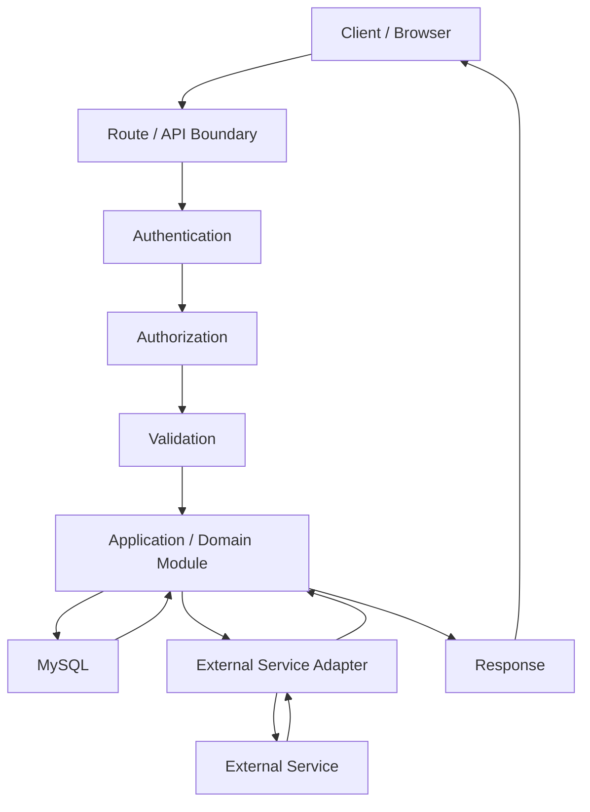
```mermaid
flowchart TD
    C["Client / Browser"]
    R["Route / API Boundary"]
    A["Authentication"]
    Z["Authorization"]
    V["Validation"]
    M["Application / Domain Module"]
    DB["MySQL"]
    E["External Service Adapter"]
    X["External Service"]
    RESP["Response"]

    C --> R
    R --> A
    A --> Z
    Z --> V
    V --> M
    M --> DB
    M --> E
    E --> X
    X --> E
    E --> M
    DB --> M
    M --> RESP
    RESP --> C
```

## 5.2 Authentication Flow

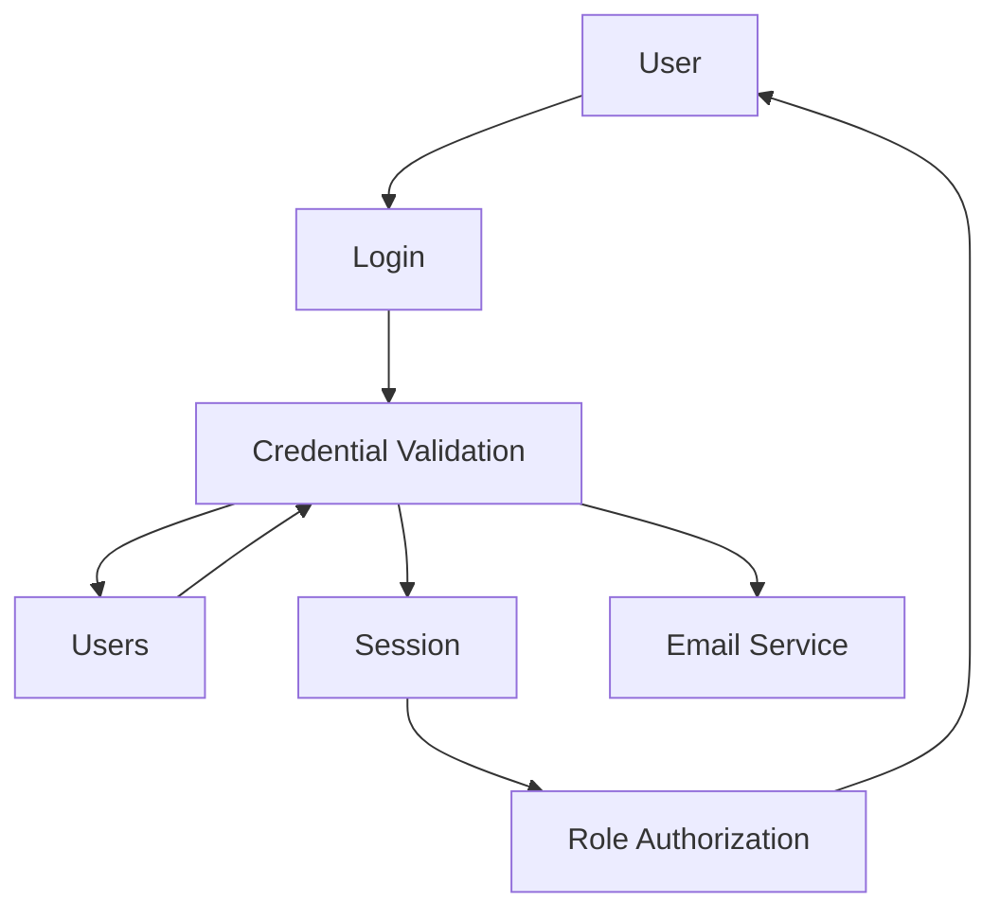
```mermaid
flowchart TD
    U["User"]
    L["Login"]
    C["Credential Validation"]
    DB["Users"]
    S["Session"]
    Z["Role Authorization"]
    E["Email Service"]

    U --> L
    L --> C
    C --> DB
    DB --> C
    C --> S
    S --> Z
    C --> E
    Z --> U
```

Email verification is a prerequisite for Tenant rental creation, not a substitute for authentication.

## 5.3 Kost Publication Flow

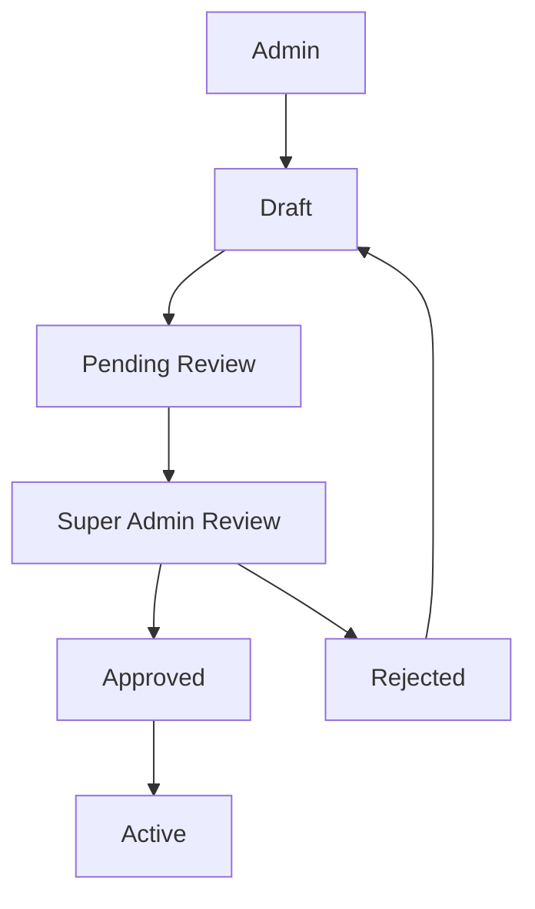
```mermaid
flowchart TD
    A["Admin"]
    D["Draft"]
    PR["Pending Review"]
    SA["Super Admin Review"]
    AP["Approved"]
    AC["Active"]
    RJ["Rejected"]

    A --> D
    D --> PR
    PR --> SA
    SA --> AP
    SA --> RJ
    RJ --> D
    AP --> AC
```

The design preserves the SRS distinction between approval and activation.

## 5.4 Rental Creation Flow

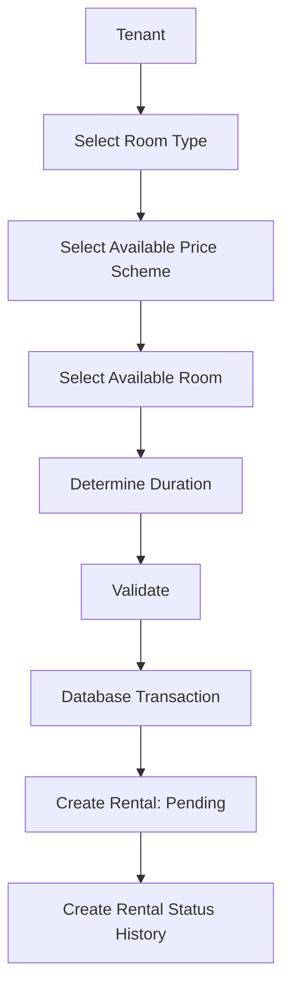
```mermaid
flowchart TD
    T["Tenant"]
    RT["Select Room Type"]
    PS["Select Available Price Scheme"]
    R["Select Available Room"]
    DU["Determine Duration"]
    V["Validate"]
    TX["Database Transaction"]
    RENT["Create Rental: Pending"]
    HIST["Create Rental Status History"]

    T --> RT
    RT --> PS
    PS --> R
    R --> DU
    DU --> V
    V --> TX
    TX --> RENT
    RENT --> HIST
```

Critical invariant: the Room must still be available at the point of transaction.

## 5.5 Payment Flow

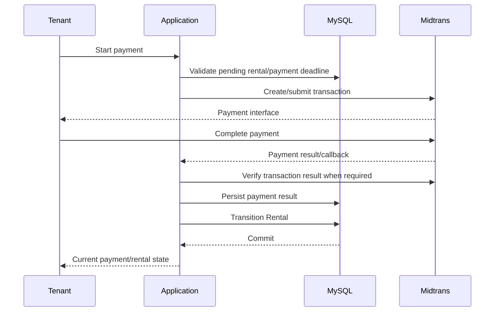
```mermaid
sequenceDiagram
    participant T as Tenant
    participant APP as Application
    participant DB as MySQL
    participant MID as Midtrans

    T->>APP: Start payment
    APP->>DB: Validate pending rental/payment deadline
    APP->>MID: Create/submit transaction
    MID-->>T: Payment interface
    T->>MID: Complete payment
    MID-->>APP: Payment result/callback
    APP->>MID: Verify transaction result when required
    APP->>DB: Persist payment result
    APP->>DB: Transition Rental
    DB-->>APP: Commit
    APP-->>T: Current payment/rental state
```

Payment callback must be treated as untrusted input until verified.

## 5.6 Rental Document Verification

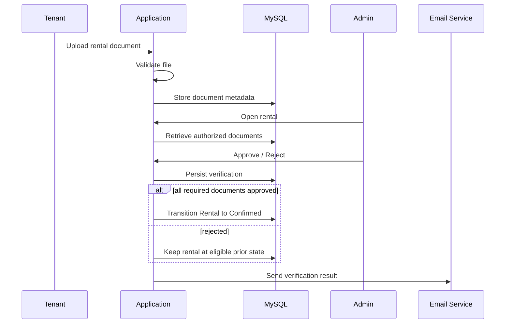
```mermaid
sequenceDiagram
    participant T as Tenant
    participant APP as Application
    participant DB as MySQL
    participant A as Admin
    participant E as Email Service

    T->>APP: Upload rental document
    APP->>APP: Validate file
    APP->>DB: Store document metadata
    A->>APP: Open rental
    APP->>DB: Retrieve authorized documents
    A->>APP: Approve / Reject
    APP->>DB: Persist verification
    alt all required documents approved
        APP->>DB: Transition Rental to Confirmed
    else rejected
        APP->>DB: Keep rental at eligible prior state
    end
    APP->>E: Send verification result
```

Email failure must not invalidate an otherwise valid business transition.

---

# 6. Detailed Manual Process Flowchart

## 6.1 Admin Registration Outside System

The Business Analysis/Discovery process explicitly includes manual administrative verification of a prospective Admin.

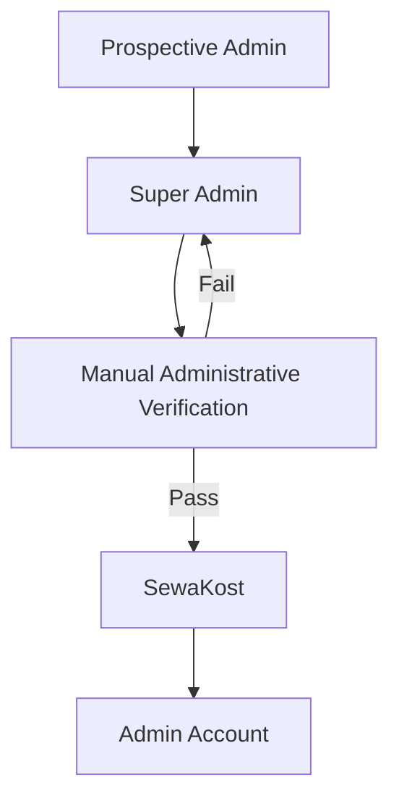
```mermaid
flowchart TD
    C["Prospective Admin"]
    SA["Super Admin"]
    V["Manual Administrative Verification"]
    SYS["SewaKost"]
    ACC["Admin Account"]

    C --> SA
    SA --> V
    V -->|Pass| SYS
    SYS --> ACC
    V -->|Fail| SA
```

The system does not digitize this verification process.

## 6.2 Kost Verification Outside/Inside Boundary

Discovery describes Super Admin verification administratively. The application captures the resulting review decision.

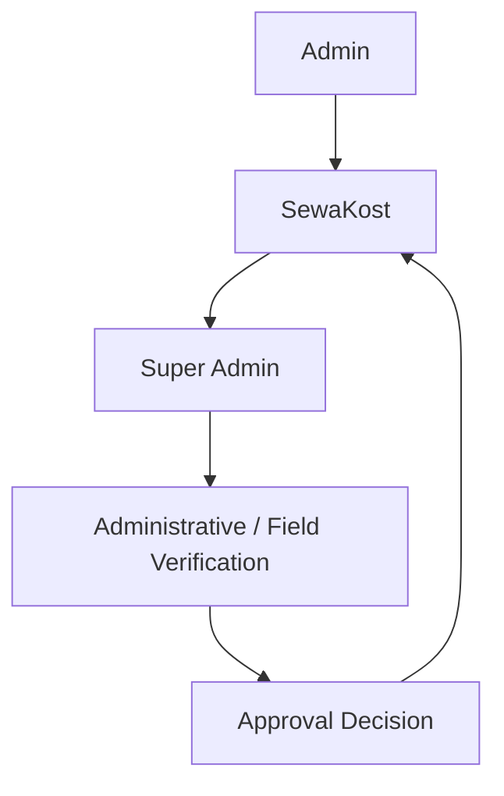
```mermaid
flowchart TD
    A["Admin"]
    SYS["SewaKost"]
    SA["Super Admin"]
    MAN["Administrative / Field Verification"]
    DEC["Approval Decision"]

    A --> SYS
    SYS --> SA
    SA --> MAN
    MAN --> DEC
    DEC --> SYS
```

The DDS does not introduce a meeting scheduler, digital field-verification subsystem, or physical-document management module because these are excluded.

---

# 7. Context Diagram

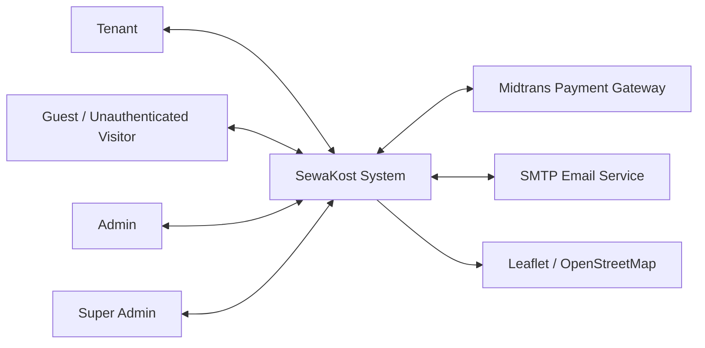
```mermaid
flowchart LR
    T["Tenant"]
    G["Guest / Unauthenticated Visitor"]
    A["Admin"]
    SA["Super Admin"]
    S["SewaKost System"]
    MID["Midtrans Payment Gateway"]
    EMAIL["SMTP Email Service"]
    MAP["Leaflet / OpenStreetMap"]

    T <--> S
    G <--> S
    A <--> S
    SA <--> S
    S <--> MID
    S <--> EMAIL
    S --> MAP
```

## 7.1 Boundary Interpretation

The application system contains:
- web interface;
- application logic;
- authorization;
- persistence;
- internal RESTful API boundary;
- integration adapters.

External:
- Midtrans;
- SMTP;
- map display/data source.

No cloud storage service is part of the MVP context.

---

# 8. Data Flow Diagram

## 8.1 Level 0

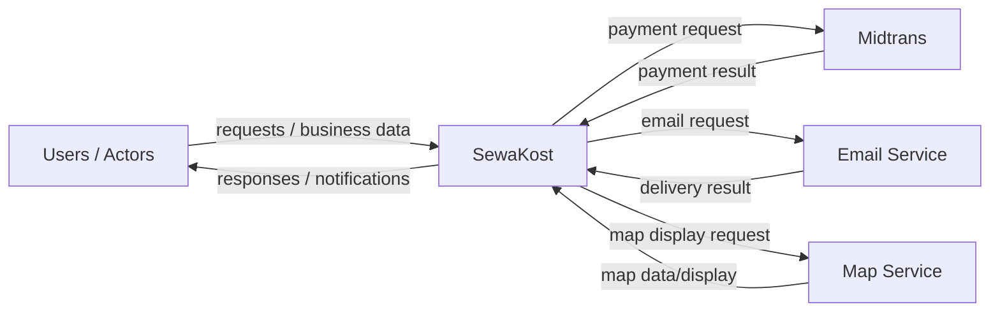
```mermaid
flowchart LR
    U["Users / Actors"]
    S["SewaKost"]
    MID["Midtrans"]
    EMAIL["Email Service"]
    MAP["Map Service"]

    U -->|requests / business data| S
    S -->|responses / notifications| U
    S -->|payment request| MID
    MID -->|payment result| S
    S -->|email request| EMAIL
    EMAIL -->|delivery result| S
    S -->|map display request| MAP
    MAP -->|map data/display| S
```

## 8.2 Level 1 Processes

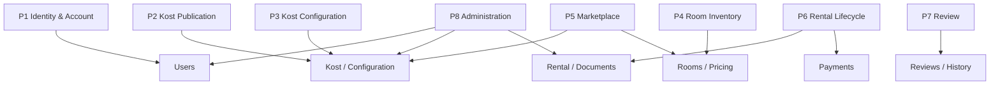
```mermaid
flowchart TD
    P1["P1 Identity & Account"]
    P2["P2 Kost Publication"]
    P3["P3 Kost Configuration"]
    P4["P4 Room Inventory"]
    P5["P5 Marketplace"]
    P6["P6 Rental Lifecycle"]
    P7["P7 Review"]
    P8["P8 Administration"]

    D1["Users"]
    D2["Kost / Configuration"]
    D3["Rooms / Pricing"]
    D4["Rental / Documents"]
    D5["Payments"]
    D6["Reviews / History"]

    P1 --> D1
    P2 --> D2
    P3 --> D2
    P4 --> D3
    P5 --> D2
    P5 --> D3
    P6 --> D4
    P6 --> D5
    P7 --> D6
    P8 --> D1
    P8 --> D2
    P8 --> D4
```

## 8.3 Data Flow Rules

- Authentication data enters through Identity.
- Public marketplace reads only publishable/current data.
- Rental writes must respect lifecycle and inventory state.
- Payment results are persisted separately from Rental state.
- Reviews require completed Rental eligibility.
- Administrative operations require role/resource authorization.

---

# 9. ERD Design Baseline

## 9.1 Current ERD

The current ERD contains 29 principal entities, including:

```text
users
kosts
addresses
kost_images
categories
category_kost
facilities
facility_schemes
facility_scheme_items
facility_scheme_kosts
facility_scheme_room_types
rules
rule_schemes
rule_scheme_items
rule_scheme_kosts
rule_scheme_room_types
room_types
room_type_images
price_schemes
room_type_price_schemes
rooms
rentals
rental_documents
payments
payment_logs
rental_status_histories
kost_reviews
room_reviews
review_images
```

## 9.2 Core Data Domains

| Domain | Principal Entities |
|---|---|
| Identity | users |
| Kost | kosts, addresses, kost_images |
| Standardized category | categories, category_kost |
| Facility content | facilities, facility_schemes, facility_scheme_items, application junctions |
| Rule content | rules, rule_schemes, rule_scheme_items, application junctions |
| Room inventory | room_types, room_type_images, rooms |
| Pricing | price_schemes, room_type_price_schemes |
| Rental | rentals, rental_documents, rental_status_histories |
| Payment | payments, payment_logs |
| Review | kost_reviews, room_reviews, review_images |

## 9.3 Data Invariants

### Identity
- `users.email` is unique.
- `users.role` is `user`, `admin`, or `superadmin`.
- `deleted_at` supports account deletion semantics.
- Deleted users must not authenticate or initiate new business activity.

### Kost
- `kosts.slug` is unique.
- Kost belongs to an Admin through `user_id`.
- Approval is recorded through `approved_by`.
- Publication lifecycle is represented explicitly through status.

### Category
- Category master is standardized.
- Super Admin defines category master data.
- Admin only assigns available categories to managed Kost.

### Facility / Rule
- Master items are reusable.
- Admin can create/manage items according to SRS.
- Scheme composes items.
- Scheme may be applied to Kost or Room Type within the permitted Kost boundary.
- These items are informational content and are not marketplace filter dimensions.

### Room Type
- Room Type belongs to one Kost.
- Name and slug are unique within the Kost.
- Facility/Rule schemes can be applied at Room Type level.

### Pricing
- One Room Type may use multiple Price Schemes.
- Price Scheme contains price + duration value + duration unit.
- Inactive Price Scheme cannot be selected for new rental.
- Rental preserves price/duration snapshot.

### Room
- Room belongs to a Kost and Room Type.
- Room code is unique within Kost.
- Admin can change operational state from `available` to `inactive` or `maintenance`.
- `reserved` and `occupied` are system lifecycle consequences.

### Rental
- Rental references Tenant, Room, and Price Scheme.
- Rental status is lifecycle state.
- Rental status history records transitions.
- One Rental has one Payment according to ERD.
- Rental remains historical after completion/cancellation.

### Payment
- Payment status is separate from Rental status.
- Payment logs retain gateway interaction history.
- Payment success must be verified before Rental transition.

### Review
- One Kost Review per Rental.
- One Room Review per Rental.
- Rating constrained to 1–5.
- Review eligibility derives from completed Rental.
- Review images use polymorphic relation.

## 9.4 ERD Relationship Strategy

The uploaded ERD specifies 40 relationships and explicitly preserves historical records using RESTRICT/SET NULL behavior where deletion would otherwise destroy business history.

Important relationships:
- users → kosts;
- users → rentals;
- kosts → room_types;
- room_types → rooms;
- rooms → rentals;
- price_schemes → rentals;
- rentals → documents/payments/history/reviews;
- payments → payment_logs;
- review → review_images polymorphically.

## 9.5 ERD Change Control

DDS treats the uploaded ERD as the current data baseline. If implementation reveals a required data-model change:
1. identify requirement/design reason;
2. create TDR/change proposal;
3. update ERD;
4. update affected DDS sections;
5. verify SRS traceability;
6. only then implement.

---

# 10. CDM — Conceptual Data Model

## 10.1 Conceptual Entities

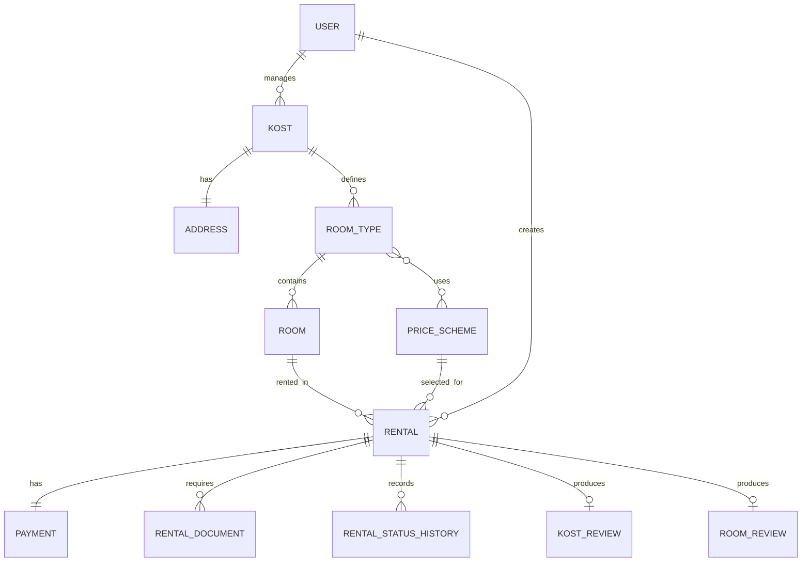
```mermaid
erDiagram
    USER ||--o{ KOST : manages
    USER ||--o{ RENTAL : creates
    KOST ||--|| ADDRESS : has
    KOST ||--o{ ROOM_TYPE : defines
    ROOM_TYPE ||--o{ ROOM : contains
    ROOM_TYPE }o--o{ PRICE_SCHEME : uses
    ROOM ||--o{ RENTAL : rented_in
    PRICE_SCHEME ||--o{ RENTAL : selected_for
    RENTAL ||--|| PAYMENT : has
    RENTAL ||--o{ RENTAL_DOCUMENT : requires
    RENTAL ||--o{ RENTAL_STATUS_HISTORY : records
    RENTAL ||--o| KOST_REVIEW : produces
    RENTAL ||--o| ROOM_REVIEW : produces
```

## 10.2 Conceptual Meaning

- **User** represents authenticated identity and role.
- **Kost** is the principal marketplace property.
- **Room Type** defines a class of room offered by a Kost.
- **Room** represents an individual rentable inventory unit.
- **Price Scheme** defines available rental pricing/duration.
- **Rental** represents the tenant's transaction and lifecycle.
- **Payment** records payment state.
- **Review** records post-rental evaluation.
- **History** preserves lifecycle evidence.

---

# 11. PDM — Physical Data Model

## 11.1 Physical Strategy

The PDM follows the uploaded ERD:
- BIGINT UNSIGNED auto-increment identifiers;
- VARCHAR lengths as specified;
- TEXT for free-form descriptions/comments/notes;
- DECIMAL for monetary and geographic values;
- ENUM for controlled lifecycle/role fields;
- TIMESTAMP for lifecycle timestamps;
- BOOLEAN for binary flags;
- composite PK/unique constraints for junction tables.

## 11.2 Status Enums

### User Role

```text
user
admin
superadmin
```

### Kost Status

```text
draft
pending_review
approved
active
inactive
suspended
rejected
archived
```

### Room Status

```text
available
occupied
reserved
maintenance
inactive
```

### Rental Status

```text
pending
paid
confirmed
active
completed
cancelled
```

### Payment Status

```text
pending
success
failed
```

### Duration Unit

```text
day
week
month
```

### Verification Status

```text
pending
approved
rejected
```

### Review Type

```text
kost
room
```

## 11.3 Referential Integrity

Delete/update behavior follows the current ERD.

Important principle:
- child operational data may cascade where it is purely dependent;
- historical records use RESTRICT/SET NULL where preservation is required;
- application logic must not bypass database integrity.

## 11.4 Index Strategy

Indexes must be derived from:
- primary/foreign keys;
- unique identifiers;
- marketplace search/filter access patterns;
- lifecycle queries;
- ownership/scope queries;
- payment gateway identifiers;
- status + time queries where required.

The final index list must remain consistent with the uploaded ERD and actual query patterns discovered during implementation.

---

# 12. Database Dictionary

The database dictionary is derived from the current ERD. The following is the implementation-oriented semantic dictionary; exact physical types remain those specified by ERD.

## 12.1 Identity

| Table | Important Fields | Purpose |
|---|---|---|
| users | id, first_name, last_name, email, verification timestamps, role, avatar_path, deleted_at | Account, authentication identity, role |

## 12.2 Kost

| Table | Important Fields | Purpose |
|---|---|---|
| kosts | user_id, slug, name, description, contact_number, status, published_at, approved_at, approved_by, rejected_reason | Kost lifecycle and public identity |
| addresses | kost_id, full_address, district, city, province, postal_code, country, latitude, longitude | Kost address/location |
| kost_images | kost_id, image_path, is_thumbnail, sort_order | Kost media |

## 12.3 Configuration

| Table | Important Fields | Purpose |
|---|---|---|
| categories | name, slug, description | Super Admin-managed category master |
| category_kost | kost_id, category_id | Kost/category assignment |
| facilities | name, slug | Facility item master |
| facility_schemes | kost_id, name, description | Facility template |
| facility_scheme_items | scheme_id, facility_id | Scheme composition |
| facility_scheme_kosts | scheme_id, kost_id | Kost-level application |
| facility_scheme_room_types | scheme_id, room_type_id | Room Type-level application |
| rules | name, slug | Rule item master |
| rule_schemes | kost_id, name, description | Rule template |
| rule_scheme_items | scheme_id, rule_id | Scheme composition |
| rule_scheme_kosts | scheme_id, kost_id | Kost-level application |
| rule_scheme_room_types | scheme_id, room_type_id | Room Type-level application |

## 12.4 Inventory & Pricing

| Table | Important Fields | Purpose |
|---|---|---|
| room_types | kost_id, name, slug, description, room_size, max_occupants, security_deposit | Room class/template |
| room_type_images | room_type_id, image_path, is_thumbnail, sort_order | Room Type media |
| price_schemes | kost_id, price, duration_value, duration_unit, is_active | Pricing rule |
| room_type_price_schemes | room_type_id, price_scheme_id | Pricing assignment |
| rooms | kost_id, room_type_id, code, status | Individual room inventory |

## 12.5 Rental & Payment

| Table | Important Fields | Purpose |
|---|---|---|
| rentals | tenant, room, price scheme, price/duration snapshot, rental dates, status | Transaction/lifecycle aggregate |
| rental_documents | rental_id, document metadata, verification data | Administrative documents |
| payments | rental_id, gateway reference, amount, status | Payment state |
| payment_logs | payment_id, gateway event/response data | Payment integration history |
| rental_status_histories | rental_id, status, changed_by, internal_notes, created_at | Rental lifecycle audit trail |

## 12.6 Review

| Table | Important Fields | Purpose |
|---|---|---|
| kost_reviews | rental_id, kost_id, rating, comment | Kost review |
| room_reviews | rental_id, room_id, rating, comment | Room review |
| review_images | review_type, review_id, image_path, sort_order | Polymorphic review media |

---

# 13. API Specification

## 13.1 API Design Boundary

Discovery explicitly requires RESTful internal API. DDS therefore defines a consistent API contract, but does not invent public third-party API exposure.

The API is primarily an application boundary for:
- frontend/backend separation where used;
- capability-to-capability interaction;
- integration support;
- testing through Postman;
- future extensibility.

## 13.2 API Principles

1. Resource-oriented routes.
2. HTTP semantics must remain meaningful.
3. Authorization occurs server-side.
4. State transitions use semantic operations where appropriate.
5. Validation errors are structured.
6. Resource scope is enforced server-side.
7. External callback endpoints are isolated.
8. Payment callbacks are verified before business state changes.
9. Sensitive fields are not returned unnecessarily.

## 13.3 API Contract

| Field | Required Design |
|---|---|
| Method | GET/POST/PATCH/DELETE or semantic action endpoint where lifecycle requires it |
| Path | Stable resource path |
| Auth | Required role/session state |
| Scope | Resource ownership/administrative scope |
| Preconditions | Required state |
| Request | Validated input |
| Response | Resource/result |
| Errors | Validation/auth/state/external errors |
| Transaction | Defined when atomicity required |
| Traceability | UC/FR/BR references |

## 13.4 Endpoint Groups

### Identity

```text
POST   /login
POST   /logout
GET    /email/verify
POST   /email/verification-notification
GET    /profile
PATCH  /profile
DELETE /account
```

### Kost Publication

```text
GET    /admin/kosts
POST   /admin/kosts
GET    /admin/kosts/{kost}
PATCH  /admin/kosts/{kost}
POST   /admin/kosts/{kost}/submit-review

GET    /superadmin/kost-submissions
POST   /superadmin/kost-submissions/{kost}/approve
POST   /superadmin/kost-submissions/{kost}/reject

POST   /admin/kosts/{kost}/publish
POST   /admin/kosts/{kost}/status
```

`/status` is not a generic unrestricted status mutation. Allowed transitions must be enforced by the application.

### Kost Configuration

```text
PATCH  /admin/kosts/{kost}/information
PUT    /admin/kosts/{kost}/categories

POST   /admin/kosts/{kost}/facility-items
POST   /admin/kosts/{kost}/facility-schemes
PUT    /admin/kosts/{kost}/facility-schemes/{scheme}

POST   /admin/kosts/{kost}/rule-items
POST   /admin/kosts/{kost}/rule-schemes
PUT    /admin/kosts/{kost}/rule-schemes/{scheme}
```

### Inventory

```text
POST   /admin/kosts/{kost}/room-types
PATCH  /admin/room-types/{roomType}

POST   /admin/room-types/{roomType}/price-schemes
PATCH  /admin/price-schemes/{priceScheme}

POST   /admin/room-types/{roomType}/rooms
PATCH  /admin/rooms/{room}
```

### Marketplace

```text
GET /marketplace/kosts
GET /marketplace/kosts/{kost}
GET /marketplace/kosts/{kost}/room-types
GET /marketplace/kosts/{kost}/rooms
```

Search/filter parameters are limited to SRS-supported dimensions:
- name/location;
- price;
- category;
- rating/review-related supported criteria.

Facility and Rule are displayed content, not filter dimensions.

### Rental

```text
POST /rentals
GET  /rentals/{rental}
GET  /rentals
POST /rentals/{rental}/documents
POST /rentals/{rental}/documents/{document}/verify
```

### Payment

```text
POST /rentals/{rental}/payment
POST /payments/midtrans/callback
GET  /payments/{payment}
```

### Review

```text
POST /rentals/{rental}/kost-review
POST /rentals/{rental}/room-review
POST /reviews/{review}/images
```

### Administration

```text
POST  /superadmin/admins
GET   /superadmin/admins
GET   /superadmin/admins/{admin}
PATCH /superadmin/admins/{admin}
```

These paths are **design-level contract proposals**, not additional requirements. Final route names may be adjusted during implementation without changing behavior.

---

# 14. Sequence Diagrams

## 14.1 Create Rental

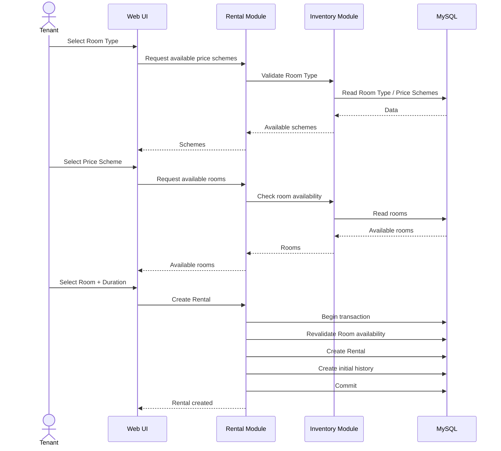
```mermaid
sequenceDiagram
    actor T as Tenant
    participant UI as Web UI
    participant APP as Rental Module
    participant INV as Inventory Module
    participant DB as MySQL

    T->>UI: Select Room Type
    UI->>APP: Request available price schemes
    APP->>INV: Validate Room Type
    INV->>DB: Read Room Type / Price Schemes
    DB-->>INV: Data
    INV-->>APP: Available schemes
    APP-->>UI: Schemes

    T->>UI: Select Price Scheme
    UI->>APP: Request available rooms
    APP->>INV: Check room availability
    INV->>DB: Read rooms
    DB-->>INV: Available rooms
    INV-->>APP: Rooms
    APP-->>UI: Available rooms

    T->>UI: Select Room + Duration
    UI->>APP: Create Rental
    APP->>DB: Begin transaction
    APP->>DB: Revalidate Room availability
    APP->>DB: Create Rental
    APP->>DB: Create initial history
    APP->>DB: Commit
    APP-->>UI: Rental created
```

## 14.2 Payment

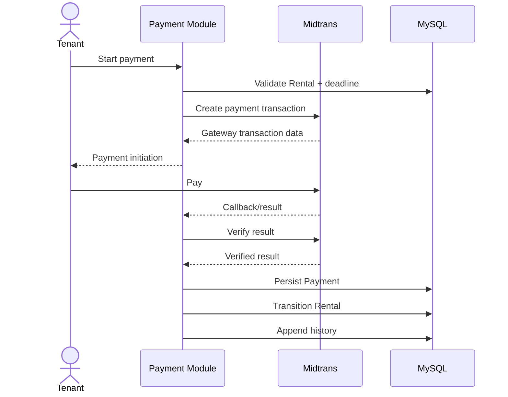
```mermaid
sequenceDiagram
    actor T as Tenant
    participant APP as Payment Module
    participant MID as Midtrans
    participant DB as MySQL

    T->>APP: Start payment
    APP->>DB: Validate Rental + deadline
    APP->>MID: Create payment transaction
    MID-->>APP: Gateway transaction data
    APP-->>T: Payment initiation

    T->>MID: Pay
    MID-->>APP: Callback/result
    APP->>MID: Verify result
    MID-->>APP: Verified result
    APP->>DB: Persist Payment
    APP->>DB: Transition Rental
    APP->>DB: Append history
```

## 14.3 Document Verification

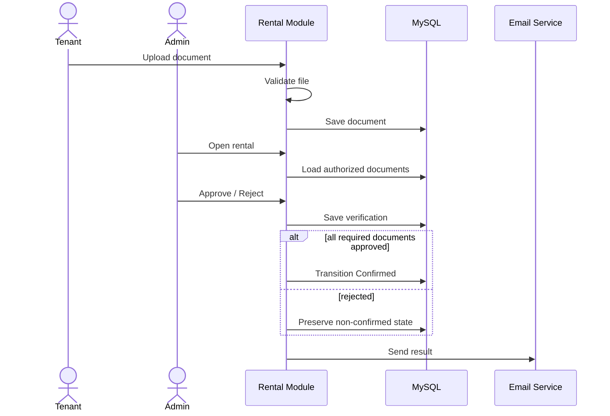
```mermaid
sequenceDiagram
    actor T as Tenant
    actor A as Admin
    participant APP as Rental Module
    participant DB as MySQL
    participant EMAIL as Email Service

    T->>APP: Upload document
    APP->>APP: Validate file
    APP->>DB: Save document
    A->>APP: Open rental
    APP->>DB: Load authorized documents
    A->>APP: Approve / Reject
    APP->>DB: Save verification
    alt all required documents approved
        APP->>DB: Transition Confirmed
    else rejected
        APP->>DB: Preserve non-confirmed state
    end
    APP->>EMAIL: Send result
```

---

# 15. Activity Diagrams

## 15.1 Kost Publication

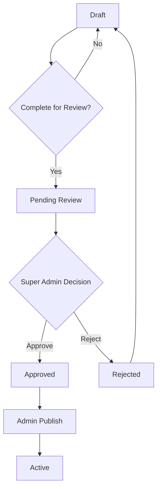
```mermaid
flowchart TD
    S["Draft"] --> V{"Complete for Review?"}
    V -->|No| S
    V -->|Yes| PR["Pending Review"]
    PR --> R{"Super Admin Decision"}
    R -->|Approve| AP["Approved"]
    R -->|Reject| RJ["Rejected"]
    RJ --> S
    AP --> P["Admin Publish"]
    P --> AC["Active"]
```

## 15.2 Rental Lifecycle

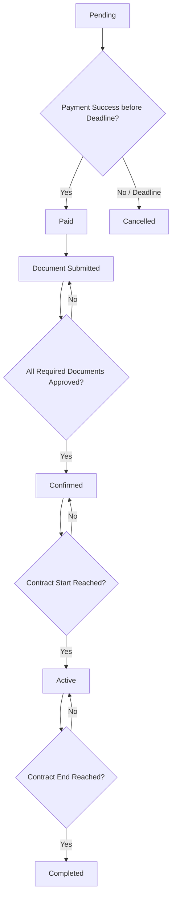
```mermaid
flowchart TD
    P["Pending"] --> D{"Payment Success before Deadline?"}
    D -->|Yes| PAID["Paid"]
    D -->|No / Deadline| C["Cancelled"]
    PAID --> DOC["Document Submitted"]
    DOC --> V{"All Required Documents Approved?"}
    V -->|No| DOC
    V -->|Yes| CONF["Confirmed"]
    CONF --> START{"Contract Start Reached?"}
    START -->|No| CONF
    START -->|Yes| ACTIVE["Active"]
    ACTIVE --> END{"Contract End Reached?"}
    END -->|No| ACTIVE
    END -->|Yes| DONE["Completed"]
```

## 15.3 Room Lifecycle Authority

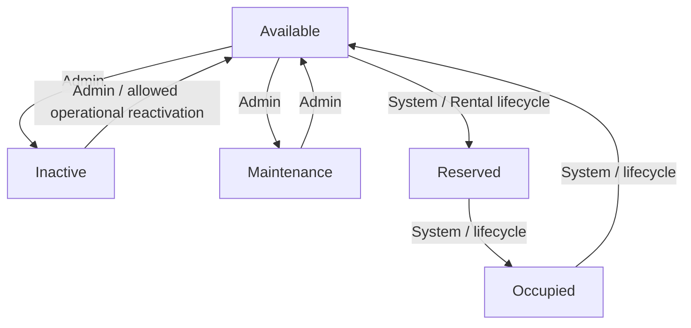
```mermaid
flowchart TD
    AV["Available"]
    IN["Inactive"]
    MA["Maintenance"]
    RES["Reserved"]
    OCC["Occupied"]

    AV -->|Admin| IN
    AV -->|Admin| MA
    AV -->|System / Rental lifecycle| RES
    RES -->|System / lifecycle| OCC
    OCC -->|System / lifecycle| AV
    MA -->|Admin| AV
    IN -->|Admin / allowed operational reactivation| AV
```

The exact transition set must follow the SRS business rules. In particular, Admin cannot directly force `occupied` or `reserved`; those are system lifecycle states.

---

# 16. State Machine Diagrams

## 16.1 Kost

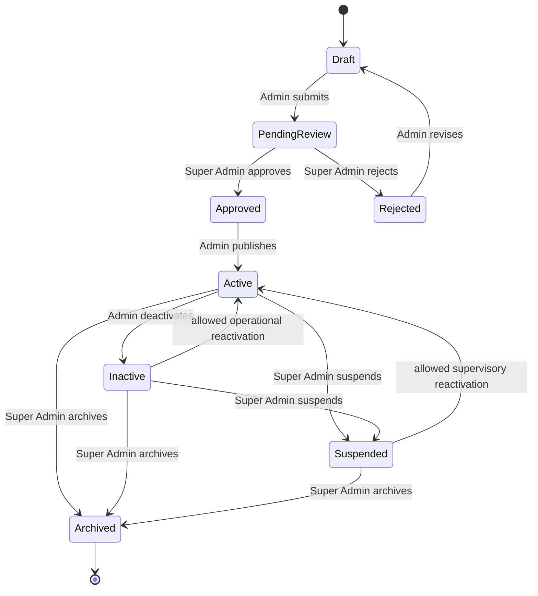
```mermaid
stateDiagram-v2
    [*] --> Draft
    Draft --> PendingReview: Admin submits
    PendingReview --> Approved: Super Admin approves
    PendingReview --> Rejected: Super Admin rejects
    Rejected --> Draft: Admin revises
    Approved --> Active: Admin publishes
    Active --> Inactive: Admin deactivates
    Inactive --> Active: allowed operational reactivation
    Active --> Suspended: Super Admin suspends
    Inactive --> Suspended: Super Admin suspends
    Suspended --> Active: allowed supervisory reactivation
    Active --> Archived: Super Admin archives
    Inactive --> Archived: Super Admin archives
    Suspended --> Archived: Super Admin archives
    Archived --> [*]
```

`Archived` is terminal according to lifecycle semantics.

## 16.2 Room

```mermaid
stateDiagram-v2
    [*] --> Available
    Available --> Reserved: System
    Reserved --> Occupied: System
    Occupied --> Available: System
    Available --> Maintenance: Admin
    Maintenance --> Available: Admin
    Available --> Inactive: Admin
    Inactive --> Available: allowed operational reactivation
```

## 16.3 Rental

```mermaid
stateDiagram-v2
    [*] --> Pending
    Pending --> Paid: verified payment success
    Pending --> Cancelled: payment deadline expires
    Paid --> DocumentSubmitted: documents submitted
    DocumentSubmitted --> Confirmed: all required documents approved
    DocumentSubmitted --> DocumentSubmitted: document correction/resubmission
    Confirmed --> Active: contract start reached
    Active --> Completed: contract end reached
    Cancelled --> [*]
    Completed --> [*]
```

## 16.4 Payment

```mermaid
stateDiagram-v2
    [*] --> Pending
    Pending --> Success: verified payment success
    Pending --> Failed: verified failure
    Failed --> Pending: retry while rental deadline permits
    Success --> [*]
```

Payment `success` does not itself mean Rental `completed`; it only enables the next Rental lifecycle stage.

---

# 17. Component Diagram

```mermaid
flowchart TB
    UI["Web UI / Presentation"]
    API["RESTful Application Boundary"]

    ID["Identity & Account"]
    KP["Kost Publication"]
    KC["Kost Configuration"]
    RI["Room Inventory"]
    MP["Marketplace"]
    RN["Rental"]
    PAY["Payment"]
    REV["Review"]
    ADM["Administration"]

    DB["MySQL"]
    MID["Midtrans Adapter"]
    EMAIL["Email Adapter"]
    MAP["Map Adapter"]

    UI --> API
    API --> ID
    API --> KP
    API --> KC
    API --> RI
    API --> MP
    API --> RN
    API --> PAY
    API --> REV
    API --> ADM

    ID --> DB
    KP --> DB
    KC --> DB
    RI --> DB
    MP --> DB
    RN --> DB
    PAY --> DB
    REV --> DB
    ADM --> DB

    PAY --> MID
    ID --> EMAIL
    KP --> EMAIL
    RN --> EMAIL
    ADM --> EMAIL
    MP --> MAP
```

## 17.1 Component Responsibilities

| Component | Responsibility |
|---|---|
| Identity & Account | Authentication, verification, profile, account lifecycle |
| Kost Publication | Draft, review submission, approval, publication, status lifecycle |
| Kost Configuration | Information, categories, facility/rule content |
| Room Inventory | Room Type, Price Scheme, Room |
| Marketplace | Public browsing/search/filter/detail |
| Rental | Rental creation, documents, lifecycle monitoring/completion |
| Payment | Midtrans transaction boundary and payment state |
| Review | Kost/Room reviews |
| Administration | Admin account creation/management |
| Email Adapter | SMTP abstraction |
| Map Adapter | Map display boundary |
| Persistence | MySQL access and transaction consistency |

---

# 18. Package Diagram

```mermaid
flowchart TB
    Shared["Shared / Infrastructure"]

    Identity["Identity"]
    Kost["Kost"]
    Inventory["Inventory"]
    Marketplace["Marketplace"]
    Rental["Rental"]
    Payment["Payment"]
    Review["Review"]
    Administration["Administration"]

    Identity --> Shared
    Kost --> Shared
    Inventory --> Shared
    Marketplace --> Shared
    Rental --> Shared
    Payment --> Shared
    Review --> Shared
    Administration --> Shared

    Rental --> Inventory
    Rental --> Payment
    Review --> Rental
    Marketplace --> Kost
    Marketplace --> Inventory
    Administration --> Identity
    Administration --> Kost
```

## 18.1 Dependency Rule

Allowed:
- dependency on shared infrastructure;
- dependency on another module's explicit application contract.

Discouraged:
- direct access to another module's private repository/model logic;
- circular dependencies;
- duplicate business rules across modules.

---

# 19. Folder Structure

## 19.1 Proposed Repository

```text
app/
├── Actions/
│   ├── Identity/
│   ├── Kost/
│   ├── Inventory/
│   ├── Marketplace/
│   ├── Rental/
│   ├── Payment/
│   ├── Review/
│   └── Administration/
│
├── Domain/
│   ├── Identity/
│   ├── Kost/
│   ├── Inventory/
│   ├── Marketplace/
│   ├── Rental/
│   ├── Payment/
│   ├── Review/
│   └── Administration/
│
├── Http/
│   ├── Controllers/
│   ├── Requests/
│   ├── Resources/
│   └── Middleware/
│
├── Models/
│
├── Services/
│
├── Integrations/
│   ├── Midtrans/
│   ├── Mail/
│   └── Maps/
│
├── Policies/
├── Jobs/
├── Notifications/
├── Support/
└── Providers/

database/
├── migrations/
├── seeders/
└── factories/

resources/
├── views/
├── css/
└── js/

routes/
├── web.php
└── api.php

storage/
├── app/
├── framework/
└── logs/

tests/
├── Feature/
├── Unit/
└── Integration/

docs/
└── ...
```

## 19.2 Folder Rules

- `Domain/` contains capability-specific business abstractions.
- `Actions/` contains explicit application operations.
- `Http/` remains presentation/application boundary.
- `Integrations/` contains provider-specific code.
- `Models/` represents persistence entities.
- `Policies/` enforces resource authorization.
- `Jobs/` may be used for non-critical asynchronous work.
- `Notifications/` is restricted to MVP email channel.
- `storage/app` is used for non-public files; public media must use appropriate Laravel storage configuration.

---

# 20. Detailed UI/UX Design

## 20.1 UX Architecture

Primary navigation differs by actor.

### Guest / Public

```text
Marketplace
 ├── Search
 ├── Filter
 └── Kost Detail
```

### Tenant

```text
Marketplace
Profile
Rentals
 ├── Pending Payment
 ├── Payment
 ├── Documents
 ├── Rental Status
 └── Review
```

### Admin

```text
Dashboard
Kost
 ├── Publication
 ├── Information
 ├── Categories
 ├── Facilities
 ├── Rules
 ├── Room Types
 ├── Price Schemes
 └── Rooms
Rentals
 └── Document Verification
```

### Super Admin

```text
Dashboard
Kost Review
Categories
Admin Accounts
```

## 20.2 Critical Rental UX

The SRS explicitly defines:

```text
Room Type
   ↓
Available Price Scheme
   ↓
Available Room
   ↓
Duration
   ↓
Rental Created
```

This sequence must remain visible and understandable in UI.

## 20.3 Kost Configuration UX

### Category

Admin:
- sees standardized category list;
- selects categories;
- saves assignment.

Admin cannot:
- create category master;
- rename category;
- delete category definition.

### Facility / Rule

Admin can:
1. create/select item;
2. create scheme;
3. compose scheme;
4. apply scheme to Kost or Room Type.

Facility/Rule remain content information and are not marketplace filters.

## 20.4 Form States

Every important form should support:
- initial;
- loading;
- validation error;
- authorization denied;
- successful save;
- external-service failure where applicable.

## 20.5 Rental Payment UI

Display:
- rental identifier;
- selected room;
- selected price scheme;
- price;
- duration;
- payment deadline;
- current payment status;
- current rental status;
- payment action only while permitted.

After deadline:
- payment action is disabled;
- Rental is shown as `Cancelled` after system processing.

## 20.6 Document UI

Tenant:
- required documents;
- upload status;
- validation error;
- resubmission state.

Admin:
- document list;
- verification status;
- approve/reject action;
- reason/notes where required.

## 20.7 Responsive Requirement

The Business Analysis identifies smartphone as an important Tenant device while supporting desktop/laptop/tablet/smartphone. Therefore:
- tenant marketplace and rental flow must be responsive;
- administrative interfaces may remain desktop-oriented but must still conform to supported browser compatibility.

## 20.8 Accessibility

At minimum:
- visible labels;
- non-color-only status communication;
- keyboard-usable primary controls;
- readable validation messages;
- consistent focus/interaction behavior.

These map to NFR-ACC-001 and NFR-ACC-002.

---

# 21. Project Cost Estimation and Pricing

## 21.1 Scope

This section estimates technical operating costs, not Kost rental prices.

## 21.2 Cost Categories

| Category | MVP Treatment |
|---|---|
| Development | 1 Full-stack Developer |
| Server | Linux VPS |
| Domain | Required for production deployment |
| SMTP | Required |
| Midtrans | Transaction-based gateway cost according to applicable account/transaction terms |
| Map | Leaflet + OpenStreetMap; no separate commercial map service introduced |
| Storage | Local VPS filesystem |
| Backup | VPS/server backup mechanism |
| Monitoring | Basic application/server logs |
| Cloud object storage | Not required for MVP |

## 21.3 Estimation Boundary

The Business Analysis estimates approximately **12–18 weeks** for one Full-stack Developer under full-time MVP development assumptions. DDS does not artificially reduce that estimate; technical design confirms the architecture is compatible with the assumption.

Exact monetary prices should be populated from actual selected providers/contracts at deployment time rather than hard-coded into DDS.

## 21.4 Cost Optimization Decisions

- avoid microservice infrastructure;
- avoid cloud object storage for MVP;
- avoid multi-channel notification;
- avoid multiple payment gateways;
- avoid commercial mapping stack;
- use one relational database;
- keep deployment single-server.

---

# 22. Technical Feasibility & Trade-offs

## 22.1 Feasibility Summary

**Overall:** Feasible for MVP.

Reason:
- Laravel 13 is aligned with project goals.
- MySQL matches relational ERD.
- Single-server deployment is sufficient for MVP scope.
- Midtrans is isolated to payment boundary.
- SMTP supports required notification channel.
- Leaflet/OpenStreetMap satisfies map display requirement.
- Filesystem storage satisfies single-server constraint.

## 22.2 Trade-off Matrix

| Decision | Benefit | Cost / Risk | Verdict |
|---|---|---|---|
| Modular monolith | Simple deployment + modularity | Less independent scaling | Accept |
| MySQL | Strong relational integrity | Vertical scaling focus | Accept |
| Local filesystem | Simple, cheap | Server storage/backup responsibility | Accept for MVP |
| SMTP | Simple required channel | Delivery dependency | Accept |
| Midtrans | Fast payment integration | Vendor dependency | Accept with adapter |
| Leaflet/OSM | Lightweight map display | Service policy/availability dependency | Accept |
| Single VPS | Low operational complexity | Single failure domain | Accept for MVP |
| RESTful internal API | Clear application boundary | Additional API layer | Accept |
| Explicit state transitions | Business integrity | More code than generic CRUD | Required |

## 22.3 Technical Risks

| Risk | Impact | Mitigation |
|---|---|---|
| Double room booking | High | Transaction + revalidation at commit |
| Invalid payment callback | High | Gateway verification + idempotency |
| Payment timeout race | High | Deadline validation + atomic state transition |
| Partial rental creation | High | Database transaction |
| Unauthorized document access | High | Private storage + authorization |
| Malicious upload | High | File validation + non-executable storage |
| Email outage | Medium | Persist business result independently; log delivery failure |
| VPS failure | High | Scheduled backup + recovery procedure |
| Growing database | Medium | Indexing, pagination, query discipline |
| Cross-module coupling | Medium | Explicit module contracts |

## 22.4 Feasibility Constraints

The following are deliberately not introduced:
- microservices;
- Kubernetes/container orchestration requirement;
- distributed event bus;
- cloud object storage;
- Redis requirement;
- Elasticsearch;
- separate notification platform;
- mobile backend;
- multi-region deployment.

They are not required by the current artifacts.

---

# 23. Design Traceability

## 23.1 Traceability Model

```text
Discovery
   ↓
Business Analysis
   ↓
SRS
 ├── Business Capability
 ├── Business Policy
 ├── Use Case
 ├── Functional Requirement
 ├── Non-Functional Requirement
 └── Security Requirement
   ↓
DDS
 ├── Architecture
 ├── Data
 ├── API
 ├── Behavior
 ├── UI/UX
 ├── Security
 └── Operations
   ↓
Implementation
   ↓
Verification
```

## 23.2 Capability → Design Mapping

| Capability | Main Design Artifacts |
|---|---|
| BC-001 Identity & Account | Identity component, auth flow, User model, authorization, email integration |
| BC-002 Kost Publication | Kost component, Kost state machine, publication API, approval UI |
| BC-003 Kost Configuration | Configuration component, category/content schema, configuration UI/API |
| BC-004 Room Inventory | Inventory component, Room/Room Type/Pricing PDM, room state machine |
| BC-005 Marketplace | Marketplace component, search/filter API, public UI, map display |
| BC-006 Rental Lifecycle | Rental component, rental state machine, payment sequence, document flow |
| BC-007 Review Management | Review component, review PDM, review UI/API |
| BC-008 Administration | Administration component, Admin account flow, authorization |

## 23.3 Requirement → Design Examples

| Requirement | Design Realization |
|---|---|
| FR-IA-007 | Tenant rental application checks verified email |
| FR-KP-003/004 | Submit-for-review application operation + state transition |
| FR-KC-005/006 | Category master separated from Kost/category assignment |
| FR-KC-007–012 | Facility/Rule item + scheme + application boundary |
| FR-RM-010 | Price Scheme `is_active` controls availability for new rental |
| FR-RM-014 | Marketplace/Rental availability query excludes non-available rooms |
| FR-PAY-001–006 | Midtrans adapter + payment state + verified callback |
| FR-RNT-001–007 | Transactional rental creation |
| FR-RNT-012–015 | Document verification workflow |
| FR-RNT-016–024 | Rental monitoring + system lifecycle transitions |
| FR-REV-001–009 | Completed-rental eligibility + one review per rental |
| FR-ADM-001–007 | Super Admin-only Admin account module |
| NFR-SEC-001–005 | Auth, authorization, validation, secret protection, file security |
| NFR-REL-001–003 | transactions, history, external-service isolation |
| NFR-BKP-001–003 | scheduled backup and protected backup storage |

## 23.4 Security Traceability

| Threat | Design Control |
|---|---|
| THR-001 Spoofing | Authentication/session protection |
| THR-002 Tampering | Server-side validation + authorization + state transition guards |
| THR-003 Repudiation | Rental status history + payment logs + relevant operational logs |
| THR-004 Information Disclosure | Resource authorization + private documents + secret hygiene |
| THR-005 DoS | Input/rate control where necessary + external timeout/failure isolation |
| THR-006 Elevation of Privilege | Role and resource policies |
| THR-007 Injection | Framework query binding + validation/output encoding |
| THR-008 Malicious Upload | MIME/size/extension validation + isolated storage |
| THR-009 Secret Exposure | Environment configuration + secret exclusion from logs/source |
| THR-010 Payment Manipulation | Midtrans verification + callback validation + idempotency |

---

# 24. Design Validation & Definition of Done

## 24.1 Architecture Validation

- [x] Modular monolith selected.
- [x] Single-server deployment retained.
- [x] External services isolated.
- [x] No unnecessary infrastructure introduced.
- [x] Capability boundaries defined.

## 24.2 Data Validation

- [x] Current ERD incorporated as baseline.
- [x] Core entities represented in conceptual model.
- [x] Rental/payment separation preserved.
- [x] Historical entities preserved.
- [x] Room lifecycle and rental relation represented.
- [x] Review polymorphism represented.
- [x] Facility/Rule scheme architecture preserved.
- [x] Category master vs Kost assignment separated.

## 24.3 Behavioral Validation

- [x] Kost lifecycle modeled.
- [x] Room lifecycle modeled.
- [x] Rental lifecycle modeled.
- [x] Payment lifecycle separated.
- [x] Payment timeout → Rental cancellation represented.
- [x] Rental completion represented as system-driven.
- [x] Room `reserved/occupied` treated as system lifecycle states.
- [x] Admin Room state restriction represented.
- [x] Document verification represented.
- [x] Review eligibility represented.

## 24.4 Integration Validation

- [x] Midtrans boundary defined.
- [x] Payment verification required.
- [x] Email boundary defined.
- [x] Email failure cannot corrupt valid business state.
- [x] Map is limited to display.
- [x] No cloud storage dependency introduced.

## 24.5 Security Validation

- [x] Authentication boundary.
- [x] Role-based authorization.
- [x] Resource-level authorization.
- [x] File upload controls.
- [x] Secret protection.
- [x] Payment callback verification.
- [x] Sensitive document access protection.
- [x] Security traceability.

## 24.6 Implementation Readiness Criteria

DDS is considered implementation-ready when:

1. every Must DDS requirement has a design representation;
2. no major SRS behavior is missing;
3. lifecycle transitions are explicit;
4. database model and application behavior agree;
5. external integrations have defined boundaries and failure behavior;
6. security controls are assigned to design components;
7. API contracts can be implemented without inventing business rules;
8. UI flows follow use-case order;
9. implementation can proceed without architectural assumptions;
10. any new requirement or design conflict must enter change control.

## 24.7 Agentic Development Readiness

For AI/agent-assisted implementation, each task should include:

```text
Task
  ↓
Relevant Business Capability
  ↓
UC / FR / NFR / BR
  ↓
Affected Component
  ↓
Affected Data Model
  ↓
API / UI / State Behavior
  ↓
Acceptance Criteria
  ↓
Tests
```

Agent implementation must not infer new business behavior where the SRS is authoritative.

### Agent Context Contract

Every implementation task should provide or retrieve:
- current DDS;
- current SRS;
- current ERD;
- relevant Business Policy;
- relevant Use Case;
- relevant FR/NFR;
- affected files/modules;
- acceptance criteria;
- expected tests.

### Agent Change Rule

If an agent discovers:
- missing requirement;
- contradictory requirement;
- ERD conflict;
- architectural conflict;
- security ambiguity;

it must stop at the ambiguity boundary and report a proposed change rather than silently deciding business behavior.

---

# Appendix A — Source-to-DDS Mapping

| Source | Used For |
|---|---|
| Discovery Document | Project scope, actors, technical goals, exclusions, success criteria |
| Business Analysis Document | Business problem/process, technical resources, metrics, estimation assumptions |
| SRS v1.0.7 | Authoritative requirements, business capability, UC, FR, NFR, security, lifecycle |
| ERD | Physical data baseline, relationship constraints, historical behavior |
| DDS Skeleton | Required structure and completeness criteria |

---

# Appendix B — Artifact Boundary

| Artifact | Primary Question |
|---|---|
| Discovery Document | What was discovered and why does the project exist? |
| Business Analysis Document | What business problem/process should be solved? |
| SRS | What must the system do? |
| ERD | What data and relationships must be persisted? |
| DDS | How will the system realize those requirements? |
| Implementation | How is the approved design instantiated? |
| Test Artifacts | Does implementation satisfy the requirement/design? |

---

# Appendix C — MVP Boundary

## Included

- Authentication and account management.
- Email verification.
- RBAC.
- Kost draft/review/publish/status lifecycle.
- Standardized category master controlled by Super Admin.
- Admin Kost category assignment.
- Facility/Rule item and scheme configuration.
- Room Type and Room management.
- Price Schemes.
- Marketplace browse/search/filter/detail.
- Map display.
- Rental lifecycle.
- Midtrans payment.
- Payment timeout/cancellation.
- Rental document submission and verification.
- Email notifications.
- Rental monitoring/completion.
- Kost and Room review.
- Super Admin Admin-account management.
- Backup/recovery baseline.
- Security controls.

## Explicitly Excluded

- Mobile application.
- Chat.
- WhatsApp notification.
- Push notification.
- Promotion/voucher.
- Multi-payment gateway.
- Multi-language.
- AI recommendation.
- Advanced analytics.
- Advanced audit log.
- Automatic refund.
- Subscription system.
- Digitalization of prospective Admin's manual administrative verification.
- Meeting scheduling.
- Physical document management.
- Cloud object storage.

---

# Appendix D — Critical Business Invariants

1. A deleted User cannot authenticate or initiate new business activity.
2. Tenant rental creation requires verified email.
3. Only Super Admin defines the category master.
4. Admin only assigns available categories to its Kost.
5. Facility/Rule items are configurable content, not marketplace filter dimensions.
6. Facility/Rule schemes cannot be applied outside the Admin's Kost scope.
7. A Room must be available when Rental is created.
8. Admin may manually set Room to `inactive` or `maintenance` only from `available`.
9. `reserved` and `occupied` are system lifecycle states.
10. Inactive Price Schemes cannot be selected for new Rental.
11. Rental stores the pricing/duration snapshot required for transaction history.
12. Payment success must be verified before Rental advances.
13. Payment timeout without success results in Rental `cancelled`.
14. Payment state and Rental state remain separate.
15. Rental document verification is required before `confirmed`.
16. Rental becomes `active` when the contract period starts.
17. Rental becomes `completed` when the contract period ends.
18. Completed Rental is retained as history.
19. Review requires an eligible completed Rental.
20. Each Rental allows at most one Kost review and one Room review.
21. Super Admin creates Admin accounts after external administrative verification.
22. Admin management cannot elevate an Admin to Super Admin.
23. External service failure must not create an invalid business state.
24. Historical records required by the lifecycle must remain traceable.
25. Terminal resource states cannot be reused when the lifecycle defines them as permanent.

---

# Appendix E — Agentic Implementation Task Template

```text
## Task ID
TASK-XXX

## Objective
<single implementation objective>

## Business Capability
BC-XXX

## Use Case
UC-XXX

## Requirements
- FR-XXX
- NFR-XXX
- BR-XXX
- SR-XXX (if applicable)

## Affected Design
- Component:
- Package:
- Database:
- API:
- UI:
- State Machine:

## Preconditions
<required state>

## Expected Behavior
<implementation behavior>

## Forbidden Behavior
<business rules / constraints>

## Acceptance Criteria
- AC-XXX
- AC-XXX

## Tests Required
- Unit:
- Feature:
- Integration:
- Security:
- Regression:

## Files / Modules Expected
<implementation scope>

## Change Boundary
If a requirement/design conflict is discovered, do not silently modify business behavior.
Return:
1. conflict;
2. affected artifacts;
3. proposed resolution;
4. implementation blocked/unblocked status.
```

---

# Appendix F — Design Review Findings

## F.1 Resolved Consistency Points

The design explicitly preserves the latest project decisions:

- SRS v1.0.7 is the requirement authority.
- Actor generalization is used at UML level.
- Category definition belongs to Super Admin.
- Admin only configures categories on Kost.
- Facility/Rule items can be created by Admin and composed into schemes.
- Facility/Rule are informational content, not marketplace filters.
- Room `inactive`/`maintenance` manual transitions are restricted to `available`.
- `reserved`/`occupied` are system lifecycle states.
- Rental creation sequence is Room Type → Price Scheme → Room → Duration → Rental.
- Payment timeout results in Rental cancellation.
- Payment state is separate from Rental state.
- Notification MVP is email only.
- Maps are display-only.
- Cloud storage is not required.
- Admin's initial administrative verification remains outside the system.
- Historical data is preserved where required by ERD/SRS.

## F.2 Deliberately Deferred Implementation Choices

The following are not invented as hard requirements:
- exact frontend library;
- exact VPS vendor;
- exact SMTP vendor;
- exact Midtrans product/checkout mode;
- exact queue infrastructure;
- exact web server;
- exact CI/CD platform;
- exact monitoring product.

These may be selected during implementation as long as they satisfy the SRS/DDS constraints.

## F.3 Final Review Verdict

**Design status: Implementation Reference Candidate.**

The current DDS is considered sufficiently explicit for agentic development because:
- business behavior is inherited from SRS;
- data behavior is anchored to ERD;
- architecture is constrained by MVP assumptions;
- integration boundaries are explicit;
- lifecycle transitions are modeled;
- security controls are mapped;
- UI/API/component/package design are connected;
- agent task context and change boundaries are defined.

The DDS does not authorize changes to business requirements. Any discrepancy discovered during implementation must enter change control.
