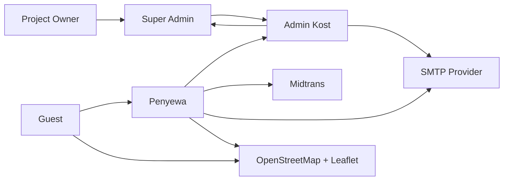

# Discovery Document

## Cover

| Item | Value |
| --- | --- |
| Document Name | Discovery Document |
| Project Name | SewaKost — Web Marketplace Kost Management &amp; Rental System |
| Project Type | Web Application \(Marketplace\) |
| Version | 1\.0\.0 |
| Document Status | Draft |
| Author | Lauhul Ridwan |
| Date | 4 Agustus 2026 |

## Document Control

### Revision History

| Version | Date | Author | Description |
| --- | --- | --- | --- |
| 1\.0\.0 | 4 Agustus 2026 | Lauhul Ridwan | Initial Discovery Document |

### Approval

| Role | Name | Status |
| --- | --- | --- |
| Project Owner | Lauhul Ridwan | Pending |
| Reviewer \(Optional\) | — | Pending |

### Distribution

| Role | Purpose |
| --- | --- |
| Project Owner | Business reference |
| System Analyst | Requirement analysis |
| Software Architect | System design |
| Full\-stack Developer | Development reference |
| UI/UX Designer | Design reference |
| QA Engineer | Testing reference |

## 1\. Project Brief

### 1\.1 Executive Summary

SewaKost merupakan aplikasi web marketplace yang dirancang untuk membantu digitalisasi proses pengelolaan dan penyewaan kost melalui satu platform terpusat\. Sistem memungkinkan Penyewa mencari kost, melakukan pemesanan, pembayaran, serta memenuhi administrasi penyewaan secara daring, sementara Admin Kost mengelola operasional kost dan Super Admin melakukan proses verifikasi sebelum kost dipublikasikan\.

Aplikasi dikembangkan sebagai proyek **pra Ujian Kompetensi Keahlian \(pra\-UKK\)** dengan pendekatan SDLC Adaptif \(guideline rancangan sendiri\), arsitektur monolith menggunakan Laravel 13, serta berfokus pada penyelesaian seluruh siklus penyewaan \(end\-to\-end rental lifecycle\) sebagai Minimum Viable Product \(MVP\)\.

### 1\.2 Project Background

Proses pengelolaan kost pada skala kecil hingga menengah masih banyak dilakukan secara manual, mulai dari publikasi informasi kost, pencatatan penyewa, administrasi dokumen, hingga pencatatan pembayaran\. Kondisi tersebut menyebabkan proses operasional menjadi kurang efisien, sulit dipantau, dan rentan terhadap kesalahan administrasi\.

Di sisi lain, calon penyewa juga mengalami keterbatasan dalam memperoleh informasi kost yang akurat, membandingkan pilihan kost, serta melakukan proses penyewaan secara terstruktur\.

SewaKost dikembangkan untuk menyediakan sistem terintegrasi yang mampu mendukung proses publikasi kost, pengelolaan kamar, penyewaan, pembayaran, dan administrasi penyewa dalam satu platform berbasis web\.

### 1\.3 Business Goals

#### Primary Goals

- Membangun marketplace kost berbasis web yang memfasilitasi penyewa dan pengelola kost\.
- Mendigitalisasi seluruh siklus penyewaan kost dari pencarian hingga penyelesaian masa sewa\.
- Menyediakan proses verifikasi publikasi kost untuk meningkatkan kualitas dan validitas informasi\.
- Mempermudah pengelolaan data kost, kamar, harga, fasilitas, aturan, dan penyewa\.

#### Secondary Goals

- Mengurangi proses administrasi manual\.
- Meningkatkan konsistensi data melalui sistem terpusat\.
- Menyediakan fondasi sistem yang dapat dikembangkan pada fase berikutnya\.

### 1\.4 Project Objectives

Project ini bertujuan menghasilkan aplikasi web marketplace kost yang mampu:

- Mengelola autentikasi dan otorisasi berbasis Role\-Based Access Control \(RBAC\)\.
- Memungkinkan Admin Kost mengelola data kost dan kamar secara mandiri\.
- Memfasilitasi proses review dan persetujuan kost oleh Super Admin sebelum dipublikasikan\.
- Mendukung proses pemesanan, pembayaran, dan verifikasi administrasi penyewa secara terstruktur\.
- Menyediakan informasi kost yang valid, konsisten, dan mudah diakses oleh calon penyewa\.

### 1\.5 High\-Level Business Process

#### A\. Admin Registration

1. Calon Admin menghubungi Super Admin\.
2. Super Admin melakukan verifikasi administrasi secara manual \(di luar sistem\)\.
3. Apabila verifikasi berhasil, Super Admin membuat akun Admin\.
4. Kredensial akun diberikan kepada Admin\.

#### B\. Kost Publication

1. Admin login\.
2. Admin membuat draft kost\.
3. Draft diajukan untuk direview\.
4. Super Admin melakukan verifikasi lapangan dan administrasi secara manual\.
5. Apabila disetujui, status kost berubah menjadi **Approved**\.
6. Admin mempublikasikan kost, status kost berubah menjadi **Active**\.

#### C\. Rental Lifecycle

1. Penyewa mencari kost\.
2. Penyewa memilih kamar\.
3. Penyewa membuat booking\.
4. Penyewa melakukan pembayaran\.
5. Penyewa mengunggah dokumen administrasi\.
6. Admin memverifikasi dokumen\.
7. Rental berstatus **Confirmed**\.
8. Penyewa menyerahkan dokumen fisik saat check\-in\.
9. Masa sewa dimulai \(status = **Active**\)\.
10. Masa sewa selesai \(status = **Completed**\)\.

### 1\.6 Actors Overview

| Actor | Description |
| --- | --- |
| Guest | Pengunjung yang dapat melihat informasi kost tanpa login\. |
| User \(Tenant\) | Penyewa yang melakukan registrasi, pemesanan, pembayaran, dan administrasi penyewaan\. |
| Admin Kost | Pengelola operasional kost yang mengelola seluruh data kost dan penyewaan pada kost yang menjadi tanggung jawabnya\. |
| Super Admin | Administrator sistem yang mengelola akun Admin serta melakukan proses review dan persetujuan publikasi kost\. |

### 1\.7 High\-Level Features

#### Authentication

- Login
- Logout
- Role\-Based Access Control

#### Marketplace

- Browse Kost
- Search
- Filter
- Detail Kost

#### Kost Management

- Kost
- Room Type
- Room
- Categories
- Facilities
- Rules
- Pricing Scheme

#### Rental

- Booking
- Payment
- Document Submission
- Rental Management

#### Administration

- Kost Approval
- User Management
- Rental Verification

### 1\.8 Technical Goals

- Menggunakan arsitektur **Monolithic** untuk mempercepat pengembangan MVP\.
- Mengembangkan aplikasi menggunakan **Laravel 13** dan **MySQL**\.
- Menerapkan **RESTful API internal** untuk pemisahan logika backend dan kemudahan integrasi antarmodul\.
- Mengintegrasikan **Midtrans** sebagai payment gateway\.
- Menggunakan **Leaflet** dan **OpenStreetMap** untuk visualisasi lokasi kost\.
- Menggunakan **SMTP Email** untuk pengiriman notifikasi email\.
- Menjalankan aplikasi pada **Linux VPS** sebagai lingkungan deployment\.

### 1\.9 Project Scope Summary

#### In Scope

- Seluruh siklus penyewaan kost dari pencarian hingga penyelesaian masa sewa\.
- Pengelolaan kost, kamar, harga, fasilitas, aturan, dan kategori\.
- Pembayaran online menggunakan Midtrans\.
- Verifikasi administrasi penyewa\.
- Verifikasi publikasi kost\.
- Role\-Based Access Control\.

#### Out of Scope

- Mobile Application
- Chat
- WhatsApp Notification
- Push Notification
- Promo &amp; Voucher
- Multi Payment Gateway
- Multi Language
- AI Recommendation
- Advanced Analytics
- Advanced Audit Log
- Automatic Refund
- Subscription System

### 1\.10 High\-Level Success Criteria

Project dianggap berhasil apabila:

- Seluruh siklus penyewaan dapat berjalan sesuai ekspektasi di dalam sistem\.
- Admin mampu mengelola operasional kost secara mandiri\.
- Super Admin dapat melakukan proses persetujuan publikasi kost\.
- Penyewa dapat melakukan pencarian, pemesanan, pembayaran, dan administrasi penyewaan melalui satu platform\.
- Seluruh modul utama MVP dapat beroperasi secara terintegrasi dan stabil sebelum memasuki fase pengembangan lanjutan\.

## 2\. Competitor Analysis

### 2\.1 Purpose

Analisis kompetitor dilakukan untuk memahami kondisi pasar, mengidentifikasi praktik terbaik \(*best practices*\), mengevaluasi kekurangan solusi yang ada, serta memperoleh referensi dalam merancang SewaKost\.

Analisis ini tidak bertujuan meniru aplikasi tertentu, melainkan mengadaptasi fitur dan alur kerja yang paling relevan dengan ruang lingkup MVP\.

### 2\.2 Competitor Overview

| Competitor | Target Market | Strengths | Weaknesses |
| --- | --- | --- | --- |
| Mamikos | Marketplace kost nasional | Fitur lengkap, pencarian baik, ekosistem besar | Kompleks, banyak fitur di luar kebutuhan MVP |
| Infokost | Marketplace kost | Antarmuka sederhana, fokus pencarian | Pengelolaan operasional relatif terbatas |
| Travelio | Properti &amp; sewa | Proses booking dan pembayaran terintegrasi | Fokus bukan khusus kost |
| OLX Property | Listing properti | Jangkauan pengguna luas | Belum mendukung siklus penyewaan secara end\-to\-end |

### 2\.3 Feature Comparison

| Feature | SewaKost | Mamikos | Infokost | Travelio |
| --- | --- | --- | --- | --- |
| Marketplace Kost | ✓ | ✓ | ✓ | ✓ |
| Search &amp; Filter | ✓ | ✓ | ✓ | ✓ |
| Room Management | ✓ | ✓ | △ | ✓ |
| Booking | ✓ | ✓ | △ | ✓ |
| Online Payment | ✓ | ✓ | ✗ | ✓ |
| Document Verification | ✓ | ✗ | ✗ | △ |
| Kost Approval Workflow | ✓ | ✗ | ✗ | ✗ |
| Multi Owner | ✓ | ✓ | ✓ | ✓ |

**Legend**

- ✓ = Supported
- △ = Limited Support
- ✗ = Not Available

### 2\.4 Key Findings

#### Strengths Observed

- Informasi kost disajikan secara lengkap\.
- Pencarian dan filter membantu pengguna menemukan kost yang sesuai\.
- Booking dan pembayaran dilakukan secara daring\.
- Galeri foto menjadi faktor penting dalam keputusan penyewa\.

#### Common Weaknesses

- Proses verifikasi administrasi penyewa umumnya masih dilakukan di luar sistem\.
- Tidak banyak platform yang memiliki workflow persetujuan publikasi kost\.
- Pengelolaan operasional kost sering kali bercampur dengan fitur bisnis lain sehingga kompleks\.

### 2\.5 Design Decisions

Berdasarkan hasil analisis kompetitor, SewaKost mengadopsi beberapa keputusan berikut:

- Fokus pada siklus penyewaan end\-to\-end\.
- Menambahkan workflow persetujuan publikasi kost oleh Super Admin\.
- Menambahkan verifikasi dokumen penyewa setelah pembayaran\.
- Mengutamakan antarmuka yang sederhana dan mudah digunakan\.
- Menghindari fitur yang tidak mendukung MVP secara langsung\.

## 3\. Similar Applications

### 3\.1 Purpose

Referensi aplikasi digunakan untuk mempelajari implementasi antarmuka, alur bisnis, dan pengalaman pengguna yang telah terbukti efektif tanpa melakukan penyalinan secara langsung\.

### 3\.2 Workflow References

| Workflow | Reference |
| --- | --- |
| Browse Kost | Mamikos |
| Search &amp; Filter | Mamikos |
| Detail Kost | Mamikos |
| Booking | Travelio |
| Payment | Travelio |
| Listing Management | Airbnb |
| Dashboard Layout | Laravel Filament |

### 3\.3 UI/UX References

| Area | Reference |
| --- | --- |
| Homepage | Mamikos |
| Search Page | Airbnb |
| Detail Page | Mamikos |
| Booking Page | Travelio |
| Dashboard | Filament Admin |
| Form Design | Filament |

### 3\.4 Best Practices

Beberapa praktik terbaik yang akan diterapkan:

- Navigasi sederhana dan konsisten\.
- Informasi penting ditampilkan secara bertahap\.
- Formulir dibuat singkat dan mudah dipahami\.
- Validasi input dilakukan sedini mungkin\.
- Status proses ditampilkan secara jelas kepada pengguna\.
- Tata letak responsif untuk berbagai ukuran layar\.

## 4\. External Environment Review

### 4\.1 Technology Trends

Implementasi mengikuti tren pengembangan web modern yang relevan dengan ruang lingkup proyek\.

| Area | Adoption |
| --- | --- |
| Laravel Monolith | ✓ |
| RESTful API Internal | ✓ |
| ORM \(Eloquent\) | ✓ |
| Responsive Web | ✓ |
| Payment Gateway Integration | ✓ |
| Email Notification | ✓ |
| Interactive Maps | ✓ |

### 4\.2 Regulations

| Regulation | Relevance |
| --- | --- |
| UU Perlindungan Data Pribadi \(UU No\. 27 Tahun 2022\) | Perlindungan data pengguna |
| UU Informasi dan Transaksi Elektronik | Transaksi elektronik |
| Ketentuan Midtrans | Integrasi pembayaran |
| SMTP Provider Policy | Pengiriman email |

### 4\.3 Technical Standards

| Standard | Purpose |
| --- | --- |
| RESTful API | Konsistensi komunikasi internal |
| PSR\-12 | Standar penulisan kode PHP |
| MVC Architecture | Pemisahan tanggung jawab aplikasi |
| Semantic HTML | Struktur halaman |
| OWASP Top 10 | Dasar keamanan aplikasi |

### 4\.4 UI/UX Standards

| Standard | Purpose |
| --- | --- |
| Responsive Design | Mendukung berbagai ukuran layar |
| Accessibility \(WCAG sebagai referensi\) | Meningkatkan aksesibilitas |
| Consistent Navigation | Kemudahan penggunaan |
| Clear Visual Hierarchy | Meningkatkan keterbacaan |

### 4\.5 Public Data Sources

| Source | Usage |
| --- | --- |
| OpenStreetMap | Data peta |
| Leaflet | Visualisasi lokasi kost |
| Midtrans Sandbox | Pengujian pembayaran |
| SMTP Testing Service | Pengujian email |

### 4\.6 Design Principles

Prinsip desain yang menjadi acuan selama pengembangan:

- Simplicity over Complexity\.
- Consistency across Features\.
- User\-Centered Design\.
- Mobile\-Friendly Interface\.
- Security by Default\.
- Maintainability\.
- Scalability for Future Development\.
- Separation of Concerns\.
- Reusability\.
- Progressive Enhancement\.

## 5\. Stakeholder Analysis

### 5\.1 Purpose

Stakeholder Analysis bertujuan mengidentifikasi seluruh pihak yang terlibat dalam proyek, memahami peran, kepentingan, tingkat pengaruh, serta pola komunikasi sehingga kebutuhan bisnis dapat dipenuhi secara efektif selama pengembangan sistem\.

### 5\.2 Stakeholder Identification

| Stakeholder | Category | Role |
| --- | --- | --- |
| Project Owner | Internal | Penanggung jawab proyek dan penentu ruang lingkup |
| Super Admin | Internal | Mengelola sistem dan melakukan verifikasi administrasi Admin Kost serta persetujuan publikasi kost |
| Admin Kost | Internal | Mengelola operasional kost, kamar, penyewaan, dan administrasi penyewa |
| Penyewa \(User\) | External | Menggunakan sistem untuk mencari, memesan, membayar, dan menyewa kost |
| Guest | External | Mengakses informasi publik tanpa autentikasi |
| Midtrans | External System | Menyediakan layanan pembayaran online |
| SMTP Provider | External System | Menyediakan layanan pengiriman email |
| OpenStreetMap &amp; Leaflet | External System | Menyediakan data dan visualisasi peta |

### 5\.3 Stakeholder Classification

| Stakeholder | Type | Interest | Influence |
| --- | --- | --- | --- |
| Project Owner | Decision Maker | High | High |
| Super Admin | Business Operator | High | High |
| Admin Kost | Primary User | High | High |
| Penyewa | End User | High | Medium |
| Guest | Potential User | Medium | Low |
| Midtrans | External Service | Medium | Low |
| SMTP Provider | External Service | Medium | Low |
| OpenStreetMap &amp; Leaflet | External Service | Low | Low |

### 5\.4 Stakeholder Details

#### Project Owner

**Responsibilities**

- Menentukan tujuan proyek\.
- Menyetujui ruang lingkup pengembangan\.
- Mengevaluasi hasil akhir proyek\.

**Needs**

- Sistem memenuhi ruang lingkup UKK\.
- Pengembangan selesai sesuai target\.

#### Super Admin

**Responsibilities**

- Membuat akun Admin Kost setelah proses verifikasi manual\.
- Mereview pengajuan publikasi kost\.
- Mengelola data global sistem\.

**Needs**

- Workflow verifikasi yang sederhana\.
- Kontrol terhadap kualitas data kost\.

#### Admin Kost

**Responsibilities**

- Mengelola data kost\.
- Mengelola tipe kamar dan kamar\.
- Mengelola harga\.
- Mengelola fasilitas dan aturan\.
- Memproses penyewaan\.
- Memverifikasi dokumen administrasi penyewa\.

**Needs**

- Dashboard yang mudah digunakan\.
- Pengelolaan operasional yang efisien\.

#### Penyewa

**Responsibilities**

- Melakukan registrasi akun\.
- Mencari kost\.
- Melakukan booking\.
- Melakukan pembayaran\.
- Mengunggah dokumen administrasi\.

**Needs**

- Informasi kost yang lengkap\.
- Proses penyewaan yang mudah\.
- Status penyewaan yang jelas\.

#### Guest

**Responsibilities**

- Menjelajah informasi kost\.

**Needs**

- Akses cepat terhadap informasi publik\.

#### External Systems

##### Midtrans

- Payment Gateway\.
- Mengelola transaksi pembayaran\.

##### SMTP Provider

- Mengirim email sistem\.

##### OpenStreetMap &amp; Leaflet

- Menyediakan peta lokasi kost\.

### 5\.5 Communication Matrix

| Stakeholder | Information Needed | Communication |
| --- | --- | --- |
| Project Owner | Progress proyek | Periodic Review |
| Super Admin | Status review kost | Dashboard |
| Admin Kost | Status penyewaan | Dashboard &amp; Email |
| Penyewa | Status booking, pembayaran, dan rental | Website &amp; Email |
| Midtrans | Payment callback | REST API |
| SMTP Provider | Email delivery | SMTP |
| OpenStreetMap &amp; Leaflet | Map tiles | HTTP API |

### 5\.6 Power–Interest Matrix

| Category | Stakeholders | Strategy |
| --- | --- | --- |
| High Power • High Interest | Project Owner, Super Admin | Manage Closely |
| High Power • Low Interest | — | Keep Satisfied |
| Low Power • High Interest | Admin Kost, Penyewa | Keep Informed |
| Low Power • Low Interest | Guest, Midtrans, SMTP Provider, OpenStreetMap &amp; Leaflet | Monitor |

### 5\.7 High\-Level RACI Matrix

| Activity | Project Owner | Super Admin | Admin Kost | Penyewa |
| --- | --- | --- | --- | --- |
| Menentukan ruang lingkup | A | C | I | I |
| Membuat akun Admin | I | A/R | I | \- |
| Review publikasi kost | I | A/R | C | \- |
| Mengelola data kost | I | I | A/R | \- |
| Mengelola kamar | I | I | A/R | \- |
| Mengelola harga | I | I | A/R | \- |
| Mengelola penyewaan | I | I | A/R | C |
| Melakukan booking | I | I | I | A/R |
| Melakukan pembayaran | I | I | I | A/R |
| Verifikasi dokumen penyewa | I | I | A/R | C |

**Legend**

- **R \(Responsible\)** — Melaksanakan pekerjaan\.
- **A \(Accountable\)** — Penanggung jawab akhir\.
- **C \(Consulted\)** — Memberikan masukan\.
- **I \(Informed\)** — Menerima informasi\.

### 5\.8 Stakeholder Relationship Overview

## 6\. Project Baseline

### 6\.1 Purpose

Project Baseline mendokumentasikan asumsi, batasan, risiko, serta keputusan awal proyek yang menjadi acuan selama proses Requirement Engineering, System Design, dan Development Preparation\. Baseline ini membantu menjaga konsistensi keputusan dan meminimalkan perubahan ruang lingkup \(*scope creep*\) selama pengembangan\.

## 6\.2 Assumption Register

| ID | Assumption | Rationale |
| --- | --- | --- |
| A\-01 | Proyek dikembangkan sebagai aplikasi web\. | Sesuai ruang lingkup UKK\. |
| A\-02 | Pengembangan menggunakan arsitektur monolith\. | Mempercepat pengembangan MVP\. |
| A\-03 | Super Admin melakukan verifikasi administrasi calon Admin secara manual di luar sistem\. | Workflow administrasi bukan bagian dari MVP\. |
| A\-04 | Super Admin hanya memverifikasi publikasi kost, bukan mengelola operasional kost\. | Memisahkan fungsi pengawasan dan operasional\. |
| A\-05 | Admin Kost bertanggung jawab penuh terhadap operasional kost yang dikelolanya\. | Menyesuaikan model marketplace multi\-owner\. |
| A\-06 | Seluruh pembayaran dilakukan melalui Midtrans\. | Menyederhanakan integrasi pembayaran\. |
| A\-07 | Email menjadi media notifikasi utama\. | WhatsApp dan Push Notification berada di luar ruang lingkup MVP\. |
| A\-08 | Peta hanya digunakan untuk visualisasi lokasi kost\. | Tidak memerlukan fitur navigasi atau GIS lanjutan\. |

## 6\.3 Constraint Register

| Category | Constraint |
| --- | --- |
| Project | Proyek ditujukan sebagai implementasi UKK\. |
| Platform | Hanya mendukung aplikasi web\. |
| Architecture | Menggunakan Laravel 13 Monolith\. |
| Database | Menggunakan MySQL\. |
| Deployment | Linux VPS\. |
| Payment | Satu payment gateway \(Midtrans\)\. |
| Notification | SMTP Email\. |
| Maps | Leaflet \+ OpenStreetMap\. |
| Timeline | Pengembangan difokuskan pada penyelesaian MVP\. |
| Scope | Fitur administratif di luar siklus penyewaan ditunda ke fase berikutnya\. |

## 6\.4 Risk Register

| ID | Risk | Impact | Mitigation |
| --- | --- | --- | --- |
| R\-01 | Perubahan requirement selama pengembangan | High | Membekukan ruang lingkup setelah SRS disetujui\. |
| R\-02 | Integrasi Midtrans mengalami kendala | Medium | Menggunakan Sandbox terlebih dahulu sebelum Production\. |
| R\-03 | Kegagalan pengiriman email | Medium | Menyediakan mekanisme pengiriman ulang \(retry\)\. |
| R\-04 | Kesalahan input data oleh Admin | Medium | Validasi input dan konfirmasi tindakan penting\. |
| R\-05 | Keterlambatan pengembangan | Medium | Menetapkan prioritas berdasarkan MVP\. |
| R\-06 | Ketidaksesuaian data akibat proses manual | Medium | Mendefinisikan SOP verifikasi yang jelas\. |

## 6\.5 Initial Business Decisions

| Area | Decision |
| --- | --- |
| Business Model | Marketplace kost multi\-owner\. |
| Admin Registration | Akun Admin hanya dibuat oleh Super Admin setelah verifikasi manual\. |
| Kost Publication | Kost harus melalui proses review sebelum dapat dipublikasikan\. |
| Rental Process | Verifikasi dokumen dilakukan setelah pembayaran berhasil\. |
| Rental Activation | Masa sewa dimulai setelah dokumen diverifikasi dan penyewa menyerahkan dokumen fisik saat kedatangan\. |
| Payment | Seluruh pembayaran dilakukan secara online melalui Midtrans\. |
| MVP Scope | Fokus pada siklus penyewaan end\-to\-end\. |

## 6\.6 Initial Technical Decisions

| Area | Decision |
| --- | --- |
| Framework | Laravel 13 |
| Programming Language | PHP 8\.x |
| Architecture | Monolithic Architecture |
| Design Pattern | MVC |
| Database | MySQL |
| ORM | Eloquent ORM |
| Frontend | Blade Template \+ JavaScript |
| API Style | Internal RESTful API |
| Authentication | Laravel Authentication \+ RBAC |
| Payment Gateway | Midtrans |
| Email Service | SMTP |
| Maps | Leaflet \+ OpenStreetMap |
| Hosting | Linux VPS |
| Version Control | Git |
| Database Design | Relational Database \(Normalized\) |
| Development Approach | SDLC Adaptif \(Guideline rancangan sendiri\) |

## 6\.7 Baseline Summary

Seluruh keputusan pada Project Baseline menjadi acuan awal pengembangan dan digunakan sebagai dasar pada fase **Requirement Engineering** serta **System Design**\. Perubahan terhadap baseline diperbolehkan apabila terdapat kebutuhan yang tervalidasi dan disetujui melalui proses perubahan ruang lingkup \(*change management*\)\.

## Appendix

### Glossary

| Term | Description |
| --- | --- |
| MVP | Minimum Viable Product\. |
| RBAC | Role\-Based Access Control\. |
| REST | Representational State Transfer\. |
| ORM | Object Relational Mapping\. |
| SMTP | Simple Mail Transfer Protocol\. |
| VPS | Virtual Private Server\. |

### References

- Laravel 13 Documentation
- Midtrans Documentation
- Leaflet Documentation
- OpenStreetMap Documentation
- OWASP Top 10
- PSR\-12 Coding Style Guide
- ISO/IEC/IEEE 29148 \(Requirements Engineering\)
- BABOK Guide

### Acronyms &amp; Abbreviations

| Acronym | Meaning |
| --- | --- |
| API | Application Programming Interface |
| DDS | Design Document Specification |
| ERD | Entity Relationship Diagram |
| MVC | Model–View–Controller |
| NFR | Non\-Functional Requirement |
| RBAC | Role\-Based Access Control |
| REST | Representational State Transfer |
| SDLC | Software Development Life Cycle |
| SMTP | Simple Mail Transfer Protocol |
| SRS | Software Requirements Specification |
| UI | User Interface |
| UKK | Ujian Kompetensi Keahlian |
| UX | User Experience |
| VPS | Virtual Private Server |