# Software Requirements Specification \(SRS\)

## Cover

| Item | Value |
| --- | --- |
| Document Name | Software Requirements Specification \(SRS\) |
| Project Name | SewaKost — Web Marketplace Kost Management &amp; Rental System |
| Project Type | Web Application \(Marketplace\) |
| Version | 1\.0\.7 |
| Document Status | Draft |
| Author | Lauhul Ridwan |
| Date | 20 Agustus 2026 |

## Document Control

### Revision History

| Version | Date | Author | Description |
| --- | --- | --- | --- |
| 1\.0\.0 | 6 Agustus 2026 | Lauhul Ridwan | Initial Software Requirements Specification |
| 1\.0\.1 | 9 Agustus 2026 | Lauhul Ridwan | Requirement consistency and traceability synchronization |
| 1\.0\.2 | 12 Agustus 2026 | Lauhul Ridwan | Minor updates and clarifications |
| 1\.0\.3 | 15 Agustus 2026 | Lauhul Ridwan | Additional functional requirements added |
| 1\.0\.4 | 18 Agustus 2026 | Lauhul Ridwan | Additional use case specification |
| 1\.0\.5 | 20 Agustus 2026 | Lauhul Ridwan | Cleaning up |
| 1\.0\.6 | 20 Agustus 2026 | Lauhul Ridwan | Cleaning up |
| 1\.0\.7 | 20 Agustus 2026 | Lauhul Ridwan | Consistency audit and requirement synchronization |

### Approval

| Role | Name | Status |
| --- | --- | --- |
| Project Owner | Lauhul Ridwan | Pending |

### Distribution

| Role | Purpose |
| --- | --- |
| Project Owner | Requirement reference |
| Business Analyst | Requirement validation |
| System Analyst | System specification |
| Software Architect | System design reference |
| Full\-stack Developer | Development reference |
| UI/UX Designer | User interface reference |
| QA Engineer | Test planning and validation |

## 1\. Introduction

### 1\.1 Purpose

Dokumen **Software Requirements Specification \(SRS\)** mendefinisikan kebutuhan perangkat lunak SewaKost secara lengkap sebagai dasar implementasi, pengujian, dan validasi sistem\. Dokumen ini menerjemahkan hasil analisis bisnis menjadi kebutuhan fungsional dan non\-fungsional yang dapat diimplementasikan secara teknis\.

SRS berfungsi sebagai acuan utama bagi seluruh pemangku kepentingan \(stakeholder\) selama proses pengembangan sehingga setiap kebutuhan memiliki definisi yang konsisten, dapat ditelusuri \(*traceable*\), dan dapat diverifikasi\.

### 1\.2 Scope

Dokumen ini mencakup seluruh kebutuhan sistem untuk **Minimum Viable Product \(MVP\)** SewaKost yang meliputi:

- Analisis pengguna\.
- Interaksi sistem\.
- Functional Requirements\.
- Non\-Functional Requirements\.
- Acceptance Criteria\.
- Requirement Traceability melalui Use Case, Functional Requirements, Acceptance Criteria, dan matriks traceability yang tersedia pada bagian terkait\.
- Threat Identification\.

Pembahasan mengenai latar belakang bisnis, analisis kompetitor, ruang lingkup proyek, estimasi proyek, serta analisis bisnis telah dijelaskan pada **Discovery Document** dan **Business Analysis Document**, sehingga tidak dibahas kembali pada dokumen ini\.

### 1\.3 Intended Audience

| Role | Purpose |
| --- | --- |
| Project Owner | Memastikan kebutuhan sistem sesuai dengan tujuan proyek\. |
| Business Analyst | Memvalidasi kebutuhan bisnis dan ruang lingkup sistem\. |
| System Analyst | Menyusun spesifikasi kebutuhan sistem secara rinci\. |
| Software Architect | Menyusun desain teknis berdasarkan requirement\. |
| Full\-stack Developer | Mengimplementasikan fitur sesuai spesifikasi\. |
| UI/UX Designer | Merancang antarmuka berdasarkan kebutuhan pengguna\. |
| QA Engineer | Menyusun test case dan memverifikasi implementasi requirement\. |

### 1\.4 Document Convention

Dokumen ini menggunakan konvensi berikut agar seluruh requirement memiliki format yang konsisten\.

| Convention | Description |
| --- | --- |
| FR\-xxx | Functional Requirement Identifier\. |
| NFR\-xxx | Non\-Functional Requirement Identifier\. |
| UC\-xxx | Use Case Identifier\. |
| AC\-xxx | Acceptance Criteria Identifier\. |
| Actor | Entitas yang berinteraksi dengan sistem\. |
| Module | Kelompok fitur berdasarkan fungsi bisnis\. |
| Priority | Tingkat prioritas implementasi requirement\. |
| Source | Asal requirement \(Business Requirement, User Need, atau System Requirement\)\. |

Seluruh requirement ditulis menggunakan bahasa yang jelas, terukur, konsisten, dan dapat diverifikasi untuk mengurangi ambiguitas selama implementasi\.

### 1\.5 References

Dokumen ini disusun berdasarkan artefak dan referensi berikut\.

**Internal Project Documents**

- Discovery Document v1\.0\.0
- Business Analysis Document v1\.0\.0

**Standards**

- ISO/IEC/IEEE 29148 — Systems and Software Engineering — Life Cycle Processes — Requirements Engineering
- ISO/IEC 25010 — Systems and Software Quality Model

**Technical References**

- Laravel Documentation
- PHP Documentation
- MySQL Documentation
- Midtrans API Documentation
- Leaflet Documentation
- OpenStreetMap Documentation
- SMTP Documentation

## 2\. User Analysis

### 2\.1 Purpose

Bagian ini mengidentifikasi karakteristik pengguna yang akan berinteraksi dengan SewaKost\. Analisis dilakukan untuk memahami tujuan pengguna, kebutuhan utama, hambatan yang dihadapi, serta ekspektasi terhadap sistem sehingga seluruh requirement yang dirancang berorientasi pada kebutuhan nyata setiap aktor\.

Hasil analisis pada bab ini menjadi dasar penyusunan Use Case, Functional Requirements, User Interface, dan Acceptance Criteria pada bagian selanjutnya\.

### 2\.2 User Persona

SewaKost memiliki tiga aktor utama yang mewakili seluruh proses bisnis pada ruang lingkup MVP\.

| Persona | Role | Description |
| --- | --- | --- |
| Tenant | User | Pengguna yang mencari, memesan, membayar, dan menyewa kamar kost melalui sistem\. |
| Kost Administrator | Admin | Pengelola operasional kost yang bertanggung jawab mengelola data kost, kamar, harga, penyewaan, serta verifikasi dokumen penyewa\. |
| Super Administrator | Super Admin | Administrator sistem yang mengelola akun Admin serta melakukan review dan persetujuan publikasi kost\. |

**Persona 1 — Tenant**

| Item | Description |
| --- | --- |
| Persona ID | PER\-001 |
| Role | Tenant |
| Primary Goal | Menemukan kost yang sesuai dan menyelesaikan proses penyewaan secara online\. |
| Responsibilities | Mengelola akun, mencari kost, melakukan booking, melakukan pembayaran, mengunggah dokumen administrasi, serta memberikan ulasan setelah masa sewa selesai\. |
| System Access | Marketplace, Rental, Payment, Review, Profile Management |
| Technical Skill | Dasar hingga menengah |
| Primary Device | Smartphone |
| Supported Devices | Desktop, Laptop, Tablet, Smartphone |
| Frequency of Use | Sesuai kebutuhan penyewaan |

**Characteristics**

- Mengutamakan kemudahan penggunaan\.
- Membutuhkan informasi kost yang lengkap dan terpercaya\.
- Mengharapkan proses penyewaan yang sederhana\.
- Menginginkan status penyewaan dapat dipantau dengan jelas\.

**Persona 2 — Kost Administrator**

| Item | Description |
| --- | --- |
| Persona ID | PER\-002 |
| Role | Admin |
| Primary Goal | Mengelola seluruh operasional kost melalui satu sistem terintegrasi\. |
| Responsibilities | Mengelola data kost, kategori, fasilitas, aturan, tipe kamar, kamar, harga, penyewaan, pembayaran, dan verifikasi dokumen penyewa\. |
| System Access | Seluruh modul operasional kost |
| Technical Skill | Menengah |
| Primary Device | Desktop / Laptop |
| Supported Devices | Desktop, Laptop, Tablet, Smartphone |
| Frequency of Use | Harian |

**Characteristics**

- Bertanggung jawab terhadap operasional kost\.
- Membutuhkan proses administrasi yang efisien\.
- Membutuhkan monitoring status penyewaan secara real\-time\.
- Memerlukan pengelolaan data yang konsisten dan terstruktur\.

**Persona 3 — Super Administrator**

| Item | Description |
| --- | --- |
| Persona ID | PER\-003 |
| Role | Super Admin |
| Primary Goal | Menjaga kualitas data dan mengelola sistem secara keseluruhan\. |
| Responsibilities | Membuat akun Admin, melakukan review publikasi kost, menyetujui atau menolak pengajuan kost, serta mengelola konfigurasi sistem yang menjadi kewenangannya\. |
| System Access | Administrative Modules |
| Technical Skill | Menengah hingga tinggi |
| Primary Device | Desktop / Laptop |
| Supported Devices | Desktop, Laptop, Tablet, Smartphone |
| Frequency of Use | Sesuai kebutuhan operasional |

**Characteristics**

- Tidak terlibat dalam operasional harian setiap kost\.
- Berfokus pada validasi dan pengawasan\.
- Menjamin kualitas data yang dipublikasikan\.
- Menjaga konsistensi operasional sistem\.

### 2\.3 User Goals

| Role | Primary Goals |
| --- | --- |
| Tenant | Mencari kost, melakukan penyewaan, menyelesaikan pembayaran, mengunggah dokumen administrasi, serta memantau status penyewaan\. |
| Admin | Mengelola seluruh operasional kost, memproses penyewaan, memverifikasi dokumen penyewa, serta mempublikasikan kost setelah memperoleh persetujuan\. |
| Super Admin | Mengelola akun Admin dan memastikan setiap kost yang dipublikasikan telah melalui proses verifikasi sesuai prosedur\. |

### 2\.4 User Journey

User Journey menggambarkan alur interaksi utama setiap aktor dalam menyelesaikan tujuan bisnisnya\. Journey ini menjadi dasar penyusunan Use Case Diagram dan Functional Requirements\.

**Tenant Journey**

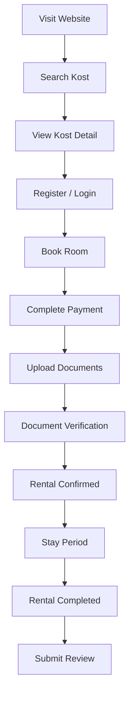

**Admin Journey**

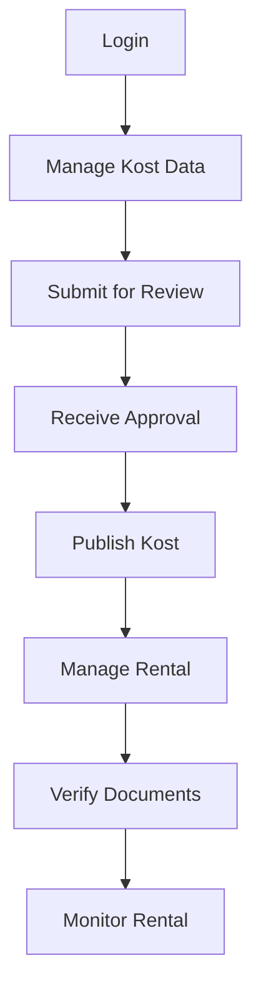

**Super Admin Journey**

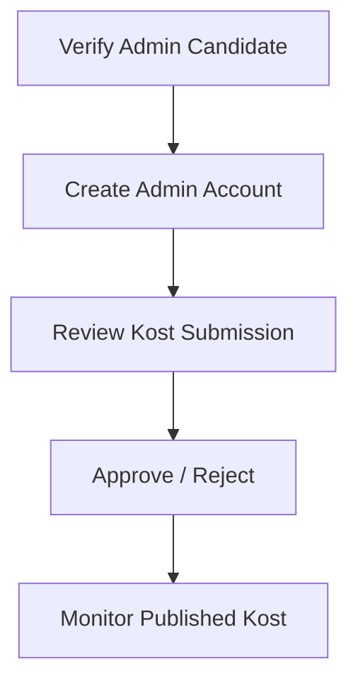

### 2\.5 User Pain Points

| Role | Pain Points |
| --- | --- |
| Tenant | Sulit menemukan informasi kost yang lengkap dan terpercaya, serta kurang mengetahui perkembangan status penyewaan\. |
| Admin | Pengelolaan data operasional masih tersebar dan membutuhkan banyak proses administratif\. |
| Super Admin | Sulit menjaga konsistensi kualitas data apabila tidak terdapat proses review sebelum publikasi\. |

### 2\.6 User Expectations

| Role | Expectations |
| --- | --- |
| Tenant | Proses pencarian, pemesanan, pembayaran, dan penyewaan berlangsung sederhana, transparan, dan mudah dipantau\. |
| Admin | Seluruh operasional kost dapat dikelola melalui satu sistem yang terintegrasi dan efisien\. |
| Super Admin | Memiliki mekanisme yang sederhana untuk memverifikasi akun Admin dan melakukan review publikasi kost sebelum dipublikasikan\. |

## 3\. System Interaction

### 3\.1 Purpose

Bagian ini mendefinisikan bagaimana setiap aktor berinteraksi dengan SewaKost melalui sekumpulan business capability yang disediakan sistem\. Setiap capability merepresentasikan nilai bisnis yang dapat dicapai oleh pengguna\.

Hasil pada bab ini menjadi dasar penyusunan Functional Requirements, Acceptance Criteria, desain sistem, serta Requirement Traceability Matrix\.

### 3\.2 Actor Definition

SewaKost memiliki tiga aktor utama yang berinteraksi langsung dengan sistem\. Setiap aktor memperoleh hak akses berdasarkan mekanisme **Role\-Based Access Control \(RBAC\)**\.

Tenant

| Item | Description |
| --- | --- |
| Actor ID | ACT\-001 |
| Role | Tenant |
| Description | Pengguna yang mencari kost, melakukan penyewaan, menyelesaikan pembayaran, mengunggah dokumen administrasi, serta memberikan ulasan setelah masa sewa selesai\. |
| Authentication | Required \(kecuali eksplorasi marketplace\) |
| Primary Capabilities | Marketplace, Rental, Payment, Review |

**Admin**

| Item | Description |
| --- | --- |
| Actor ID | ACT\-002 |
| Role | Admin |
| Description | Pengelola operasional kost yang bertanggung jawab mengelola data kost, kamar, harga sewa, penyewaan, serta verifikasi dokumen penyewa\. |
| Authentication | Required |
| Primary Capabilities | Kost Management, Rental Management, Document Verification |

**Super Admin**

| Item | Description |
| --- | --- |
| Actor ID | ACT\-003 |
| Role | Super Admin |
| Description | Administrator sistem yang bertanggung jawab membuat akun Admin, melakukan review pengajuan kost, serta menjaga kualitas data yang dipublikasikan\. |
| Authentication | Required |
| Primary Capabilities | Administration, Kost Review |

### 3\.3 Business Capability Overview

Business Capability menggambarkan kemampuan utama yang disediakan sistem untuk memenuhi kebutuhan bisnis\. Setiap capability dapat mencakup beberapa entitas pada ERD dan terdiri atas satu atau lebih Use Case dan disusun berdasarkan domain bisnis dan lifecycle proses\.

| Capability ID | Business Capability | Primary Actor | Related Domain |
| --- | --- | --- | --- |
| BC\-001 | Identity &amp; Account | Tenant, Admin, Super Admin | User |
| BC\-002 | Kost Publication | Admin, Super Admin | Kost |
| BC\-003 | Kost Configuration | Admin | Kost |
| BC\-004 | Room Inventory Management | Admin | Room |
| BC\-005 | Marketplace Exploration | Tenant | Marketplace |
| BC\-006 | Rental Lifecycle Management | Tenant, Admin | Rental |
| BC\-007 | Review Management | Tenant | Review |
| BC\-008 | Administration | Super Admin | Administration |

### 3\.4 Business Capability Catalog

| ID | Business Capability | Objective | Related Domain Entities | Included Use Cases |
| --- | --- | --- | --- | --- |
| BC\-001 | Identity &amp; Account | Mengelola identitas pengguna dan proses autentikasi sebelum pengguna mengakses sistem sesuai hak aksesnya\. | Users | UC\-001 Authenticate User UC\-002 Manage User Profile |
| BC\-002 | Kost Publication | Mengelola lifecycle publikasi kost mulai dari pembuatan draft, proses verifikasi, publikasi, pengelolaan status operasional, hingga penghentian permanen kemitraan oleh Super Admin\. | Kosts | UC\-003 Create Kost Draft UC\-004 Submit Kost for Review UC\-005 Review Kost Submission UC\-006 Publish Kost UC\-007 Change Kost Status |
| BC\-003 | Kost Configuration | Mengelola konfigurasi Kost, termasuk informasi, kategori, serta content template berupa Facility Scheme dan Rule Scheme yang dapat diterapkan pada Kost maupun Room Type\. | Kosts, Addresses, Kost Images, Categories, Facilities, Rules, Facility Schemes, Rule Schemes | UC\-008 Configure Kost Information UC\-009 Configure Kost Categories UC\-010 Configure Facility Scheme UC\-011 Configure Rule Scheme |
| BC\-004 | Room Inventory Management | Mengelola tipe kamar, kamar, harga sewa, serta konfigurasi operasional yang berkaitan dengan inventaris kamar\. | Room Types, Rooms, Price Schemes | UC\-012 Configure Room Types UC\-013 Configure Rental Pricing UC\-014 Manage Room Inventory |
| BC\-005 | Marketplace Exploration | Memungkinkan calon penyewa menemukan kost yang sesuai berdasarkan informasi yang dipublikasikan\. | Kosts, Room Types, Price Schemes, Reviews | UC\-015 Browse Marketplace UC\-016 Search &amp; Filter Kost UC\-017 View Kost Detail |
| BC\-006 | Rental Lifecycle Management | Mengelola seluruh proses penyewaan mulai dari pemesanan hingga penyewaan selesai\. | Rentals, Rental Documents, Payments, Rental Status Histories | UC\-018 Create Rental UC\-019 Complete Payment UC\-020 Submit Rental Documents UC\-021 Verify Rental Documents UC\-022 Monitor Rental UC\-023 Complete Rental |
| BC\-007 | Review Management | Memungkinkan penyewa memberikan penilaian terhadap kost dan kamar setelah masa sewa selesai\. | Kost Reviews, Room Reviews, Review Images | UC\-024 Submit Kost Review UC\-025 Submit Room Review |
| BC\-008 | Administration | Mengelola akun Admin serta menjaga kualitas data yang dipublikasikan melalui proses administrasi sistem\. | Users | UC\-026 Create Admin Account UC\-027 Manage Admin Account |

**BC\-002 — Kost Publication Lifecycle**

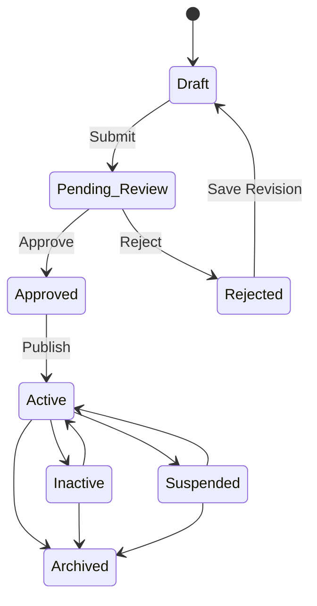

- **Inactive** merupakan status operasional yang sepenuhnya dikelola oleh **Admin**\. Kost dapat diaktifkan maupun dinonaktifkan kembali sesuai kebutuhan operasional\.
- **Suspended** merupakan status tata kelola \(*governance*\) yang hanya dapat ditetapkan maupun dicabut oleh **Super Admin**, misalnya akibat pelanggaran kebijakan atau proses investigasi\.
- **Archived** merupakan status permanen yang menandai berakhirnya hubungan kemitraan antara pengelola kost dan platform\. Kost tetap dipertahankan sebagai data historis, namun tidak dapat dipublikasikan kembali ataupun dikembalikan ke status operasional lainnya\.

**BC\-006 — Rental Lifecycle**

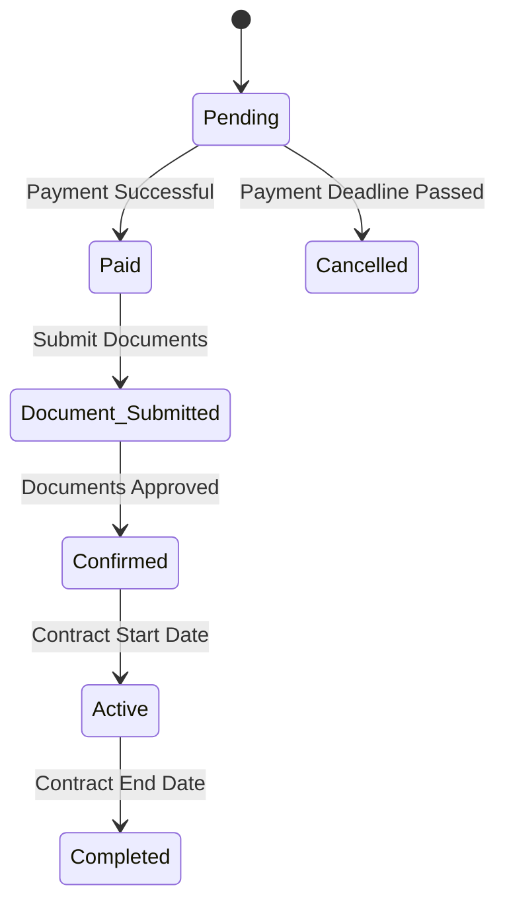

### 3\.5 Use Case Model

**3\.5\.1 Use Case Inventory**

| UC ID | Use Case | Primary Actor | Supporting Actor | Business Capability |
| --- | --- | --- | --- | --- |
| UC\-001 | Authenticate User | User | Email Service | BC\-001 Identity &amp; Account |
| UC\-002 | Manage User Profile | User | — | BC\-001 Identity &amp; Account |
| UC\-003 | Create Kost Draft | Admin | — | BC\-002 Kost Publication |
| UC\-004 | Submit Kost for Review | Admin | — | BC\-002 Kost Publication |
| UC\-005 | Review Kost Submission | Super Admin | — | BC\-002 Kost Publication |
| UC\-006 | Publish Kost | Admin | — | BC\-002 Kost Publication |
| UC\-007 | Change Kost Status | Admin / Super Admin | — | BC\-002 Kost Publication |
| UC\-008 | Configure Kost Information | Admin | — | BC\-003 Kost Configuration |
| UC\-009 | Configure Kost Categories | Super Admin | — | BC\-003 Kost Configuration |
| UC\-010 | Configure Facility Scheme | Admin | — | BC\-003 Kost Configuration |
| UC\-011 | Configure Rule Scheme | Admin | — | BC\-003 Kost Configuration |
| UC\-012 | Configure Room Types | Admin | — | BC\-004 Room Inventory Management |
| UC\-013 | Configure Rental Pricing | Admin | — | BC\-004 Room Inventory Management |
| UC\-014 | Manage Room Inventory | Admin | — | BC\-004 Room Inventory Management |
| UC\-015 | Browse Marketplace | Tenant | — | BC\-005 Marketplace Exploration |
| UC\-016 | Search &amp; Filter Kost | Tenant | — | BC\-005 Marketplace Exploration |
| UC\-017 | View Kost Detail | Tenant | — | BC\-005 Marketplace Exploration |
| UC\-018 | Create Rental | Tenant | — | BC\-006 Rental Lifecycle Management |
| UC\-019 | Complete Payment | Tenant | Midtrans Payment Gateway | BC\-006 Rental Lifecycle Management |
| UC\-020 | Submit Rental Documents | Tenant | — | BC\-006 Rental Lifecycle Management |
| UC\-021 | Verify Rental Documents | Admin | Email Service | BC\-006 Rental Lifecycle Management |
| UC\-022 | Monitor Rental | Tenant, Admin | — | BC\-006 Rental Lifecycle Management |
| UC\-023 | Complete Rental | System | — | BC\-006 Rental Lifecycle Management |
| UC\-024 | Submit Kost Review | Tenant | — | BC\-007 Review Management |
| UC\-025 | Submit Room Review | Tenant | — | BC\-007 Review Management |
| UC\-026 | Create Admin Account | Super Admin | Email Service | BC\-008 Administration |
| UC\-027 | Manage Admin Account | Super Admin | Email Service | BC\-008 Administration |

**3\.5\.2 Actor Responsibility Matrix**

**Actor Definitions**

| Actor | Description |
| --- | --- |
| User | Aktor umum \(generalized actor\) yang merepresentasikan seluruh pengguna terautentikasi dalam sistem\. Diturunkan menjadi Tenant, Admin, dan Super Admin\. |
| Tenant | Pengguna yang menggunakan marketplace untuk mencari kost, melakukan penyewaan, pembayaran, serta memberikan ulasan\. |
| Admin | Pengelola kost yang bertanggung jawab mengelola data kost, kamar, konfigurasi operasional, serta proses administrasi penyewaan\. |
| Super Admin | Pengelola platform yang bertanggung jawab terhadap tata kelola sistem, verifikasi publikasi kost, serta pengelolaan akun Admin\. |
| System | Aktor internal yang menjalankan proses otomatis berdasarkan aturan bisnis tanpa interaksi langsung dari pengguna\. |
| Email Service | Sistem eksternal yang mengirimkan email verifikasi maupun notifikasi sistem\. |
| Midtrans Payment Gateway | Sistem eksternal yang memproses transaksi pembayaran penyewaan\. |

**Actor Responsibility Matrix**

| Use Case | User | Tenant | Admin | Super Admin | System | Email Service | Midtrans |
| --- | --- | --- | --- | --- | --- | --- | --- |
| UC\-001 Authenticate User | ✓ | ✓ | ✓ | ✓ |  | ✓ |  |
| UC\-002 Manage User Profile | ✓ | ✓ | ✓ | ✓ |  |  |  |
| UC\-003 Create Kost Draft |  |  | ✓ |  |  |  |  |
| UC\-004 Submit Kost for Review |  |  | ✓ |  |  |  |  |
| UC\-005 Review Kost Submission |  |  |  | ✓ |  |  |  |
| UC\-006 Publish Kost |  |  | ✓ |  |  |  |  |
| UC\-007 Change Kost Status |  |  | ✓ | ✓ |  |  |  |
| UC\-008 Configure Kost Information |  |  | ✓ |  |  |  |  |
| UC\-009 Configure Kost Categories |  |  |  | ✓ |  |  |  |
| UC\-010 Configure Facility Scheme |  |  | ✓ |  |  |  |  |
| UC\-011 Configure Rule Scheme |  |  | ✓ |  |  |  |  |
| UC\-012 Configure Room Types |  |  | ✓ |  |  |  |  |
| UC\-013 Configure Rental Pricing |  |  | ✓ |  |  |  |  |
| UC\-014 Manage Room Inventory |  |  | ✓ |  |  |  |  |
| UC\-015 Browse Marketplace |  | ✓ |  |  |  |  |  |
| UC\-016 Search &amp; Filter Kost |  | ✓ |  |  |  |  |  |
| UC\-017 View Kost Detail |  | ✓ |  |  |  |  |  |
| UC\-018 Create Rental |  | ✓ |  |  |  |  |  |
| UC\-019 Complete Payment |  | ✓ |  |  |  |  | ✓ |
| UC\-020 Submit Rental Documents |  | ✓ |  |  |  |  |  |
| UC\-021 Verify Rental Documents |  |  | ✓ |  |  | ✓ |  |
| UC\-022 Monitor Rental |  | ✓ | ✓ |  |  |  |  |
| UC\-023 Complete Rental |  |  |  |  | ✓ |  |  |
| UC\-024 Submit Kost Review |  | ✓ |  |  |  |  |  |
| UC\-025 Submit Room Review |  | ✓ |  |  |  |  |  |
| UC\-026 Create Admin Account |  |  |  | ✓ |  | ✓ |  |
| UC\-027 Manage Admin Account |  |  |  | ✓ |  | ✓ |  |

**3\.5\.3 Use Case Relationship Analysis**

Menganalisis seluruh hubungan antara **Actor** dan **Business Use Case** sebelum divisualisasikan dalam Use Case Diagram\. Analisis dilakukan pada level Business Capability sehingga relasi yang dimasukkan harus memiliki makna bisnis dan tidak sekadar merepresentasikan urutan teknis sistem\.

**Relationship yang dianalisis**

- **Association** — hubungan interaksi antara Actor dan Use Case\.
- **`&amp;lt;&amp;lt;include&amp;gt;&amp;gt;`** — perilaku wajib yang digunakan kembali oleh Use Case lain\.
- **`&amp;lt;&amp;lt;extend&amp;gt;&amp;gt;`** — perilaku opsional atau kondisional yang memperluas Use Case dasar\.
- **Actor Generalization** — pewarisan hubungan dan tanggung jawab dari generalized actor kepada specialized actor\.

**Validation Rules**

- Setiap Use Case memiliki hubungan dengan **Primary Actor**\.
- Supporting Actor hanya dihubungkan apabila benar\-benar berpartisipasi dalam Use Case\.
- `&amp;lt;&amp;lt;include&amp;gt;&amp;gt;` hanya digunakan apabila perilaku target **selalu diperlukan** oleh source Use Case\.
- `&amp;lt;&amp;lt;extend&amp;gt;&amp;gt;` hanya digunakan apabila perilaku target **bersifat opsional atau kondisional**\.
- Actor Generalization digunakan untuk merepresentasikan spesialisasi aktor yang telah disepakati\.
- Tidak terdapat relasi yang hanya dibuat untuk menunjukkan urutan proses\.
- Tidak terdapat relasi yang redundan\.
- Tidak membuat Use Case baru hanya untuk merepresentasikan langkah internal yang belum mencapai abstraksi Business Capability\.

**Use Case Relationship Matrix**

Berdasarkan abstraksi Business Capability yang telah ditetapkan, belum terdapat hubungan &lt;&lt;include&gt;&gt; atau &lt;&lt;extend&gt;&gt; yang cukup kuat untuk dimodelkan tanpa menurunkan Use Case ke level proses/operasi sistem\.

**3\.5\.4 Overall Use Case Diagram**

```plantuml
@startuml
left to right direction

skinparam packageStyle rectangle

actor User
actor Tenant
actor Admin
actor "Super Admin" as SuperAdmin
actor System
actor "Email Service" as Email
actor "Midtrans Payment Gateway" as Midtrans

User <|-- Tenant
User <|-- Admin
User <|-- SuperAdmin

rectangle "SewaKost Web Application" {

    package "BC-001 Identity & Account" {
        usecase "UC-001\nAuthenticate User" as UC001
        usecase "UC-002\nManage User Profile" as UC002
    }

    package "BC-002 Kost Publication" {
        usecase "UC-003\nCreate Kost Draft" as UC003
        usecase "UC-004\nSubmit Kost for Review" as UC004
        usecase "UC-005\nReview Kost Submission" as UC005
        usecase "UC-006\nPublish Kost" as UC006
        usecase "UC-007\nChange Kost Status" as UC007
    }

    package "BC-003 Kost Configuration" {
        usecase "UC-008\nConfigure Kost Information" as UC008
        usecase "UC-009\nConfigure Kost Categories" as UC009
        usecase "UC-010\nConfigure Facility Scheme" as UC010
        usecase "UC-011\nConfigure Rule Scheme" as UC011
    }

    package "BC-004 Room Inventory Management" {
        usecase "UC-012\nConfigure Room Types" as UC012
        usecase "UC-013\nConfigure Rental Pricing" as UC013
        usecase "UC-014\nManage Room Inventory" as UC014
    }

    package "BC-005 Marketplace Exploration" {
        usecase "UC-015\nBrowse Marketplace" as UC015
        usecase "UC-016\nSearch & Filter Kost" as UC016
        usecase "UC-017\nView Kost Detail" as UC017
    }

    package "BC-006 Rental Lifecycle Management" {
        usecase "UC-018\nCreate Rental" as UC018
        usecase "UC-019\nComplete Payment" as UC019
        usecase "UC-020\nSubmit Rental Documents" as UC020
        usecase "UC-021\nVerify Rental Documents" as UC021
        usecase "UC-022\nMonitor Rental" as UC022
        usecase "UC-023\nComplete Rental" as UC023
    }

    package "BC-007 Review Management" {
        usecase "UC-024\nSubmit Kost Review" as UC024
        usecase "UC-025\nSubmit Room Review" as UC025
    }

    package "BC-008 Administration" {
        usecase "UC-026\nCreate Admin Account" as UC026
        usecase "UC-027\nManage Admin Account" as UC027
    }
}

User --> UC001
User --> UC002

Admin --> UC003
Admin --> UC004
SuperAdmin --> UC005
Admin --> UC006
Admin --> UC007
SuperAdmin --> UC007

Admin --> UC008
SuperAdmin --> UC009
Admin --> UC010
Admin --> UC011

Admin --> UC012
Admin --> UC013
Admin --> UC014

Tenant --> UC015
Tenant --> UC016
Tenant --> UC017

Tenant --> UC018
Tenant --> UC019
Tenant --> UC020
Admin --> UC021
Tenant --> UC022
Admin --> UC022
System --> UC023

Tenant --> UC024
Tenant --> UC025

SuperAdmin --> UC026
SuperAdmin --> UC027

Email --> UC001
Midtrans --> UC019
Email --> UC021
Email --> UC026
Email --> UC027

@enduml
```

**3\.5\.5 Capability\-Centered Use Case Diagrams**

**BC\-001 Identity &amp; Account**

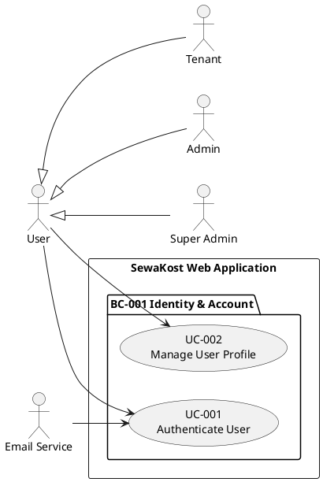

**BC\-002 Kost Publication**

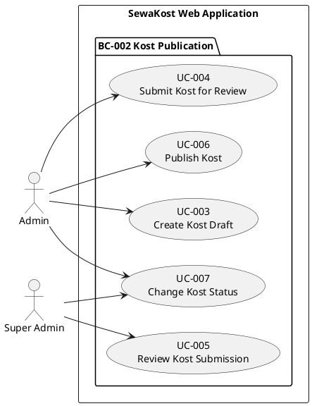

**BC\-003 Kost Configuration**

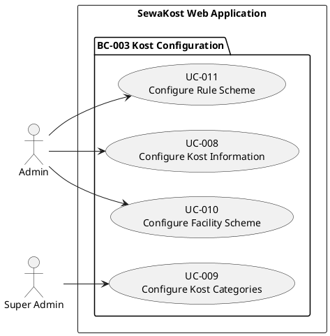

**BC\-004 Room Inventory Management**

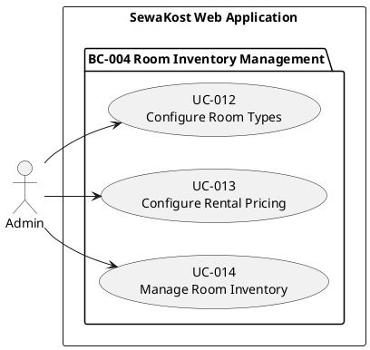

**BC\-005 Marketplace Exploration**

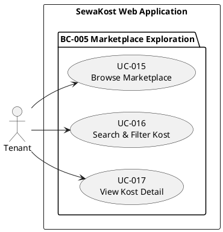

**BC\-006 Rental Lifecycle Management**

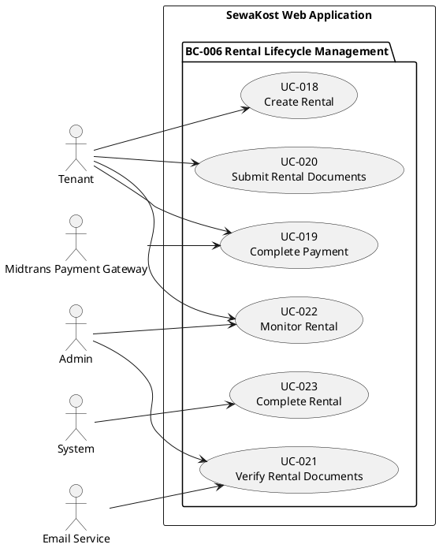

**BC\-007 Review Management**

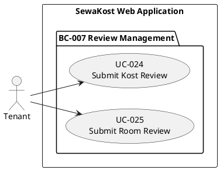

**BC\-008 Administration**

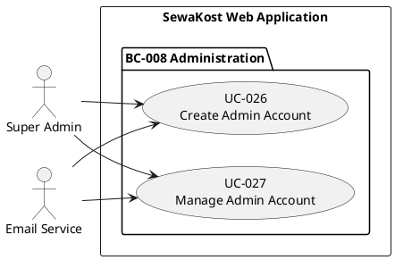

### 3\.6 Use Case Specification

Setiap Use Case pada bagian ini akan didokumentasikan menggunakan format yang konsisten sehingga dapat ditelusuri langsung ke Functional Requirements, Acceptance Criteria, dan Test Case\.

**Use Case Template**

| Field | Description |
| --- | --- |
| Use Case ID | Identitas unik use case \(UC\-xxx\)\. |
| Use Case Name | Nama business capability yang dijalankan\. |
| Business Capability | Capability induk tempat use case berada\. |
| Primary Actor | Aktor utama yang menjalankan proses\. |
| Supporting Actor | Aktor lain yang terlibat \(jika ada\)\. |
| Goal | Tujuan bisnis yang ingin dicapai aktor\. |
| Trigger | Kondisi yang memulai proses\. |
| Preconditions | Kondisi yang harus dipenuhi sebelum proses dijalankan\. |
| Postconditions | Kondisi sistem setelah proses selesai\. |
| Main Flow | Alur utama proses bisnis\. |
| Alternative Flow | Alur alternatif yang masih menghasilkan tujuan bisnis\. |
| Exception Flow | Penanganan ketika terjadi kegagalan proses\. |
| Related Requirements | Functional Requirement yang merealisasikan use case tersebut\. |

**BC\-001 Identity &amp; Account**

| Use Case ID | Use Case Name | Business Capability | Primary Actor | Supporting Actor | Goal | Trigger | Preconditions | Postconditions | Main Flow | Alternative Flow | Exception Flow | Related Requirements |
| --- | --- | --- | --- | --- | --- | --- | --- | --- | --- | --- | --- | --- |
| UC\-001 | Authenticate User | BC\-001 Identity &amp; Account | User | Email Service | Memungkinkan User menjalani lifecycle autentikasi dan memperoleh, mempertahankan, serta mengakhiri akses sistem sesuai identitas dan role\. | User melakukan login, verifikasi email, meminta pengiriman ulang verifikasi, atau logout\. | 1\. User memiliki akun\. 2\. Kredensial tersedia untuk autentikasi\. | 1\. User terautentikasi dan memperoleh akses sesuai role; atau 2\. identitas/email berhasil diverifikasi; atau 3\. sesi akses User berakhir setelah logout\. | 1\. User memasukkan kredensial\. 2\. Sistem memvalidasi kredensial\. 3\. Sistem mengautentikasi User\. 4\. Sistem menerapkan akses berdasarkan role\. 5\. Jika verifikasi email diperlukan, sistem mengirim email melalui Email Service\. 6\. User melakukan verifikasi\. 7\. Sistem memperbarui status verifikasi\. 8\. Selama sesi aktif, User mengakses fungsi sesuai hak akses\. 9\. User memilih logout\. 10\. Sistem mengakhiri sesi akses User\. | A1 — Email belum terverifikasi: sistem mengarahkan User ke proses verifikasi\. A2 — Pengiriman ulang: User meminta email verifikasi baru → sistem mengirim ulang email\. | E1: Kredensial tidak valid → autentikasi ditolak\. E2: Akun tidak dapat digunakan → autentikasi ditolak\. E3: Verifikasi tidak valid → status verifikasi tidak diperbarui\. E4: User mengakses fungsi di luar role → akses ditolak\. | FR\-IA\-001–007, FR\-IA\-012–013; BR\-ID\-001, BR\-ID\-003–006 |
| UC\-002 | Manage User Profile | BC\-001 Identity &amp; Account | User | — | Memungkinkan User mengelola informasi profil dan akun miliknya\. | User membuka profil atau memilih operasi pengelolaan akun\. | 1\. User telah terautentikasi\. 2\. User mengakses profil miliknya sendiri\. | Perubahan profil yang valid tersimpan atau proses account deletion diterapkan sesuai ketentuan\. | 1\. User membuka profil\. 2\. Sistem menampilkan informasi profil\. 3\. User memilih data yang akan diperbarui atau account deletion\. 4\. Sistem memvalidasi perubahan\. 5\. Sistem menyimpan perubahan yang valid\. 6\. Jika deletion dipilih dan memenuhi ketentuan, sistem menerapkan deletion\. 7\. Data historis yang diperlukan tetap dipertahankan\. | A1: User hanya melihat profil tanpa melakukan perubahan\. A2: User memperbarui sebagian informasi yang diperbolehkan\. | E1: Data tidak valid → perubahan ditolak\. E2: User mencoba mengakses profil pengguna lain → ditolak\. E3: Account deletion tidak memenuhi kondisi → ditolak\. | FR\-IA\-008–013; FR\-CC\-002, FR\-CC\-007, FR\-CC\-010; BR\-ID\-006 |

**BC\-002 Kost Publication**

| Use Case ID | Use Case Name | Business Capability | Primary Actor | Supporting Actor | Goal | Trigger | Preconditions | Postconditions | Main Flow | Alternative Flow | Exception Flow | Related Requirements |
| --- | --- | --- | --- | --- | --- | --- | --- | --- | --- | --- | --- | --- |
| UC\-003 | Create Kost Draft | BC\-002 Kost Publication | Admin | — | Membuat atau memperbarui data Kost dalam tahap Draft agar siap diajukan untuk review\. | Admin memilih membuat Kost baru atau mengelola Kost yang berada dalam Draft/Rejected\. | 1\. Admin terautentikasi\. 2\. Admin memiliki kewenangan mengelola Kost\. | Data Kost tersimpan sebagai Draft dan dapat dilanjutkan ke proses pengajuan\. | 1\. Admin memilih pembuatan/pengelolaan Draft\. 2\. Sistem menampilkan data Kost\. 3\. Admin memasukkan atau memperbarui informasi Kost\. 4\. Sistem memvalidasi data\. 5\. Admin menyimpan perubahan\. 6\. Sistem menyimpan Kost sebagai Draft\. | A1 — Rejected: Admin membuka Kost Rejected → melakukan revisi → menyimpan perubahan → status berubah menjadi Draft\. | E1: Data tidak valid/tidak lengkap → sistem menolak penyimpanan Draft dan meminta Admin memperbaiki data\. E2: Admin tidak memiliki kewenangan → operasi ditolak\. | FR\-KP\-001, FR\-KP\-002, FR\-KP\-008; BR\-KP\-001, BR\-KP\-004 |
| UC\-004 | Submit Kost for Review | BC\-002 Kost Publication | Admin | — | Mengajukan Kost Draft untuk memperoleh keputusan review publikasi\. | Admin memilih mengajukan Kost Draft untuk review\. | 1\. Admin terautentikasi\. 2\. Kost berstatus Draft\. 3\. Data wajib untuk review telah terpenuhi\. | Kost berubah menjadi Pending Review dan tersedia untuk direview Super Admin\. | 1\. Admin memilih Kost Draft\. 2\. Sistem memeriksa kelengkapan data wajib\. 3\. Sistem memvalidasi pengajuan\. 4\. Sistem mengubah status menjadi Pending Review\. 5\. Sistem mencatat pengajuan\. | A1 — Re\-submit: Draft hasil revisi Rejected dapat diajukan kembali dengan alur yang sama\. | E1: Data wajib belum terpenuhi → pengajuan ditolak\. E2: Status Kost bukan Draft → pengajuan ditolak\. | FR\-KP\-003, FR\-KP\-004, FR\-KP\-009; BR\-KP\-002, BR\-KP\-004 |
| UC\-005 | Review Kost Submission | BC\-002 Kost Publication | Super Admin | — | Menilai pengajuan Kost dan menghasilkan keputusan publikasi yang eksplisit\. | Terdapat Kost berstatus Pending Review yang siap ditinjau\. | 1\. Super Admin terautentikasi\. 2\. Kost berstatus Pending Review\. | Kost memperoleh status Approved atau Rejected\. Jika Rejected, alasan penolakan tersimpan dan Kost menunggu revisi Admin\. | 1\. Super Admin membuka submission\. 2\. Sistem menampilkan informasi Kost yang diperlukan untuk review\. 3\. Super Admin mengevaluasi submission\. 4\. Super Admin memilih keputusan\. 5\. Sistem mengubah status menjadi Approved atau Rejected\. 6\. Jika Rejected, sistem menyimpan alasan penolakan\. | A1 — Reject: Super Admin memilih Rejected → alasan penolakan dicatat → Kost tetap Rejected sampai Admin menyimpan revisi\. | E1: Kost bukan Pending Review → review tidak dapat dilakukan\. E2: Keputusan tidak lengkap → review tidak dapat diselesaikan\. | FR\-KP\-005, FR\-KP\-006, FR\-KP\-007, FR\-KP\-008; BR\-KP\-003, BR\-KP\-004 |
| UC\-006 | Publish Kost | BC\-002 Kost Publication | Admin | — | Mempublikasikan Kost yang telah memperoleh persetujuan review sehingga dapat tersedia di marketplace\. | Admin memilih Kost Approved untuk dipublikasikan\. | 1\. Admin terautentikasi\. 2\. Kost berstatus Approved\. 3\. Kost telah memenuhi persyaratan publikasi\. | Kost berubah menjadi Active dan tersedia di marketplace sesuai kondisi publikasi\. | 1\. Admin memilih Kost Approved\. 2\. Sistem memeriksa status dan kondisi publikasi\. 3\. Admin mengonfirmasi publikasi\. 4\. Sistem mengubah status menjadi Active\. 5\. Sistem menjadikan Kost tersedia di marketplace\. | — | E1: Kost bukan Approved → publikasi ditolak\. | FR\-KP\-010; BR\-KP\-005, BR\-KP\-006 |
| UC\-007 | Change Kost Status | BC\-002 Kost Publication | Admin / Super Admin | — | Mengelola status operasional dan governance Kost sesuai kewenangan masing\-masing tanpa memperlakukan status tersebut sebagai penghapusan data\. | Admin atau Super Admin memilih perubahan status Kost sesuai kewenangannya\. | 1\. Aktor terautentikasi\. 2\. Kost berada pada status yang memungkinkan transisi\. 3\. Aktor memiliki kewenangan atas transisi yang dipilih\. | Status Kost berubah sesuai workflow yang valid; Archived menjadi kondisi terminal dan tetap dipertahankan sebagai histori\. | 1\. Aktor memilih Kost dan perubahan status\. 2\. Sistem memeriksa status saat ini\. 3\. Sistem memeriksa kewenangan aktor\. 4\. Sistem memvalidasi transisi\. 5\. Sistem menerapkan status baru\. 6\. Sistem mempertahankan data Kost sesuai lifecycle\. | A1 — Inactive: Admin mengubah Active menjadi Inactive atau Inactive menjadi Active\. A2 — Suspended: Super Admin menetapkan Suspended atau mencabutnya kembali ke Active\. A3 — Archived: Super Admin memilih Kost berstatus Active, Inactive, atau Suspended yang hubungan kemitraannya telah berakhir → sistem menetapkan Archived\. Kost tidak dapat kembali ke status operasional maupun dipublikasikan kembali, tetapi datanya tetap dipertahankan sebagai histori\. | E1: Aktor tidak berwenang → perubahan ditolak\. E2: Transisi tidak sesuai workflow → perubahan ditolak\. | FR\-KP\-011–015; BR\-KP\-007–011 |

**BC\-003 — Kost Configuration**

| Use Case ID | Use Case Name | Business Capability | Primary Actor | Supporting Actor | Goal | Trigger | Preconditions | Postconditions | Main Flow | Alternative Flow | Exception Flow | Related Requirements |
| --- | --- | --- | --- | --- | --- | --- | --- | --- | --- | --- | --- | --- |
| UC\-008 | Configure Kost Information | BC\-003 Kost Configuration | Admin | — | Mengelola informasi utama Kost, alamat, dan gambar agar informasi Kost lengkap dan dapat digunakan dalam proses publikasi maupun marketplace\. | Admin memilih untuk membuat atau memperbarui informasi Kost\. | 1\. Admin terautentikasi\. 2\. Admin memiliki kewenangan terhadap Kost yang dikelola\. | Informasi Kost yang valid tersimpan dan tersedia bagi proses bisnis berikutnya\. | 1\. Admin membuka konfigurasi informasi Kost\. 2\. Sistem menampilkan informasi yang tersedia\. 3\. Admin memasukkan atau memperbarui informasi Kost, alamat, dan gambar\. 4\. Sistem memvalidasi data\. 5\. Admin menyimpan perubahan\. 6\. Sistem menyimpan informasi yang valid\. | — | E1: Data tidak valid → perubahan ditolak\. E2: Admin tidak memiliki kewenangan → operasi ditolak\. | FR\-KC\-001, FR\-KC\-002, FR\-KC\-003, FR\-KC\-004; BR\-KC\-001 |
| UC\-009 | Configure Kost Categories | BC\-003 Kost Configuration | Admin | — | Mengonfigurasi kategori Kost berdasarkan kategori yang telah distandarisasi oleh Super Admin\. | Admin memilih kategori untuk Kost\. | 1\. Admin terautentikasi\. 2\. Admin memiliki kewenangan terhadap Kost\. 3\. Kategori tersedia dalam daftar yang dikelola Super Admin\. | Kategori yang dipilih tersimpan sebagai kategori Kost\. | 1\. Admin membuka konfigurasi kategori\. 2\. Sistem menampilkan kategori yang tersedia\. 3\. Admin memilih satu atau beberapa kategori\. 4\. Sistem memvalidasi pilihan\. 5\. Sistem menyimpan konfigurasi kategori\. | A1: Admin mengubah pilihan kategori yang sebelumnya telah dikonfigurasi\. | E1: Kategori tidak tersedia/invalid → pilihan ditolak\. E2: Admin mencoba membuat atau mengubah definisi kategori → operasi ditolak\. | FR\-KC\-005, FR\-KC\-006; BR\-KC\-002, BR\-KC\-003 |
| UC\-010 | Configure Facility Scheme | BC\-003 Kost Configuration | Admin | — | Membuat dan mengelola Facility Item serta Facility Scheme sebagai reusable content template yang dapat diterapkan pada Kost maupun Room Type\. | Admin memilih untuk mengelola Facility Item, membentuk Facility Scheme, atau menerapkan Facility Scheme\. | 1\. Admin terautentikasi\. 2\. Admin memiliki kewenangan terhadap target Kost/Room Type\. | Facility Item tersimpan dan dapat digunakan dalam Scheme; Facility Scheme tersimpan dan dapat diterapkan pada Kost atau Room Type\. | 1\. Admin membuka konfigurasi fasilitas\. 2\. Admin membuat atau memilih Facility Item\. 3\. Sistem memvalidasi dan menyimpan Facility Item\. 4\. Admin memilih Facility Item untuk membentuk atau memperbarui Facility Scheme\. 5\. Sistem menyimpan Scheme beserta item yang dipilih\. 6\. Admin memilih target penerapan, yaitu Kost atau Room Type\. 7\. Sistem memvalidasi target dan kewenangan\. 8\. Sistem menyimpan penerapan Facility Scheme\. | A1: Facility Scheme diterapkan pada Kost\. A2: Facility Scheme diterapkan pada Room Type dalam Kost yang sama\. A3: Admin memperbarui komposisi Scheme dengan menambah atau menghapus Facility Item\. | E1: Target bukan bagian dari Kost yang dikelola → operasi ditolak\. E2: Facility Item atau Scheme tidak valid/tersedia → operasi ditolak\. | FR\-KC\-007, FR\-KC\-008, FR\-KC\-009; BR\-KC\-004, BR\-KC\-005, BR\-KC\-006 |
| UC\-011 | Configure Rule Scheme | BC\-003 Kost Configuration | Admin | — | Membuat dan mengelola Rule Item serta Rule Scheme sebagai reusable content template yang dapat diterapkan pada Kost maupun Room Type\. | Admin memilih untuk mengelola Rule Item, membentuk Rule Scheme, atau menerapkan Rule Scheme\. | 1\. Admin terautentikasi\. 2\. Admin memiliki kewenangan terhadap target Kost/Room Type\. | Rule Item tersimpan dan dapat digunakan dalam Scheme; Rule Scheme tersimpan dan dapat diterapkan pada Kost atau Room Type\. | 1\. Admin membuka konfigurasi peraturan\. 2\. Admin membuat atau memilih Rule Item\. 3\. Sistem memvalidasi dan menyimpan Rule Item\. 4\. Admin memilih Rule Item untuk membentuk atau memperbarui Rule Scheme\. 5\. Sistem menyimpan Scheme beserta item yang dipilih\. 6\. Admin memilih target penerapan, yaitu Kost atau Room Type\. 7\. Sistem memvalidasi target dan kewenangan\. 8\. Sistem menyimpan penerapan Rule Scheme\. | A1: Rule Scheme diterapkan pada Kost\. A2: Rule Scheme diterapkan pada Room Type dalam Kost yang sama\. A3: Admin memperbarui komposisi Scheme dengan menambah atau menghapus Rule Item\. | E1: Target bukan bagian dari Kost yang dikelola → operasi ditolak\. E2: Rule Item atau Scheme tidak valid/tersedia → operasi ditolak\. | FR\-KC\-010, FR\-KC\-011, FR\-KC\-012; BR\-KC\-007, BR\-KC\-008, BR\-KC\-009 |

**BC\-004 — Room Inventory Management**

| Use Case ID | Use Case Name | Business Capability | Primary Actor | Supporting Actor | Goal | Trigger | Preconditions | Postconditions | Main Flow | Alternative Flow | Exception Flow | Related Requirements |
| --- | --- | --- | --- | --- | --- | --- | --- | --- | --- | --- | --- | --- |
| UC\-012 | Configure Room Types | BC\-004 Room Inventory Management | Admin | — | Mengelola Room Type beserta informasi, gambar, dan konfigurasi fasilitas/peraturan yang diperlukan untuk operasional dan marketplace\. | Admin memilih untuk membuat atau memperbarui Room Type\. | 1\. Admin terautentikasi\. 2\. Admin memiliki kewenangan terhadap Kost\. 3\. Room Type terkait dengan Kost yang dikelola\. | Room Type beserta informasi dan konfigurasi yang valid tersimpan\. | 1\. Admin membuka konfigurasi Room Type\. 2\. Sistem menampilkan Room Type\. 3\. Admin membuat atau memperbarui informasi Room Type\. 4\. Admin mengelola gambar Room Type\. 5\. Admin menerapkan Facility Scheme dan/atau Rule Scheme yang tersedia\. 6\. Sistem memvalidasi data\. 7\. Sistem menyimpan perubahan valid\. | — | E1: Data wajib tidak valid → perubahan ditolak\. E2: Admin tidak berwenang → operasi ditolak\. E3: Scheme yang dipilih tidak tersedia → penerapan ditolak\. | FR\-RM\-001–006; BR\-RI\-001, BR\-RI\-003; BR\-KC\-009, BR\-KC\-010 |
| UC\-013 | Configure Rental Pricing | BC\-004 Room Inventory Management | Admin | — | Mengelola Price Scheme yang menentukan harga dan durasi sewa yang tersedia untuk Room Type\. | Admin memilih untuk membuat atau memperbarui konfigurasi harga Room Type\. | 1\. Admin terautentikasi\. 2\. Admin memiliki kewenangan terhadap Kost\. 3\. Room Type tersedia\. | Price Scheme yang valid tersimpan dan dapat digunakan untuk rental sesuai statusnya\. | 1\. Admin memilih Room Type\. 2\. Sistem menampilkan Price Scheme\. 3\. Admin membuat atau memperbarui Price Scheme\. 4\. Admin menetapkan harga, durasi, dan unit durasi\. 5\. Admin mengatur status Price Scheme\. 6\. Sistem memvalidasi konfigurasi\. 7\. Sistem menyimpan perubahan valid\. | — | E1: Harga atau durasi tidak valid → perubahan ditolak\. E2: Admin tidak berwenang → operasi ditolak\. | FR\-RM\-007–010; BR\-RI\-004, BR\-RI\-005 |
| UC\-014 | Manage Room Inventory | BC\-004 Room Inventory Management | Admin | System | Mengelola unit Room dan kondisi operasionalnya agar inventaris kamar tetap akurat\. | Admin mengelola Room atau sistem memproses perubahan status Room akibat lifecycle rental\. | 1\. Admin terautentikasi untuk operasi administratif\. 2\. Admin memiliki kewenangan terhadap Kost\. 3\. Room terkait dengan Room Type pada Kost tersebut\. | Data Room tersimpan dan statusnya merepresentasikan kondisi operasional yang berlaku\. | 1\. Admin memilih Room Type\. 2\. Sistem menampilkan Room\. 3\. Admin membuat atau memperbarui data Room\. 4\. Sistem memastikan identitas Room unik dalam Kost\. 5\. Untuk perubahan operasional oleh Admin, sistem memeriksa status Room saat ini\. 6\. Sistem menerapkan perubahan yang valid\. 7\. Dalam lifecycle rental, sistem dapat mengubah status Room sesuai kondisi rental\. | A1 — Admin: Jika Room berstatus Available, Admin dapat mengubahnya menjadi Inactive atau Maintenance\. A2 — System: Status Reserved atau Occupied dapat ditetapkan sistem sebagai konsekuensi lifecycle rental\. | E1: Identitas Room tidak unik → perubahan ditolak\. E2: Admin tidak berwenang → operasi ditolak\. E3: Admin mencoba mengubah Room dari status selain Available menjadi Inactive/Maintenance → perubahan ditolak\. E4: Room masih terlibat rental aktif → penghapusan permanen ditolak\. | FR\-RM\-011–014; BR\-RI\-002, BR\-RI\-006–010 |

**BC\-005 — Marketplace Exploration**

| Use Case ID | Use Case Name | Business Capability | Primary Actor | Supporting Actor | Goal | Trigger | Preconditions | Postconditions | Main Flow | Alternative Flow | Exception Flow | Related Requirements |
| --- | --- | --- | --- | --- | --- | --- | --- | --- | --- | --- | --- | --- |
| UC\-015 | Browse Marketplace | BC\-005 Marketplace Exploration | Tenant | — | Memungkinkan Tenant mengeksplorasi Kost yang tersedia di marketplace\. | Tenant membuka marketplace\. | Tidak ada autentikasi yang diperlukan\. | Daftar Kost yang memenuhi kondisi publikasi ditampilkan kepada Tenant\. | 1\. Tenant membuka marketplace\. 2\. Sistem mengambil Kost yang memenuhi kondisi publikasi\. 3\. Sistem menampilkan informasi ringkas Kost\. 4\. Tenant dapat memilih Kost untuk melihat informasi lebih lanjut\. | A1: Tenant membuka halaman marketplace tanpa kriteria pencarian/filter → sistem menampilkan daftar Kost yang tersedia\. | E1: Tidak terdapat Kost yang memenuhi kondisi publikasi → sistem menampilkan kondisi hasil kosong\. | FR\-MP\-001, FR\-MP\-002, FR\-MP\-003; BR\-MP\-001, BR\-MP\-003 |
| UC\-016 | Search &amp; Filter Kost | BC\-005 Marketplace Exploration | Tenant | — | Memungkinkan Tenant menemukan Kost berdasarkan kriteria pencarian dan filter yang didukung sistem\. | Tenant memasukkan kata pencarian atau menerapkan filter marketplace\. | Marketplace dapat diakses dan terdapat data Kost yang dapat dieksplorasi\. | Sistem menampilkan hasil Kost yang memenuhi kriteria yang dipilih\. | 1\. Tenant membuka fungsi pencarian/filter\. 2\. Tenant memasukkan kriteria pencarian dan/atau filter\. 3\. Sistem memproses kriteria\. 4\. Sistem menampilkan Kost yang memenuhi kriteria\. 5\. Tenant dapat memilih Kost dari hasil pencarian\. | A1: Tenant hanya menggunakan pencarian\. A2: Tenant hanya menggunakan filter\. A3: Tenant menggabungkan beberapa kriteria pencarian/filter\. | E1: Tidak ada Kost yang memenuhi kriteria → sistem menampilkan hasil kosong\. E2: Nilai filter tidak valid → sistem menolak kriteria tersebut\. | FR\-MP\-004–007; BR\-MP\-004 |
| UC\-017 | View Kost Detail | BC\-005 Marketplace Exploration | Tenant | — | Memungkinkan Tenant mengevaluasi informasi lengkap Kost dan pilihan kamar sebelum memulai proses penyewaan\. | Tenant memilih Kost dari marketplace\. | Kost yang dipilih memenuhi kondisi untuk ditampilkan pada marketplace\. | Detail Kost ditampilkan berdasarkan data yang berlaku sehingga Tenant dapat mengevaluasi pilihan penyewaan\. | 1\. Tenant memilih Kost\. 2\. Sistem menampilkan informasi Kost dan alamat\. 3\. Sistem menampilkan gambar Kost\. 4\. Sistem menampilkan kategori serta Facility dan Rule yang diterapkan\. 5\. Sistem menampilkan Room Type dan informasi kamar yang relevan\. 6\. Sistem menampilkan Price Scheme yang berlaku\. 7\. Sistem menampilkan informasi review yang tersedia\. 8\. Tenant dapat memilih Room yang tersedia untuk melanjutkan proses rental\. | A1: Tenant memilih Room Type tertentu untuk melihat pilihan Room dan harga yang berlaku\. A2: Tenant memilih Room berstatus Available untuk melanjutkan ke proses rental\. | E1: Kost tidak lagi memenuhi kondisi publikasi saat detail diminta → sistem tidak mengizinkan proses rental dari Kost tersebut\. E2: Room yang sebelumnya tersedia sudah tidak Available → Room tersebut tidak dapat dipilih untuk rental baru\. | FR\-MP\-003, FR\-MP\-008–010; BR\-MP\-002, BR\-MP\-003, BR\-MP\-005, BR\-MP\-006 |

**BC\-006 — Rental Lifecycle Management** 

| Use Case ID | Use Case Name | Business Capability | Primary Actor | Supporting Actor | Goal | Trigger | Preconditions | Postconditions | Main Flow | Alternative Flow | Exception Flow | Related Requirements |
| --- | --- | --- | --- | --- | --- | --- | --- | --- | --- | --- | --- | --- |
| UC\-018 | Create Rental | BC\-006 Rental Lifecycle Management | Tenant | System | Membuat Rental berdasarkan Room yang tersedia dan Price Scheme yang berlaku\. | Tenant memilih untuk memulai proses rental dari Room Type yang tersedia\. | 1\. Tenant telah terautentikasi\. 2\. Email Tenant telah terverifikasi\. 3\. Room Type memiliki Price Scheme yang tersedia\. | Rental dibuat dengan Room, Price Scheme, harga, durasi, dan periode rental yang dipilih, serta status awal sesuai lifecycle rental\. | 1\. Tenant memilih Room Type\. 2\. Sistem menampilkan Price Scheme yang tersedia untuk Room Type tersebut\. 3\. Tenant memilih Price Scheme\. 4\. Sistem menampilkan Room yang tersedia berdasarkan pilihan tersebut\. 5\. Tenant memilih Room\. 6\. Tenant menentukan durasi rental berdasarkan unit durasi yang tersedia pada Price Scheme\. 7\. Sistem memvalidasi pilihan dan ketersediaan Room\. 8\. Sistem membuat Rental dalam status awal sesuai lifecycle\. 9\. Sistem menyimpan nilai harga dan durasi yang digunakan sebagai histori transaksi\. | — | E1: Room yang dipilih tidak lagi Available → Rental tidak dibuat\. E2: Durasi yang dipilih tidak didukung Price Scheme → Rental tidak dibuat\. E3: Tenant tidak memenuhi prasyarat pembuatan Rental → proses ditolak\. | FR\-RNT\-001–007; BR\-ID\-005; BR\-RNT\-001–005 |
| UC\-019 | Complete Payment | BC\-006 Rental Lifecycle Management | Tenant | Midtrans Payment Gateway | Menyelesaikan pembayaran Rental agar lifecycle dapat dilanjutkan\. | Tenant memulai pembayaran Rental\. | 1\. Rental telah dibuat\. 2\. Rental masih berada dalam batas waktu pembayaran\. | Payment berhasil tercatat dan Rental dapat melanjutkan lifecycle\. | 1\. Tenant memilih pembayaran Rental\. 2\. Sistem mengirim informasi transaksi ke Payment Gateway\. 3\. Tenant menyelesaikan pembayaran\. 4\. Sistem menerima hasil pembayaran\. 5\. Sistem memvalidasi hasil\. 6\. Sistem menyimpan status Payment\. 7\. Sistem memperbarui status Rental sesuai hasil pembayaran\. | A1: Payment gagal → Tenant dapat mencoba kembali selama payment deadline masih berlaku\. A2: Payment deadline terlewati tanpa Payment Success → Rental diproses menjadi Cancelled sesuai lifecycle\. | E1: Hasil transaksi tidak dapat dikonfirmasi → Payment tidak dinyatakan berhasil\. | FR\-PAY\-001–006; FR\-RNT\-007–009; BR\-PAY\-001–009 |
| UC\-020 | Submit Rental Documents | BC\-006 Rental Lifecycle Management | Tenant | — | Menyerahkan dokumen administrasi Rental setelah pembayaran berhasil\. | Tenant memilih untuk menyerahkan dokumen Rental\. | 1\. Payment berhasil\. 2\. Rental berada pada tahap yang memungkinkan pengiriman dokumen\. | Dokumen tersimpan dan tersedia untuk verifikasi Admin\. | 1\. Tenant membuka pengiriman dokumen\. 2\. Sistem menampilkan dokumen yang diperlukan\. 3\. Tenant menyerahkan dokumen\. 4\. Sistem memvalidasi dokumen\. 5\. Sistem menyimpan dokumen\. | A1: Tenant memperbaiki atau mengganti dokumen yang belum memenuhi ketentuan\. | E1: Dokumen tidak memenuhi ketentuan → dokumen tidak diterima untuk verifikasi\. | FR\-RNT\-010–011; BR\-RNT\-007 |
| UC\-021 | Verify Rental Documents | BC\-006 Rental Lifecycle Management | Admin | Email Service | Memverifikasi dokumen Rental sebelum Rental dapat dikonfirmasi\. | Dokumen Rental tersedia untuk verifikasi\. | 1\. Admin terautentikasi\. 2\. Payment berhasil\. 3\. Dokumen yang diperlukan tersedia\. | Hasil verifikasi tersimpan; jika seluruh persyaratan terpenuhi, Rental menjadi Confirmed\. | 1\. Admin membuka Rental\. 2\. Sistem menampilkan dokumen\. 3\. Admin memeriksa dokumen\. 4\. Admin menerima atau menolak dokumen\. 5\. Sistem menyimpan hasil verifikasi\. 6\. Jika seluruh dokumen disetujui, sistem menetapkan Rental Confirmed\. 7\. Sistem mengirim hasil verifikasi melalui Email Service\. | A1: Dokumen ditolak → Tenant diberi informasi untuk melakukan perbaikan/pengiriman ulang\. | E1: Dokumen belum tersedia → verifikasi tidak dapat diselesaikan\. | FR\-RNT\-012–015; BR\-RNT\-008–009 |
| UC\-022 | Monitor Rental | BC\-006 Rental Lifecycle Management | Tenant / Admin | System | Memantau status dan kondisi Rental sepanjang lifecycle, termasuk masa kontrak\. | Tenant atau Admin membuka Rental yang berada dalam kewenangannya\. | 1\. Rental tersedia\. 2\. Aktor memiliki kewenangan melihat Rental\. | Status dan informasi Rental terkini tersedia; perubahan lifecycle tercatat\. | 1\. Aktor membuka Rental\. 2\. Sistem menampilkan status Rental\. 3\. Sistem menampilkan informasi masa kontrak\. 4\. Sistem menampilkan informasi pembayaran dan dokumen yang relevan\. 5\. Sistem mencatat perubahan status\. 6\. Ketika periode kontrak mulai berlaku, sistem menetapkan Rental Active\. 7\. Sistem mempertahankan Active selama masa kontrak berlangsung\. | — | E1: Rental tidak ditemukan atau di luar kewenangan aktor → informasi tidak dapat ditampilkan\. | FR\-RNT\-016–022; BR\-RNT\-010–012 |
| UC\-023 | Complete Rental | BC\-006 Rental Lifecycle Management | System | — | Menyelesaikan Rental ketika masa kontrak berakhir\. | Masa kontrak Rental berakhir\. | 1\. Rental berstatus Active\. 2\. Periode kontrak telah berakhir\. | Rental menjadi Completed dan dipertahankan sebagai histori\. | 1\. Sistem memantau periode kontrak\. 2\. Sistem mendeteksi tanggal akhir kontrak\. 3\. Sistem mengubah Rental menjadi Completed\. 4\. Sistem mencatat perubahan status sebagai histori\. | — | E1: Masa kontrak belum berakhir → Rental tetap Active\. | FR\-RNT\-023–024; BR\-RNT\-013–014 |

**BC\-007 — Review Management**

| Use Case ID | Use Case Name | Business Capability | Primary Actor | Supporting Actor | Goal | Trigger | Preconditions | Postconditions | Main Flow | Alternative Flow | Exception Flow | Related Requirements |
| --- | --- | --- | --- | --- | --- | --- | --- | --- | --- | --- | --- | --- |
| UC\-024 | Submit Kost Review | BC\-007 Review Management | Tenant | — | Memberikan review terhadap Kost berdasarkan Rental yang telah diselesaikan\. | Tenant memilih untuk memberikan review Kost terhadap Rental yang eligible\. | 1\. Tenant terautentikasi\. 2\. Rental telah berstatus Completed\. 3\. Rental belum memiliki review Kost\. | Review Kost tersimpan dan terkait dengan Rental yang menjadi sumber kelayakannya\. | 1\. Tenant memilih Rental yang telah selesai\. 2\. Sistem memeriksa kelayakan review\. 3\. Tenant memberikan rating dan konten review\. 4\. Sistem memvalidasi rating dan konten\. 5\. Sistem menyimpan review Kost dan mengaitkannya dengan Rental\. | A1: Tenant menambahkan gambar setelah review berhasil dibuat\. | E1: Rental belum memenuhi kondisi kelayakan → review tidak dapat dikirim\. E2: Rental sudah memiliki review Kost → review tambahan ditolak\. E3: Rating atau konten tidak valid → review ditolak\. | FR\-REV\-001, FR\-REV\-003–008; BR\-REV\-001–005 |
| UC\-025 | Submit Room Review | BC\-007 Review Management | Tenant | — | Memberikan review terhadap Room berdasarkan Rental yang telah diselesaikan\. | Tenant memilih untuk memberikan review Room terhadap Rental yang eligible\. | 1\. Tenant terautentikasi\. 2\. Rental telah berstatus Completed\. 3\. Rental belum memiliki review Room\. | Review Room tersimpan dan terkait dengan Rental yang menjadi sumber kelayakannya\. | 1\. Tenant memilih Rental yang telah selesai\. 2\. Sistem memeriksa kelayakan review\. 3\. Tenant memberikan rating dan konten review\. 4\. Sistem memvalidasi rating dan konten\. 5\. Sistem menyimpan review Room dan mengaitkannya dengan Rental\. | A1: Tenant menambahkan gambar setelah review berhasil dibuat\. | E1: Rental belum memenuhi kondisi kelayakan → review tidak dapat dikirim\. E2: Rental sudah memiliki review Room → review tambahan ditolak\. E3: Rating atau konten tidak valid → review ditolak\. | FR\-REV\-002–009; BR\-REV\-001–005 |

**BC\-008 — Administration**

| Use Case ID | Use Case Name | Business Capability | Primary Actor | Supporting Actor | Goal | Trigger | Preconditions | Postconditions | Main Flow | Alternative Flow | Exception Flow | Related Requirements |
| --- | --- | --- | --- | --- | --- | --- | --- | --- | --- | --- | --- | --- |
| UC\-026 | Create Admin Account | BC\-008 Administration | Super Admin | Email Service | Membuat akun Admin setelah calon Admin menyelesaikan verifikasi administratif di luar sistem\. | Super Admin memilih untuk membuat akun Admin\. | 1\. Super Admin terautentikasi\. 2\. Calon Admin telah melalui verifikasi administratif di luar sistem\. | Akun baru tersimpan dengan role Admin dan informasi akses/aktivasi dikirim melalui Email Service apabila diperlukan\. | 1\. Super Admin memulai pembuatan akun Admin\. 2\. Super Admin memasukkan informasi akun yang diperlukan\. 3\. Sistem memvalidasi informasi akun\. 4\. Sistem membuat akun\. 5\. Sistem menetapkan role Admin\. 6\. Sistem mengirim informasi aktivasi/akses melalui Email Service apabila diperlukan\. | — | E1: Informasi akun tidak valid → akun tidak dibuat\. | FR\-ADM\-001–004; BR\-ID\-002 |
| UC\-027 | Manage Admin Account | BC\-008 Administration | Super Admin | Email Service | Mengelola informasi akun Admin yang berada dalam cakupan administrasi Super Admin tanpa mengubah batasan role akun\. | Super Admin memilih akun Admin untuk dikelola\. | 1\. Super Admin terautentikasi\. 2\. Akun target memiliki role Admin\. 3\. Akun berada dalam cakupan administrasi Super Admin\. | Informasi akun Admin yang valid diperbarui tanpa meningkatkan hak akses menjadi Super Admin\. | 1\. Super Admin membuka daftar akun Admin\. 2\. Sistem menampilkan akun Admin dalam cakupan administrasinya\. 3\. Super Admin memilih akun Admin\. 4\. Sistem menampilkan informasi yang dapat dikelola\. 5\. Super Admin memperbarui informasi yang diperbolehkan\. 6\. Sistem memvalidasi perubahan\. 7\. Sistem menyimpan perubahan\. 8\. Jika perubahan memerlukan komunikasi, sistem mengirim informasi melalui Email Service\. | — | E1: Akun target bukan Admin atau berada di luar cakupan → operasi ditolak\. E2: Informasi perubahan tidak valid → perubahan ditolak\. E3: Perubahan berusaha memberikan role Super Admin → perubahan ditolak\. | FR\-ADM\-005–007; BR\-ID\-001, BR\-ID\-004 |

### 3\.7 Domain Business Policies

**3\.7\.1 Purpose**

Bagian ini mendefinisikan sekumpulan aturan bisnis yang mengatur perilaku sistem berdasarkan kebutuhan operasional SewaKost\. Setiap policy bersifat independen terhadap implementasi teknis dan mendeskripsikan apa yang harus dipatuhi oleh sistem, bukan bagaimana sistem diimplementasikan\.

Business Policy berfungsi sebagai acuan utama dalam penyusunan Functional Requirements, Acceptance Criteria, Test Case, serta validasi implementasi sistem\.

**Policy Characteristics**

Setiap Business Policy harus memenuhi karakteristik berikut\.

- Berasal dari kebutuhan bisnis\.
- Berlaku pada satu atau lebih Business Capability\.
- Tidak bergantung pada framework atau teknologi tertentu\.
- Dapat diverifikasi melalui pengujian\.
- Dapat ditelusuri \(*traceable*\) menuju Use Case, Functional Requirement, Acceptance Criteria, dan Test Case\.

**Excluded Items**

Bagian ini **tidak** mendokumentasikan:

- Detail implementasi Laravel\.
- Aturan database \(index, foreign key, trigger, dsb\.\)\.
- Validasi antarmuka pengguna\.
- Algoritma teknis\.
- Konfigurasi infrastruktur\.

Seluruh aspek tersebut didokumentasikan pada artefak teknis lain apabila diperlukan\.

**3\.7\.2 Policy Classification**

Business Policy dikelompokkan berdasarkan **Business Capability** agar konsisten dengan domain bisnis serta memudahkan penelusuran terhadap Use Case dan Functional Requirement\.

| Prefix | Domain | Related Business Capability |
| --- | --- | --- |
| BR\-ID | Identity &amp; Account | BC\-001 |
| BR\-KP | Kost Publication | BC\-002 |
| BR\-KC | Kost Configuration | BC\-003 |
| BR\-RI | Room Inventory Management | BC\-004 |
| BR\-MP | Marketplace Exploration | BC\-005 |
| BR\-RNT | Rental Lifecycle Management | BC\-006 |
| BR\-PAY | Payment | BC\-006 |
| BR\-REV | Review Management | BC\-007 |

**3\.7\.3 Policy Template**

Seluruh Business Policy menggunakan struktur dokumentasi yang konsisten\.

| Field | Description |
| --- | --- |
| Policy ID | Identitas unik Business Policy\. |
| Domain | Domain bisnis tempat policy berlaku\. |
| Policy Statement | Pernyataan aturan bisnis yang harus dipatuhi sistem\. |
| Rationale | Alasan atau tujuan bisnis diterapkannya policy\. |
| Related Business Capability | Business Capability yang dipengaruhi\. |
| Related Use Cases | Use Case yang mengimplementasikan policy\. |
| Related Entities | Entitas ERD yang berkaitan\. |
| Remarks | Catatan tambahan apabila diperlukan\. |

**3\.7\.4 Domain Policies**

**Identity &amp; Account Policies**

| Policy ID | Policy Statement | Rationale | Related Business Capability | Related Use Case | Related Entities | Remarks |
| --- | --- | --- | --- | --- | --- | --- |
| BR\-ID\-001 | Setiap akun harus memiliki tepat satu role yang menentukan hak akses sistem\. | Menjamin penerapan Role\-Based Access Control \(RBAC\)\. | BC\-001 Identity &amp; Account | UC\-001 Authenticate User | users | Satu akun hanya memiliki satu role aktif\. |
| BR\-ID\-002 | Akun Admin hanya dapat dibuat oleh Super Admin setelah proses verifikasi administratif di luar sistem selesai\. | Memastikan hanya calon Admin yang telah diverifikasi memperoleh hak akses Admin\. | BC\-008 Administration | UC\-026 Create Admin Account | users | Verifikasi administrasi dilakukan di luar ruang lingkup sistem\. |
| BR\-ID\-003 | Pengguna harus berhasil melakukan autentikasi sebelum mengakses fitur yang memerlukan hak akses\. | Melindungi sumber daya sistem dari akses tidak sah\. | BC\-001 Identity &amp; Account | UC\-001 Authenticate User | users | Marketplace tetap dapat diakses tanpa autentikasi sesuai scope MVP\. |
| BR\-ID\-004 | Hak akses setiap pengguna dibatasi sesuai role yang dimiliki\. | Mencegah pengguna mengakses fungsi di luar kewenangannya\. | BC\-001 Identity &amp; Account | UC\-001 Authenticate User | users | Berlaku pada seluruh modul sistem\. |
| BR\-ID\-005 | Penyewa harus memiliki email terverifikasi sebelum dapat membuat penyewaan\. | Memastikan identitas penyewa dapat diverifikasi sebelum memasuki proses bisnis utama\. | BC\-001 Identity &amp; Account, BC\-006 Rental Lifecycle Management | UC\-001 Authenticate User, UC\-018 Create Rental | users | Berlaku sebelum proses booking dimulai\. |
| BR\-ID\-006 | Akun yang telah dihapus secara soft delete tidak dapat digunakan untuk autentikasi maupun aktivitas bisnis\. | Menjaga konsistensi status akun dan keamanan sistem\. | BC\-001 Identity &amp; Account | UC\-001 Authenticate User | users | Tidak memengaruhi keberadaan data historis\. |

**Kost Publication Policies**

| Policy ID | Policy Statement | Rationale | Related Business Capability | Related Use Case | Related Entities | Remarks |
| --- | --- | --- | --- | --- | --- | --- |
| BR\-KP\-001 | Setiap kost baru harus dibuat dengan status Draft\. | Memberikan kesempatan Admin melengkapi data sebelum diajukan untuk review\. | BC\-002 Kost Publication | UC\-003 Create Kost Draft | kosts | Status awal seluruh kost\. |
| BR\-KP\-002 | Hanya kost berstatus Draft yang dapat diajukan untuk proses review\. | Menjaga urutan workflow publikasi\. | BC\-002 Kost Publication | UC\-004 Submit Kost for Review | kosts | — |
| BR\-KP\-003 | Hanya kost berstatus Pending Review yang dapat direview oleh Super Admin\. | Mencegah review terhadap pengajuan yang belum atau sudah selesai diproses\. | BC\-002 Kost Publication | UC\-005 Review Kost Submission | kosts | — |
| BR\-KP\-004 | Hasil review hanya dapat mengubah status kost menjadi Approved atau Rejected\. | Memastikan setiap proses review menghasilkan keputusan yang eksplisit\. | BC\-002 Kost Publication | UC\-005 Review Kost Submission | kosts | Status Rejected dipertahankan hingga Admin menyimpan revisi sebagai Draft baru sebelum diajukan kembali\. |
| BR\-KP\-005 | Hanya kost berstatus Approved yang dapat dipublikasikan oleh Admin\. | Memastikan hanya kost yang telah lolos verifikasi yang dapat dipublikasikan\. | BC\-002 Kost Publication | UC\-006 Publish Kost | kosts | — |
| BR\-KP\-006 | Hanya kost berstatus Active yang ditampilkan pada marketplace\. | Menampilkan hanya kost yang tersedia kepada publik\. | BC\-002 Kost Publication, BC\-005 Marketplace Exploration | UC\-006 Publish Kost, UC\-015 Browse Marketplace | kosts | Berlaku untuk seluruh pencarian dan daftar kost\. |
| BR\-KP\-007 | Perubahan status kost harus mengikuti workflow publikasi yang telah ditetapkan\. | Menjaga integritas lifecycle publikasi kost\. | BC\-002 Kost Publication | UC\-007 Change Kost Status | kosts | Tidak diperbolehkan melewati tahapan workflow\. |
| BR\-KP\-008 | Status Inactive hanya dapat ditetapkan maupun dicabut oleh Admin sesuai kebutuhan operasional Kost\. | Memberikan kendali operasional kepada pengelola Kost\. | BC\-002 Kost Publication | UC\-007 Change Kost Status | kosts | — |
| BR\-KP\-009 | Status Suspended hanya dapat ditetapkan maupun dicabut oleh Super Admin\. | Memastikan tindakan governance berada pada otoritas platform\. | BC\-002 Kost Publication | UC\-007 Change Kost Status | kosts | — |
| BR\-KP\-010 | Status Archived hanya dapat ditetapkan oleh Super Admin sebagai akhir hubungan kemitraan antara pengelola Kost dan platform\. | Memisahkan penghentian kemitraan dari pengelolaan operasional kost\. | BC\-002 Kost Publication | UC\-007 Change Kost Status | kosts | — |
| BR\-KP\-011 | Kost yang telah berstatus Archived tidak dapat dikembalikan ke status operasional maupun dipublikasikan kembali\. | Menjamin Archived merupakan status akhir dalam lifecycle publikasi kost\. | BC\-002 Kost Publication | UC\-007 Change Kost Status | kosts | — |

**Kost Configuration Policies**

| Policy ID | Policy Statement | Rationale | Related Business Capability | Related Use Case | Related Entities | Remarks |
| --- | --- | --- | --- | --- | --- | --- |
| BR\-KC\-001 | Setiap kost harus memiliki tepat satu alamat\. | Menjamin setiap kost memiliki lokasi yang jelas dan dapat diidentifikasi\. | BC\-003 Kost Configuration | UC\-008 Configure Kost Information | kosts, addresses | — |
| BR\-KC\-002 | Informasi alamat harus merepresentasikan lokasi fisik kost yang sebenarnya\. | Menjamin keakuratan informasi lokasi bagi penyewa\. | BC\-003 Kost Configuration | UC\-008 Configure Kost Information | addresses | — |
| BR\-KC\-003 | Setiap gambar kost harus terkait dengan tepat satu kost\. | Menjamin setiap media memiliki kepemilikan yang jelas\. | BC\-003 Kost Configuration | UC\-008 Configure Kost Information | kost\_images | — |
| BR\-KC\-004 | Setiap kost harus memiliki tepat satu gambar thumbnail\. | Menyediakan representasi visual utama kost pada marketplace\. | BC\-003 Kost Configuration | UC\-008 Configure Kost Information | kost\_images | — |
| BR\-KC\-005 | Satu kategori dapat digunakan oleh banyak kost dan satu kost dapat memiliki lebih dari satu kategori\. | Mendukung klasifikasi kost yang fleksibel\. | BC\-003 Kost Configuration | UC\-009 Configure Kost Categories | categories, category\_kost | — |
| BR\-KC\-006 | Hubungan antara kost dan kategori tidak boleh didaftarkan lebih dari satu kali\. | Menjaga konsistensi klasifikasi kost\. | BC\-003 Kost Configuration | UC\-009 Configure Kost Categories | category\_kost | — |
| BR\-KC\-007 | Facility Scheme mendefinisikan kumpulan fasilitas yang dapat diterapkan pada Kost maupun Room Type\. | Menjamin konsistensi konfigurasi fasilitas\. | BC\-003 Kost Configuration | UC\-010 Configure Facility Scheme | facility\_schemes, facility\_scheme\_items, facility\_scheme\_kosts, facility\_scheme\_room\_types | — |
| BR\-KC\-008 | Rule Scheme mendefinisikan kumpulan aturan yang dapat diterapkan pada Kost maupun Room Type\. | Menjamin konsistensi konfigurasi aturan operasional\. | BC\-003 Kost Configuration | UC\-011 Configure Rule Scheme | rule\_schemes, rule\_scheme\_items, rule\_scheme\_kosts, rule\_scheme\_room\_types | — |
| BR\-KC\-009 | Satu Facility Scheme dapat diterapkan pada satu atau lebih entitas yang mendukung Facility Scheme\. | Mendukung penggunaan ulang konfigurasi fasilitas pada beberapa entitas\. | BC\-003 Kost Configuration | UC\-010 Configure Facility Scheme | facility\_scheme\_kosts, facility\_scheme\_room\_types | — |
| BR\-KC\-010 | Satu Rule Scheme dapat diterapkan pada satu atau lebih entitas yang mendukung Rule Scheme | Mendukung penggunaan ulang konfigurasi aturan pada beberapa entitas\. | BC\-003 Kost Configuration | UC\-011 Configure Rule Scheme | rule\_scheme\_kosts, rule\_scheme\_room\_types | — |
| BR\-KC\-011 | Perubahan pada Scheme berlaku terhadap seluruh entitas yang masih mereferensikan Scheme tersebut\. | Menjaga konsistensi konfigurasi bersama dalam sistem\. | BC\-003 Kost Configuration | UC\-010 Configure Facility Scheme, UC\-011 Configure Rule Scheme | facility\_schemes, rule\_schemes, facility\_scheme\_kosts, facility\_scheme\_room\_types, rule\_scheme\_kosts, rule\_scheme\_room\_types | — |

**Room Inventory Management Policies**

| Policy ID | Policy Statement | Rationale | Related Business Capability | Related Use Case | Related Entities | Remarks |
| --- | --- | --- | --- | --- | --- | --- |
| BR\-RI\-001 | Setiap Room Type harus dimiliki oleh tepat satu Kost\. | Menjamin setiap tipe kamar berada dalam satu pengelolaan kost\. | BC\-004 Room Inventory Management | UC\-012 Configure Room Types | kosts, room\_types | — |
| BR\-RI\-002 | Setiap Room harus dimiliki oleh tepat satu Room Type\. | Menjamin setiap kamar memiliki karakteristik yang konsisten berdasarkan tipe kamarnya\. | BC\-004 Room Inventory Management | UC\-014 Manage Room Inventory | room\_types, rooms | — |
| BR\-RI\-003 | Setiap Room Type harus memiliki tepat satu gambar thumbnail\. | Menyediakan representasi visual utama tipe kamar\. | BC\-004 Room Inventory Management | UC\-012 Configure Room Types | room\_type\_images | — |
| BR\-RI\-004 | Satu Room Type dapat memiliki lebih dari satu Price Scheme untuk durasi sewa yang berbeda\. | Mendukung variasi skema penyewaan sesuai kebutuhan bisnis\. | BC\-004 Room Inventory Management | UC\-013 Configure Rental Pricing | room\_types, room\_type\_price\_schemes, price\_schemes | — |
| BR\-RI\-005 | Satu Price Scheme dapat digunakan oleh lebih dari satu Room Type\. | Mendukung penggunaan ulang skema harga pada beberapa tipe kamar\. | BC\-004 Room Inventory Management | UC\-013 Configure Rental Pricing | room\_type\_price\_schemes, price\_schemes | — |
| BR\-RI\-006 | Setiap Room harus memiliki identitas yang unik dalam lingkup satu Kost\. | Memudahkan identifikasi kamar oleh Admin dan penyewa\. | BC\-004 Room Inventory Management | UC\-014 Manage Room Inventory | rooms | — |
| BR\-RI\-007 | Hanya Room berstatus Available yang dapat digunakan untuk proses penyewaan\. | Menjamin hanya kamar yang tersedia yang dapat dipilih penyewa\. | BC\-004 Room Inventory Management, BC\-006 Rental Lifecycle Management | UC\-014 Manage Room Inventory, UC\-018 Create Rental | rooms | — |
| BR\-RI\-008 | Status Room harus selalu merepresentasikan kondisi operasional kamar saat ini\. | Menjamin informasi ketersediaan kamar tetap akurat\. | BC\-004 Room Inventory Management | UC\-014 Manage Room Inventory | rooms | — |
| BR\-RI\-009 | Perubahan status Room harus mencerminkan perubahan kondisi operasional kamar\. | Menjaga konsistensi data inventaris dengan kondisi aktual\. | BC\-004 Room Inventory Management | UC\-014 Manage Room Inventory | rooms | — |
| BR\-RI\-010 | Room yang masih terlibat dalam proses penyewaan aktif tidak boleh dihapus permanen\. | Menjaga integritas data dan riwayat penyewaan\. | BC\-004 Room Inventory Management | UC\-014 Manage Room Inventory | rooms, rentals | — |

**Marketplace Exploration Policies**

| Policy ID | Policy Statement | Rationale | Related Business Capability | Related Use Case | Related Entities | Remarks |
| --- | --- | --- | --- | --- | --- | --- |
| BR\-MP\-001 | Marketplace hanya menampilkan Kost berstatus Active\. | Memastikan hanya Kost yang tersedia dipublikasikan kepada calon penyewa\. | BC\-005 | UC\-015 Browse Marketplace | kosts | — |
| BR\-MP\-002 | Hanya Room berstatus Available yang dapat dipilih untuk memulai proses penyewaan\. | Mencegah penyewa memilih kamar yang tidak tersedia\. | BC\-005, BC\-006 | UC\-016 Search &amp; Filter Kost, UC\-018 Create Rental | rooms | — |
| BR\-MP\-003 | Informasi yang ditampilkan pada marketplace harus merepresentasikan kondisi data yang berlaku saat itu\. | Memberikan informasi yang akurat kepada calon penyewa\. | BC\-005 | UC\-015, UC\-017 | kosts, room\_types, rooms, price\_schemes | — |
| BR\-MP\-004 | Penyewa dapat mencari dan memfilter Kost berdasarkan nama, lokasi, harga, kategori, dan rating/review yang didukung sistem\. | Membantu penyewa menemukan Kost yang sesuai tanpa bergantung pada content bebas\. | BC\-005 | UC\-016 | kosts, addresses, categories | — |
| BR\-MP\-005 | Detail Kost harus menampilkan informasi yang diperlukan penyewa untuk mengambil keputusan penyewaan, termasuk Facility dan Rule yang diterapkan\. | Mendukung evaluasi Kost sebelum penyewaan\. | BC\-005 | UC\-017 | kosts, addresses, kost\_images, room\_types, price\_schemes, facility\_schemes, rule\_schemes | — |
| BR\-MP\-006 | Harga yang ditampilkan kepada penyewa harus berasal dari Price Scheme yang berlaku pada Room Type terkait\. | Menjamin konsistensi informasi harga\. | BC\-005 | UC\-017 | room\_type\_price\_schemes, price\_schemes | — |

**Rental Lifecycle Management Policies**

| Policy ID | Policy Statement | Rationale | Related Business Capability | Related Use Case | Related Entities | Remarks |
| --- | --- | --- | --- | --- | --- | --- |
| BR\-RNT\-001 | Penyewaan hanya dapat dibuat oleh Penyewa yang telah berhasil diautentikasi\. | Memastikan identitas penyewa diketahui sebelum transaksi dilakukan\. | BC\-006 Rental Lifecycle Management | UC\-018 Create Rental | users, rentals | — |
| BR\-RNT\-002 | Setiap Rental hanya dapat mereferensikan satu Room\. | Menjamin satu transaksi penyewaan hanya berlaku untuk satu kamar\. | BC\-006 Rental Lifecycle Management | UC\-018 Create Rental | rentals, rooms | — |
| BR\-RNT\-003 | Penyewaan hanya dapat dibuat pada Room yang berstatus Available\. | Mencegah penyewaan terhadap kamar yang tidak tersedia\. | BC\-006 Rental Lifecycle Management | UC\-018 Create Rental | rentals, rooms | — |
| BR\-RNT\-004 | Setiap Rental harus menggunakan tepat satu Price Scheme sebagai dasar perhitungan biaya sewa\. | Menjamin konsistensi harga selama masa kontrak berlangsung\. | BC\-006 Rental Lifecycle Management | UC\-018 Create Rental | rentals, room\_type\_price\_schemes, price\_schemes | — |
| BR\-RNT\-005 | Nilai harga dan durasi sewa yang digunakan saat Rental dibuat harus dipertahankan sebagai riwayat transaksi\. | Menjaga histori transaksi tetap konsisten meskipun Price Scheme berubah di kemudian hari\. | BC\-006 Rental Lifecycle Management | UC\-018 Create Rental | rentals | — |
| BR\-RNT\-006 | Setiap Rental harus melalui proses pembayaran sebelum proses administrasi penyewa dapat dilanjutkan\. | Menjamin pembayaran menjadi prasyarat administrasi penyewaan\. | BC\-006 Rental Lifecycle Management | UC\-019 Complete Payment | rentals, payments | — |
| BR\-RNT\-007 | Setelah pembayaran berhasil, penyewa wajib mengunggah dokumen administrasi yang dipersyaratkan\. | Mendukung proses verifikasi administrasi sebelum kontrak sewa dikonfirmasi\. | BC\-006 Rental Lifecycle Management | UC\-020 Submit Rental Documents | rentals, rental\_documents | — |
| BR\-RNT\-008 | Dokumen administrasi harus diverifikasi oleh Admin sebelum Rental dapat dikonfirmasi\. | Memastikan seluruh persyaratan administrasi telah dipenuhi\. | BC\-006 Rental Lifecycle Management | UC\-021 Verify Rental Documents | rentals, rental\_documents | — |
| BR\-RNT\-009 | Rental hanya dapat berubah menjadi Confirmed apabila pembayaran berhasil dan seluruh dokumen administrasi telah disetujui\. | Menjamin seluruh persyaratan administrasi telah dipenuhi sebelum kontrak sewa dinyatakan siap dimulai\. | BC\-006 Rental Lifecycle Management | UC\-021 Verify Rental Documents | rentals, payments, rental\_documents | — |
| BR\-RNT\-010 | Status Rental berubah menjadi Active ketika periode kontrak sewa mulai berlaku\. | Menetapkan awal masa berlaku kontrak sewa secara konsisten\. | BC\-006 Rental Lifecycle Management | UC\-022 Monitor Rental | rentals | Status Active merepresentasikan periode kontrak sewa yang sedang berlangsung, bukan status kehadiran penyewa\. |
| BR\-RNT\-011 | Perubahan status Rental harus mengikuti lifecycle penyewaan yang telah ditetapkan\. | Menjaga konsistensi proses bisnis penyewaan dari awal hingga selesai\. | BC\-006 Rental Lifecycle Management | UC\-022 Monitor Rental | rentals | — |
| BR\-RNT\-012 | Setiap perubahan status Rental harus dicatat sebagai riwayat status\. | Menyediakan jejak perubahan status selama siklus penyewaan\. | BC\-006 Rental Lifecycle Management | UC\-022 Monitor Rental | rentals, rental\_status\_histories | — |
| BR\-RNT\-013 | Rental yang telah selesai tetap dipertahankan sebagai data historis\. | Mendukung kebutuhan audit dan riwayat transaksi penyewaan\. | BC\-006 Rental Lifecycle Management | UC\-023 Complete Rental | rentals | — |
| BR\-RNT\-014 | Rental yang masih memiliki keterkaitan dengan proses bisnis tidak boleh dihapus permanen\. | Menjaga integritas data transaksi penyewaan\. | BC\-006 Rental Lifecycle Management | UC\-022 Monitor Rental | rentals | — |

**Payment Policies**

| Policy ID | Policy Statement | Rationale | Related Business Capability | Related Use Case | Related Entities | Remarks |
| --- | --- | --- | --- | --- | --- | --- |
| BR\-PAY\-001 | Setiap Rental harus memiliki tepat satu transaksi pembayaran\. | Menjamin setiap penyewaan memiliki satu transaksi pembayaran yang jelas\. | BC\-006 Rental Lifecycle Management | UC\-019 Complete Payment | rentals, payments | — |
| BR\-PAY\-002 | Setiap transaksi pembayaran hanya dapat dikaitkan dengan satu Rental\. | Menjaga hubungan pembayaran dan penyewaan tetap konsisten\. | BC\-006 Rental Lifecycle Management | UC\-019 Complete Payment | payments, rentals | — |
| BR\-PAY\-003 | Status pembayaran harus merepresentasikan hasil proses pembayaran yang berlaku\. | Memberikan informasi status pembayaran yang akurat kepada seluruh pihak terkait\. | BC\-006 Rental Lifecycle Management | UC\-019 Complete Payment | payments | — |
| BR\-PAY\-004 | Rental hanya dapat berlanjut ke proses verifikasi administrasi apabila pembayaran berhasil\. | Menetapkan pembayaran sebagai prasyarat proses administrasi penyewaan\. | BC\-006 Rental Lifecycle Management | UC\-019 Complete Payment, UC\-020 Submit Rental Documents | rentals, payments | — |
| BR\-PAY\-005 | Setiap perubahan status pembayaran harus dicatat sebagai riwayat aktivitas pembayaran\. | Menyediakan jejak aktivitas pembayaran untuk kebutuhan penelusuran dan audit\. | BC\-006 Rental Lifecycle Management | UC\-019 Complete Payment | payments, payment\_logs | — |
| BR\-PAY\-006 | Informasi pembayaran yang tersimpan harus merepresentasikan hasil transaksi yang diterima dari Payment Gateway\. | Menjaga konsistensi status pembayaran dengan hasil transaksi yang diproses\. | BC\-006 Rental Lifecycle Management | UC\-019 Complete Payment | payments, payment\_logs | — |
| BR\-PAY\-007 | Pembayaran yang telah berhasil tidak dapat digunakan kembali untuk Rental lain\. | Menjamin satu transaksi pembayaran hanya berlaku untuk satu penyewaan\. | BC\-006 Rental Lifecycle Management | UC\-019 Complete Payment | payments, rentals | — |
| BR\-PAY\-008 | Payment harus diselesaikan sebelum payment deadline yang berlaku pada Rental\. | Membatasi waktu penyelesaian pembayaran agar Rental tidak tertahan tanpa batas waktu\. | BC\-006 Rental Lifecycle Management | UC\-019 Complete Payment | payments, rentals | — |
| BR\-PAY\-009 | Rental yang melewati payment deadline tanpa Payment Success tidak dapat melanjutkan lifecycle dan diproses menjadi Cancelled sesuai lifecycle Rental\. | Menangani Rental yang tidak menyelesaikan pembayaran dalam batas waktu yang ditetapkan\. | BC\-006 Rental Lifecycle Management | UC\-019 Complete Payment | rentals, payments | Payment timeout tidak menambahkan status baru pada Payment\. |

**Review Policies**

| Policy ID | Policy Statement | Rationale | Related Business Capability | Related Use Case | Related Entities | Remarks |
| --- | --- | --- | --- | --- | --- | --- |
| BR\-REV\-001 | Hanya Penyewa yang telah menyelesaikan Rental yang dapat memberikan ulasan\. | Menjamin ulasan berasal dari pengalaman penyewaan yang valid\. | BC\-007 Review Management | UC\-024 Submit Kost Review, UC\-025 Submit Room Review | rentals, kost\_reviews, room\_reviews | — |
| BR\-REV\-002 | Satu Rental hanya dapat menghasilkan paling banyak satu ulasan untuk Kost dan satu ulasan untuk Room\. | Mencegah duplikasi ulasan pada transaksi penyewaan yang sama\. | BC\-007 Review Management | UC\-024 Submit Kost Review, UC\-025 Submit Room Review | rentals, kost\_reviews, room\_reviews | — |
| BR\-REV\-003 | Nilai rating harus berada pada rentang 1 hingga 5\. | Menjaga konsistensi penilaian pada seluruh ulasan\. | BC\-007 Review Management | UC\-024 Submit Kost Review, UC\-025 Submit Room Review | kost\_reviews, room\_reviews | — |
| BR\-REV\-004 | Gambar ulasan hanya dapat ditambahkan pada ulasan yang telah dibuat\. | Memastikan setiap gambar memiliki ulasan sebagai referensi\. | BC\-007 Review Management | UC\-024 Submit Kost Review, UC\-025 Submit Room Review | review\_images, kost\_reviews, room\_reviews | — |
| BR\-REV\-005 | Setiap gambar ulasan harus terkait dengan tepat satu ulasan\. | Menjamin kepemilikan setiap gambar ulasan dapat ditelusuri\. | BC\-007 Review Management | UC\-024 Submit Kost Review, UC\-025 Submit Room Review | review\_images | — |
| BR\-REV\-006 | Ulasan yang ditampilkan pada marketplace harus merepresentasikan data ulasan yang tersimpan di sistem\. | Memberikan informasi yang akurat kepada calon penyewa\. | BC\-007 Review Management, BC\-005 Marketplace Exploration | UC\-024 Submit Kost Review, UC\-025 Submit Room Review, UC\-017 View Kost Detail | kost\_reviews, room\_reviews, review\_images | — |

## 4\. Functional Requirements

### 4\.1 FR\-IA — Identity &amp; Account

| FR ID | Functional Requirement | Source / Traceability | Priority | Acceptance Criteria |
| --- | --- | --- | --- | --- |
| FR\-IA\-001 | Sistem harus memungkinkan pengguna melakukan autentikasi menggunakan kredensial akun yang valid\. | UC\-001; BR\-ID\-003 | Must | Pengguna dengan kredensial valid berhasil masuk dan memperoleh akses sesuai role\. |
| FR\-IA\-002 | Sistem harus menolak autentikasi apabila kredensial tidak valid atau akun tidak memenuhi kondisi untuk digunakan\. | UC\-001; BR\-ID\-003, BR\-ID\-006 | Must | Kredensial tidak valid atau akun yang tidak dapat digunakan ditolak\. |
| FR\-IA\-003 | Sistem harus menyediakan mekanisme logout untuk mengakhiri sesi pengguna yang sedang terautentikasi\. | UC\-001 | Must | Setelah logout, sesi tidak dapat digunakan untuk mengakses fungsi terproteksi\. |
| FR\-IA\-004 | Sistem harus membatasi akses terhadap fungsi berdasarkan role pengguna yang telah terautentikasi\. | UC\-001; BR\-ID\-001, BR\-ID\-004 | Must | Pengguna tidak dapat mengakses fungsi di luar kewenangan role\-nya\. |
| FR\-IA\-005 | Sistem harus menyediakan proses verifikasi email melalui Email Service\. | UC\-001 | Must | Email verifikasi dikirim dan status berubah menjadi terverifikasi setelah proses valid selesai\. |
| FR\-IA\-006 | Sistem harus memungkinkan pengguna meminta pengiriman ulang email verifikasi apabila verifikasi belum selesai\. | UC\-001 | Should | Pengguna dapat meminta email verifikasi kembali ketika status belum terverifikasi\. |
| FR\-IA\-007 | Sistem harus mencegah Tenant membuat rental apabila email akun belum terverifikasi\. | UC\-001, UC\-018; BR\-ID\-005 | Must | Tenant dengan email belum terverifikasi tidak dapat membuat rental\. |
| FR\-IA\-008 | Sistem harus memungkinkan pengguna melihat informasi profil akunnya sendiri\. | UC\-002 | Must | Pengguna dapat melihat profil miliknya sendiri\. |
| FR\-IA\-009 | Sistem harus memungkinkan pengguna memperbarui informasi profil yang diperbolehkan\. | UC\-002 | Must | Perubahan profil yang valid berhasil disimpan\. |
| FR\-IA\-010 | Sistem harus memvalidasi perubahan informasi profil sebelum data disimpan\. | UC\-002 | Must | Data profil yang tidak memenuhi validasi ditolak\. |
| FR\-IA\-011 | Sistem harus memungkinkan pengguna menghapus akun melalui mekanisme account deletion yang ditetapkan\. | UC\-002 | Must | Pengguna dapat menjalankan proses penghapusan akun\. |
| FR\-IA\-012 | Sistem harus mencegah akun yang telah dihapus digunakan untuk autentikasi maupun aktivitas bisnis\. | UC\-001, UC\-002; BR\-ID\-006 | Must | Akun deleted tidak dapat login atau menjalankan aktivitas bisnis\. |
| FR\-IA\-013 | Sistem harus mempertahankan data historis yang terkait dengan akun yang telah dihapus sesuai lifecycle data\. | UC\-001, UC\-002; BR\-ID\-006 | Must | Data historis yang diwajibkan tetap dapat ditelusuri setelah akun dihapus\. |

### 4\.2 FR\-KP — Kost Publication

| FR ID | Functional Requirement | Source / Traceability | Priority | Acceptance Criteria |
| --- | --- | --- | --- | --- |
| FR\-KP\-001 | Sistem harus memungkinkan Admin membuat dan menyimpan data Kost dalam status Draft\. | UC\-003 | Must | Kost baru tersimpan sebagai Draft\. |
| FR\-KP\-002 | Sistem harus memungkinkan Admin mengubah data Kost yang masih berada dalam status Draft\. | UC\-003 | Must | Admin dapat memperbarui data Kost selama berstatus Draft\. |
| FR\-KP\-003 | Sistem harus memungkinkan Admin mengajukan Kost Draft untuk proses review\. | UC\-004 | Must | Kost Draft berubah menjadi Pending Review setelah pengajuan valid\. |
| FR\-KP\-004 | Sistem harus mencegah pengajuan Kost apabila data wajib untuk proses review belum terpenuhi\. | UC\-004 | Must | Pengajuan dengan data wajib yang belum terpenuhi ditolak\. |
| FR\-KP\-005 | Sistem harus memungkinkan Super Admin meninjau Kost berstatus Pending Review\. | UC\-005 | Must | Super Admin dapat melihat dan meninjau submission\. |
| FR\-KP\-006 | Sistem harus memungkinkan Super Admin menyetujui atau menolak pengajuan Kost berdasarkan hasil review\. | UC\-005 | Must | Submission menghasilkan keputusan Approved atau Rejected\. |
| FR\-KP\-007 | Sistem harus menyimpan alasan penolakan apabila pengajuan Kost ditolak\. | UC\-005 | Must | Penolakan menyimpan alasan yang dapat ditelusuri\. |
| FR\-KP\-008 | Sistem harus mengembalikan Kost Rejected menjadi Draft ketika Admin menyimpan revisi terhadap Kost tersebut\. | UC\-003, UC\-005; BR\-KP\-004 | Must | Setelah revisi disimpan, status Rejected berubah menjadi Draft\. |
| FR\-KP\-009 | Sistem harus memungkinkan Kost Draft hasil revisi diajukan kembali untuk review\. | UC\-004; BR\-KP\-004 | Must | Kost Draft dapat diajukan ulang menjadi Pending Review\. |
| FR\-KP\-010 | Sistem harus memungkinkan Admin mempublikasikan Kost yang telah memperoleh status Approved\. | UC\-006 | Must | Kost Approved dapat dipublikasikan\. |
| FR\-KP\-011 | Sistem harus memungkinkan Admin mengubah status operasional Kost antara Active dan Inactive sesuai kewenangannya\. | UC\-007 | Must | Admin dapat mengubah status operasional yang berada dalam kewenangannya\. |
| FR\-KP\-012 | Sistem harus memungkinkan Super Admin menetapkan status Suspended terhadap Kost sesuai kewenangan governance platform\. | UC\-007 | Must | Super Admin dapat menetapkan Suspended tanpa menghapus Kost\. |
| FR\-KP\-013 | Sistem harus memungkinkan Super Admin menetapkan status Archived terhadap Kost sebagai kondisi permanen berakhirnya kemitraan\. | UC\-007 | Must | Super Admin dapat menetapkan Archived\. |
| FR\-KP\-014 | Sistem harus mencegah Kost Archived kembali ke status operasional atau status publikasi sebelumnya\. | UC\-007 | Must | Kost Archived tidak dapat dikembalikan ke lifecycle sebelumnya\. |
| FR\-KP\-015 | Sistem harus mempertahankan Kost Archived sebagai data historis dan tidak memperlakukannya sebagai penghapusan data\. | UC\-007 | Must | Data Kost Archived tetap tersedia sebagai histori\. |

### 4\.3 FR\-KC — Kost Configuration

| FR ID | Functional Requirement | Source / Traceability | Priority | Acceptance Criteria |
| --- | --- | --- | --- | --- |
| FR\-KC\-001 | Sistem harus memungkinkan Admin mengelola informasi Kost yang berada dalam kewenangannya\. | UC\-008 | Must | Admin dapat menyimpan perubahan informasi Kost yang valid\. |
| FR\-KC\-002 | Sistem harus memungkinkan Admin mengelola alamat dan informasi lokasi Kost\. | UC\-008 | Must | Informasi alamat dan lokasi valid dapat disimpan\. |
| FR\-KC\-003 | Sistem harus memungkinkan Admin mengelola gambar Kost\. | UC\-008 | Must | Admin dapat menambah, mengubah, atau menghapus gambar sesuai fungsi yang tersedia\. |
| FR\-KC\-004 | Sistem harus memvalidasi data wajib sebelum informasi Kost digunakan dalam proses publikasi\. | UC\-008, UC\-004 | Must | Data wajib yang tidak valid mencegah proses publikasi\. |
| FR\-KC\-005 | Sistem harus memungkinkan Super Admin mengelola kategori Kost yang tersedia sebagai standar klasifikasi platform\. | UC\-009 | Must | Super Admin dapat membuat, mengubah, dan mengelola kategori platform\. |
| FR\-KC\-006 | Sistem harus memungkinkan Admin memilih kategori yang tersedia ketika mengonfigurasi Kost\. | UC\-008, UC\-009 | Must | Admin hanya dapat memilih kategori yang tersedia\. |
| FR\-KC\-007 | Sistem tidak boleh memberikan kewenangan kepada Admin untuk membuat, mengubah, atau menghapus master kategori platform\. | UC\-008, UC\-009 | Must | Operasi pengelolaan master kategori tidak tersedia bagi Admin Kost\. |
| FR\-KC\-008 | Sistem harus memungkinkan Admin mengelola Facility Scheme beserta item fasilitas yang tersedia di dalamnya\. | UC\-010 | Must | Admin dapat membuat dan mengelola Facility Scheme\. |
| FR\-KC\-009 | Sistem harus memungkinkan Facility Scheme diterapkan pada Kost maupun Room Type sesuai konteks penggunaannya\. | UC\-010, UC\-012 | Must | Facility Scheme dapat diterapkan pada kedua target tersebut\. |
| FR\-KC\-010 | Sistem harus mempertahankan konteks penerapan Facility Scheme pada target yang menggunakannya\. | UC\-010, UC\-012 | Must | Fasilitas ditampilkan sesuai konteks Kost atau Room Type\. |
| FR\-KC\-011 | Sistem harus memungkinkan Admin mengelola Rule Scheme beserta item peraturan yang tersedia di dalamnya\. | UC\-011 | Must | Admin dapat membuat dan mengelola Rule Scheme\. |
| FR\-KC\-012 | Sistem harus memungkinkan Rule Scheme diterapkan pada Kost maupun Room Type sesuai konteks penggunaannya\. | UC\-011, UC\-012 | Must | Rule Scheme dapat diterapkan pada kedua target tersebut\. |
| FR\-KC\-013 | Sistem harus mempertahankan konteks penerapan Rule Scheme pada target yang menggunakannya\. | UC\-011, UC\-012 | Must | Peraturan ditampilkan sesuai konteks Kost atau Room Type\. |

### 4\.4 FR\-RM — Room Inventory Management

| FR ID | Functional Requirement | Source / Traceability | Priority | Acceptance Criteria |
| --- | --- | --- | --- | --- |
| FR\-RM\-001 | Sistem harus memungkinkan Admin membuat dan mengelola Room Type pada Kost yang dikelolanya\. | UC\-012 | Must | Admin dapat membuat dan memperbarui Room Type\. |
| FR\-RM\-002 | Sistem harus memungkinkan Admin mengelola informasi Room Type yang diperlukan untuk marketplace\. | UC\-012 | Must | Informasi Room Type valid dapat disimpan dan ditampilkan\. |
| FR\-RM\-003 | Sistem harus memungkinkan Admin mengelola gambar Room Type\. | UC\-012 | Must | Admin dapat mengelola gambar Room Type\. |
| FR\-RM\-004 | Sistem harus memvalidasi data wajib Room Type sebelum digunakan untuk publikasi\. | UC\-012 | Must | Room Type dengan data wajib tidak valid ditolak\. |
| FR\-RM\-005 | Sistem harus memungkinkan Admin menerapkan Facility Scheme pada Room Type\. | UC\-012 | Must | Facility Scheme tersedia dapat diterapkan pada Room Type\. |
| FR\-RM\-006 | Sistem harus memungkinkan Admin menerapkan Rule Scheme pada Room Type\. | UC\-012 | Must | Rule Scheme tersedia dapat diterapkan pada Room Type\. |
| FR\-RM\-007 | Sistem harus memungkinkan Admin membuat dan mengelola skema harga sewa untuk Room Type\. | UC\-013 | Must | Admin dapat membuat dan mengubah skema harga\. |
| FR\-RM\-008 | Sistem harus mendukung harga berdasarkan nilai durasi dan unit durasi yang ditetapkan pada skema harga\. | UC\-013 | Must | Skema harga menyimpan dan menggunakan nilai serta unit durasi\. |
| FR\-RM\-009 | Sistem harus memungkinkan lebih dari satu skema harga digunakan untuk suatu Room Type\. | UC\-013 | Must | Satu Room Type dapat memiliki beberapa skema harga\. |
| FR\-RM\-010 | Sistem harus memungkinkan Admin mengaktifkan atau menonaktifkan skema harga yang tersedia untuk Room Type\. | UC\-013 | Must | Skema nonaktif tidak tersedia untuk rental baru\. |
| FR\-RM\-011 | Sistem harus memungkinkan Admin membuat dan mengelola unit Room berdasarkan Room Type\. | UC\-014 | Must | Admin dapat membuat dan mengelola Room\. |
| FR\-RM\-012 | Sistem harus memungkinkan Admin melihat status operasional setiap Room\. | UC\-014 | Must | Status setiap Room dapat dilihat Admin\. |
| FR\-RM\-013 | Sistem harus memungkinkan Admin mengubah status Room sesuai kondisi operasional yang tersedia\. | UC\-014 | Must | Admin dapat mengubah status Room sesuai kewenangannya\. |
| FR\-RM\-014 | Sistem harus mencegah Room yang tidak tersedia digunakan untuk rental baru\. | UC\-014, UC\-018 | Must | Room yang tidak tersedia tidak dapat dipilih untuk rental\. |

### 4\.5 FR\-MP — Marketplace Exploration

| FR ID | Functional Requirement | Source / Traceability | Priority | Acceptance Criteria |
| --- | --- | --- | --- | --- |
| FR\-MP\-001 | Sistem harus menampilkan daftar Kost yang memenuhi kondisi untuk ditampilkan pada marketplace\. | UC\-015 | Must | Marketplace hanya menampilkan Kost yang memenuhi kondisi publikasi\. |
| FR\-MP\-002 | Sistem harus menampilkan informasi ringkas yang diperlukan untuk membantu Tenant membandingkan Kost\. | UC\-015 | Must | Setiap item marketplace memiliki informasi ringkas yang relevan\. |
| FR\-MP\-003 | Sistem harus memungkinkan Tenant membuka detail Kost dari marketplace\. | UC\-015, UC\-017 | Must | Tenant dapat membuka detail Kost\. |
| FR\-MP\-004 | Sistem harus memungkinkan Tenant mencari Kost berdasarkan nama atau lokasi yang relevan\. | UC\-016 | Must | Pencarian menghasilkan Kost yang relevan\. |
| FR\-MP\-005 | Sistem harus memungkinkan Tenant memfilter Kost berdasarkan rentang harga\. | UC\-016 | Must | Hasil hanya menampilkan Kost yang memenuhi rentang harga\. |
| FR\-MP\-006 | Sistem harus memungkinkan Tenant memfilter Kost berdasarkan kategori yang tersedia\. | UC\-016 | Must | Hasil hanya menampilkan Kost yang memiliki kategori yang dipilih\. |
| FR\-MP\-007 | Sistem harus memungkinkan Tenant memfilter Kost berdasarkan rating/review yang tersedia\. | UC\-016 | Must | Hasil memenuhi kriteria rating yang dipilih\. |
| FR\-MP\-008 | Sistem harus menggabungkan kriteria pencarian dan filter yang dipilih Tenant untuk menghasilkan daftar Kost yang sesuai\. | UC\-016 | Must | Hasil memenuhi seluruh kriteria yang dipilih\. |
| FR\-MP\-009 | Sistem harus menampilkan kondisi ketika tidak terdapat Kost yang memenuhi kriteria\. | UC\-016 | Should | Sistem menampilkan kondisi hasil kosong secara jelas\. |
| FR\-MP\-010 | Sistem harus menampilkan informasi detail Kost yang tersedia untuk Tenant\. | UC\-017 | Must | Tenant dapat melihat detail Kost\. |
| FR\-MP\-011 | Sistem harus menampilkan informasi lokasi Kost dan menyediakan tampilan lokasi melalui Maps API\. | UC\-017 | Must | Lokasi Kost dapat ditampilkan melalui Maps API\. |
| FR\-MP\-012 | Sistem harus menampilkan gambar Kost yang tersedia\. | UC\-017 | Must | Gambar Kost ditampilkan\. |
| FR\-MP\-013 | Sistem harus menampilkan kategori Kost yang diterapkan\. | UC\-017 | Must | Kategori yang diterapkan ditampilkan dengan benar\. |
| FR\-MP\-014 | Sistem harus menampilkan fasilitas dan peraturan yang diterapkan pada Kost\. | UC\-017 | Must | Facility dan Rule Scheme ditampilkan dalam konteks Kost\. |
| FR\-MP\-015 | Sistem harus menampilkan Room Type yang tersedia beserta informasi terkait\. | UC\-017 | Must | Room Type tersedia ditampilkan\. |
| FR\-MP\-016 | Sistem harus menampilkan harga sewa yang tersedia untuk Room Type\. | UC\-017 | Must | Harga sewa aktif ditampilkan\. |
| FR\-MP\-017 | Sistem harus menampilkan review dan rating Kost yang tersedia\. | UC\-017 | Must | Review dan rating Kost ditampilkan\. |
| FR\-MP\-018 | Sistem harus menampilkan review dan rating Room apabila tersedia\. | UC\-017 | Should | Review dan rating Room ditampilkan apabila tersedia\. |
| FR\-MP\-019 | Sistem hanya boleh menampilkan Kost yang memenuhi kondisi publikasi yang ditetapkan untuk marketplace\. | UC\-015, UC\-017 | Must | Kost yang tidak memenuhi kondisi publikasi tidak muncul\. |
| FR\-MP\-020 | Sistem harus menampilkan hanya Room dan harga yang tersedia sesuai kondisi operasional dan konfigurasi saat ini\. | UC\-017 | Must | Room atau harga yang tidak tersedia tidak ditawarkan sebagai pilihan aktif\. |

### 4\.6 FR\-RNT — Rental Lifecycle Management

| FR ID | Functional Requirement | Source / Traceability | Priority | Acceptance Criteria |
| --- | --- | --- | --- | --- |
| FR\-RNT\-001 | Sistem harus memungkinkan Tenant membuat rental untuk Room yang tersedia berdasarkan konfigurasi harga aktif\. | UC\-018 | Must | Rental dapat dibuat untuk Room dan harga yang valid\. |
| FR\-RNT\-002 | Sistem harus memvalidasi ketersediaan Room sebelum rental dibuat\. | UC\-018 | Must | Room tidak tersedia ditolak\. |
| FR\-RNT\-003 | Sistem harus memungkinkan Tenant menentukan durasi rental berdasarkan unit durasi yang tersedia pada harga yang dipilih\. | UC\-018 | Must | Tenant hanya dapat memilih durasi yang didukung\. |
| FR\-RNT\-004 | Sistem harus menyimpan informasi durasi rental yang digunakan saat rental dibuat\. | UC\-018 | Must | Nilai dan unit durasi tersimpan pada rental\. |
| FR\-RNT\-005 | Sistem harus membuat rental dalam status awal sesuai lifecycle rental\. | UC\-018 | Must | Rental baru memperoleh status awal yang ditetapkan\. |
| FR\-RNT\-006 | Sistem harus mencegah pembuatan rental apabila Tenant atau Room tidak memenuhi kondisi yang dipersyaratkan\. | UC\-018 | Must | Rental ditolak ketika prasyarat tidak terpenuhi\. |
| FR\-RNT\-007 | Sistem harus menyediakan rental yang telah dibuat untuk proses pembayaran sesuai lifecycle\. | UC\-018, UC\-019 | Must | Rental valid tersedia untuk pembayaran\. |
| FR\-RNT\-008 | Sistem harus memperbarui status rental berdasarkan hasil pembayaran yang valid\. | UC\-019 | Must | Hasil pembayaran valid menghasilkan transisi rental yang sesuai\. |
| FR\-RNT\-009 | Sistem harus mencegah rental melanjutkan lifecycle apabila pembayaran yang diwajibkan belum terpenuhi\. | UC\-019 | Must | Rental tidak dapat melanjutkan sebelum pembayaran terpenuhi\. |
| FR\-RNT\-010 | Sistem harus memungkinkan Tenant mengunggah dokumen rental yang dipersyaratkan setelah memenuhi kondisi pembayaran\. | UC\-020 | Must | Tenant dapat menyerahkan dokumen pada tahap yang sesuai\. |
| FR\-RNT\-011 | Sistem harus memungkinkan Tenant melihat status dokumen rental yang telah diserahkan\. | UC\-020, UC\-022 | Must | Status dokumen dapat dilihat Tenant\. |
| FR\-RNT\-012 | Sistem harus memungkinkan Admin meninjau dokumen rental yang diserahkan Tenant\. | UC\-021 | Must | Admin dapat melihat dokumen untuk verifikasi\. |
| FR\-RNT\-013 | Sistem harus memungkinkan Admin menerima atau menolak dokumen rental berdasarkan hasil verifikasi\. | UC\-021 | Must | Admin dapat menghasilkan keputusan verifikasi\. |
| FR\-RNT\-014 | Sistem harus menyimpan hasil verifikasi dokumen rental\. | UC\-021 | Must | Hasil verifikasi tersimpan dan dapat ditelusuri\. |
| FR\-RNT\-015 | Sistem harus memungkinkan Tenant mengetahui hasil verifikasi dokumen rental\. | UC\-021, UC\-022 | Must | Tenant dapat melihat hasil verifikasi\. |
| FR\-RNT\-016 | Sistem harus memungkinkan Tenant memantau status rental miliknya\. | UC\-022 | Must | Tenant dapat melihat status rental miliknya\. |
| FR\-RNT\-017 | Sistem harus memungkinkan Admin memantau rental yang berada dalam tanggung jawab Kost yang dikelolanya\. | UC\-022 | Must | Admin dapat memantau rental pada Kost\-nya\. |
| FR\-RNT\-018 | Sistem harus menampilkan informasi rental yang relevan dengan status dan masa kontraknya\. | UC\-022 | Must | Status dan masa kontrak ditampilkan sesuai kondisi rental\. |
| FR\-RNT\-019 | Sistem harus mencatat perubahan status rental yang relevan sebagai histori rental\. | UC\-022 | Must | Perubahan status yang relevan tercatat\. |
| FR\-RNT\-020 | Sistem harus menetapkan rental menjadi Active ketika seluruh kondisi yang diperlukan untuk dimulainya masa kontrak telah terpenuhi\. | UC\-022 | Must | Rental menjadi Active setelah prasyarat masa kontrak terpenuhi\. |
| FR\-RNT\-021 | Status Active harus merepresentasikan masa kontrak sewa yang sedang berlangsung, bukan kehadiran atau check\-in Tenant\. | UC\-022 | Must | Rental dapat Active tanpa bukti Tenant telah check\-in\. |
| FR\-RNT\-022 | Sistem harus mempertahankan rental dalam status Active selama periode kontrak yang berlaku\. | UC\-022 | Must | Rental tetap Active selama masa kontrak berlangsung\. |
| FR\-RNT\-023 | Sistem harus memungkinkan rental diselesaikan ketika masa kontrak berakhir sesuai lifecycle rental\. | UC\-023 | Must | Rental yang mencapai kondisi akhir dapat diproses untuk penyelesaian\. |
| FR\-RNT\-024 | Sistem harus menetapkan rental menjadi Completed setelah kondisi penyelesaian terpenuhi\. | UC\-023 | Must | Rental berubah menjadi Completed setelah kondisi terpenuhi\. |

### 4\.7 FR\-PAY — Payment

| FR ID | Functional Requirement | Source / Traceability | Priority | Acceptance Criteria |
| --- | --- | --- | --- | --- |
| FR\-PAY\-001 | Sistem harus memungkinkan Tenant memulai pembayaran untuk rental yang memenuhi kondisi pembayaran\. | UC\-019 | Must | Tenant dapat memulai pembayaran untuk rental yang valid\. |
| FR\-PAY\-002 | Sistem harus meneruskan informasi pembayaran yang diperlukan kepada Midtrans Payment Gateway\. | UC\-019 | Must | Data transaksi yang diperlukan dikirim ke Midtrans\. |
| FR\-PAY\-003 | Sistem harus menerima hasil pembayaran dari Midtrans Payment Gateway\. | UC\-019 | Must | Hasil transaksi dapat diterima sistem\. |
| FR\-PAY\-004 | Sistem harus memvalidasi hasil pembayaran sebelum memperbarui status pembayaran dan rental\. | UC\-019 | Must | Hasil tidak valid tidak dapat menyebabkan pembayaran dianggap berhasil\. |
| FR\-PAY\-005 | Sistem harus menyimpan status pembayaran sebagai Pending, Success, atau Failed\. | UC\-019 | Must | Status pembayaran hanya menggunakan tiga status tersebut\. |
| FR\-PAY\-006 | Sistem harus memperbarui lifecycle rental berdasarkan hasil pembayaran yang telah divalidasi atau berakhirnya payment deadline sesuai business rules\. | UC\-019 | Must | Payment Success memungkinkan rental melanjutkan lifecycle sesuai aturan; rental yang melewati payment deadline tanpa Payment Success tidak dapat melanjutkan lifecycle dan diproses menjadi Cancelled sesuai lifecycle Rental\. |
| FR\-PAY\-007 | Sistem harus mencatat informasi transaksi dan perubahan status pembayaran yang diperlukan untuk penelusuran transaksi\. | UC\-019 | Must | Informasi transaksi dan perubahan status dapat ditelusuri\. |
| FR\-PAY\-008 | Sistem harus mempertahankan rental pada kondisi yang sesuai apabila pembayaran gagal\. | UC\-019 | Must | Payment Failed tidak menyebabkan rental melanjutkan lifecycle secara tidak valid\. |
| FR\-PAY\-009 | Sistem harus memungkinkan Tenant mengetahui hasil pembayaran yang telah diproses\. | UC\-019 | Must | Tenant dapat mengetahui Pending, Success, atau Failed\. |
| FR\-PAY\-010 | Sistem harus mencegah pembayaran Failed dianggap sebagai pembayaran Success\. | UC\-019 | Must | Payment Failed tidak pernah diperlakukan sebagai Success\. |

### 4\.8 FR\-REV — Review Management

| FR ID | Functional Requirement | Source / Traceability | Priority | Acceptance Criteria |
| --- | --- | --- | --- | --- |
| FR\-REV\-001 | Sistem harus memungkinkan Tenant memberikan review terhadap Kost setelah rental memenuhi kondisi kelayakan review\. | UC\-024 | Must | Tenant yang eligible dapat mengirim review Kost\. |
| FR\-REV\-002 | Sistem harus memungkinkan Tenant memberikan review terhadap Room setelah rental memenuhi kondisi kelayakan review\. | UC\-025 | Must | Tenant yang eligible dapat mengirim review Room\. |
| FR\-REV\-003 | Sistem harus mencegah Tenant memberikan review apabila rental belum memenuhi kondisi kelayakan\. | UC\-024, UC\-025 | Must | Tenant yang belum eligible tidak dapat mengirim review\. |
| FR\-REV\-004 | Sistem harus mengaitkan review dengan rental yang menjadi dasar kelayakan review\. | UC\-024, UC\-025 | Must | Review valid memiliki hubungan dengan rental sumbernya\. |
| FR\-REV\-005 | Sistem harus memvalidasi rating dan konten review sebelum review disimpan\. | UC\-024, UC\-025 | Must | Rating/konten tidak valid ditolak\. |
| FR\-REV\-006 | Sistem harus memungkinkan Tenant menambahkan gambar pada review apabila fungsi tersebut digunakan\. | UC\-024, UC\-025 | Should | Tenant dapat menambahkan gambar review melalui fungsi yang tersedia\. |
| FR\-REV\-007 | Sistem harus mencegah Tenant membuat review yang tidak memenuhi aturan kepemilikan atau kelayakan rental\. | UC\-024, UC\-025 | Must | Review yang tidak memenuhi ownership/eligibility ditolak\. |
| FR\-REV\-008 | Sistem harus menyimpan rating dan konten review yang berhasil dikirim\. | UC\-024, UC\-025 | Must | Review valid tersimpan beserta rating dan kontennya\. |
| FR\-REV\-009 | Sistem harus membedakan review Kost dan review Room sesuai objek yang direview\. | UC\-024, UC\-025 | Must | Review disimpan dan ditampilkan pada objek yang benar\. |

### 4\.9 FR\-ADM — Administration

| FR ID | Functional Requirement | Source / Traceability | Priority | Acceptance Criteria |
| --- | --- | --- | --- | --- |
| FR\-ADM\-001 | Sistem harus memungkinkan Super Admin membuat akun Admin\. | UC\-026 | Must | Super Admin dapat membuat akun dengan role Admin\. |
| FR\-ADM\-002 | Sistem harus memvalidasi informasi akun Admin sebelum akun dibuat\. | UC\-026 | Must | Informasi yang tidak valid mencegah pembuatan akun\. |
| FR\-ADM\-003 | Sistem harus menetapkan role Admin pada akun yang dibuat melalui proses administrasi\. | UC\-026 | Must | Akun hasil pembuatan memiliki role Admin\. |
| FR\-ADM\-004 | Sistem harus mengirimkan informasi yang diperlukan kepada Admin melalui Email Service setelah akun berhasil dibuat apabila komunikasi tersebut diperlukan untuk aktivasi atau akses akun\. | UC\-026 | Must | Informasi aktivasi/akses dikirim melalui Email Service sesuai kondisi\. |
| FR\-ADM\-005 | Sistem harus memungkinkan Super Admin melihat akun Admin yang berada dalam cakupan administrasinya\. | UC\-027 | Must | Super Admin dapat melihat akun Admin\. |
| FR\-ADM\-006 | Sistem harus memungkinkan Super Admin memperbarui informasi akun Admin yang diperbolehkan sistem\. | UC\-027 | Must | Perubahan informasi yang valid berhasil disimpan\. |
| FR\-ADM\-007 | Sistem harus mempertahankan pembatasan role sehingga pengelolaan akun Admin tidak memberikan hak Super Admin kepada Admin\. | UC\-027 | Must | Admin tidak memperoleh hak Super Admin melalui pengelolaan akun\. |

### 4\.10 FR\-CC — Cross\-Cutting Functional Requirements

| FR ID | Functional Requirement | Source / Traceability | Priority | Acceptance Criteria |
| --- | --- | --- | --- | --- |
| FR\-CC\-001 | Sistem harus membatasi akses terhadap fungsi berdasarkan role pengguna yang telah terautentikasi\. | UC\-001, UC\-027 | Must | Pengguna tanpa role yang sesuai tidak dapat mengakses fungsi terproteksi\. |
| FR\-CC\-002 | Sistem harus memastikan pengguna hanya dapat melakukan operasi terhadap data dan resource yang berada dalam kewenangannya\. | UC\-002, UC\-003, UC\-008, UC\-012, UC\-014, UC\-022, UC\-027 | Must | Pengguna tidak dapat melakukan operasi terhadap resource di luar kewenangannya\. |
| FR\-CC\-003 | Sistem harus menerapkan kewenangan berbeda antara Tenant, Admin, dan Super Admin sesuai fungsi bisnis masing\-masing\. | UC\-001, seluruh UC terproteksi | Must | Masing\-masing role memperoleh akses sesuai kewenangannya\. |
| FR\-CC\-004 | Sistem harus dapat mengirimkan notifikasi melalui Email Service ketika proses bisnis menghasilkan kondisi yang memerlukan pemberitahuan\. | UC\-001, UC\-005, UC\-019, UC\-021, UC\-026 | Must | Event yang ditentukan menghasilkan email melalui Email Service\. |
| FR\-CC\-005 | Sistem harus mengirimkan notifikasi kepada recipient yang sesuai dengan konteks proses bisnis\. | UC\-005, UC\-019, UC\-021, UC\-026 | Must | Email dikirim kepada recipient yang sesuai\. |
| FR\-CC\-006 | Sistem tidak boleh menjadikan kegagalan pengiriman notifikasi sebagai perubahan status bisnis yang tidak valid\. | UC\-005, UC\-019, UC\-021 | Must | Status bisnis tetap ditentukan oleh proses bisnis yang valid\. |
| FR\-CC\-007 | Sistem harus membedakan perubahan status operasional, penghentian publikasi, dan penghapusan data sebagai operasi yang berbeda\. | UC\-002, UC\-007 | Must | Inactive, Suspended, Archived, dan deletion diperlakukan berbeda\. |
| FR\-CC\-008 | Sistem harus mempertahankan data historis yang diperlukan untuk proses bisnis dan audit setelah resource tidak lagi aktif\. | UC\-007, UC\-022, UC\-027 | Must | Data historis yang diperlukan tetap dapat ditelusuri\. |
| FR\-CC\-009 | Sistem harus mencegah resource yang mencapai kondisi terminal digunakan kembali apabila lifecycle menetapkannya sebagai kondisi permanen\. | UC\-007, UC\-023 | Must | Resource terminal tidak dapat digunakan kembali\. |
| FR\-CC\-010 | Sistem harus menerapkan mekanisme penghapusan data sesuai lifecycle dan kewenangan yang berlaku\. | UC\-002 | Must | Penghapusan hanya dapat dilakukan melalui mekanisme dan kewenangan yang ditetapkan\. |

## 5. Non Functional Requirements

### 5.1 Performance

| ID          | Requirement                                                                                                                                              | Priority | Acceptance Criteria                                                                                     |
| ----------- | -------------------------------------------------------------------------------------------------------------------------------------------------------- | -------- | ------------------------------------------------------------------------------------------------------- |
| NFR-PER-001 | Sistem harus menyelesaikan operasi umum marketplace dan administrasi tanpa terjadi timeout pada kondisi beban pengujian MVP yang ditetapkan.                 | Must     | Seluruh skenario operasi umum yang diuji selesai tanpa timeout pada lingkungan pengujian MVP yang ditetapkan.                  |
| NFR-PER-002 | Sistem harus memproses perubahan status bisnis dan transaksi secara konsisten tanpa menghasilkan duplikasi atau kehilangan data akibat request berulang. | Must     | Request berulang tidak menghasilkan transaksi atau perubahan status yang tidak semestinya.              |
| NFR-PER-003 | Integrasi Payment Gateway dan Email Service tidak boleh menyebabkan proses bisnis menggantung tanpa penanganan kegagalan yang sesuai.                    | Must     | Kegagalan atau keterlambatan service eksternal ditangani tanpa menghasilkan status bisnis yang invalid. |

### 5.2 Availability

| ID          | Requirement                                                                                               | Priority | Acceptance Criteria                                                                                |
| ----------- | --------------------------------------------------------------------------------------------------------- | -------- | -------------------------------------------------------------------------------------------------- |
| NFR-AVL-001 | Sistem harus dapat diakses selama periode operasional MVP yang telah ditetapkan, kecuali pada maintenance terjadwal.               | Must     | Pengujian availability pada periode operasional menunjukkan sistem dapat diakses, selain periode maintenance yang telah dijadwalkan. |
| NFR-AVL-002 | Kegagalan service eksternal tidak boleh menyebabkan keseluruhan sistem kehilangan integritas data bisnis. | Must     | Sistem tetap mempertahankan state terakhir yang valid ketika service eksternal gagal.              |

### 5.3 Security

| ID          | Requirement                                                                                                                                 | Priority | Acceptance Criteria                                                                                         |
| ----------- | ------------------------------------------------------------------------------------------------------------------------------------------- | -------- | ----------------------------------------------------------------------------------------------------------- |
| NFR-SEC-001 | Sistem harus menerapkan autentikasi dan otorisasi berdasarkan role pengguna.                                                                | Must     | User hanya dapat mengakses fungsi sesuai role yang dimilikinya.                                             |
| NFR-SEC-002 | Sistem harus memvalidasi dan memproses input pengguna secara aman untuk mencegah manipulasi data dan serangan umum aplikasi web.            | Must     | Input berbahaya atau tidak valid tidak dapat menyebabkan perubahan data atau eksekusi yang tidak diizinkan. |
| NFR-SEC-003 | Sistem harus melindungi kredensial, secret, dan informasi sensitif agar tidak terekspos melalui source code, response, log, atau interface. | Must     | Secret dan credential tidak ditemukan pada artefak publik atau output sistem yang tidak berwenang.          |
| NFR-SEC-004 | Sistem harus menerapkan proteksi terhadap akses langsung ke resource yang tidak menjadi kewenangan user.                                    | Must     | Akses terhadap resource di luar kewenangan ditolak.                                                         |
| NFR-SEC-005 | Sistem harus menerapkan pengamanan terhadap file atau dokumen yang diunggah pengguna.                                                       | Must     | File yang tidak memenuhi ketentuan keamanan tidak dapat digunakan sebagai input sistem.                     |

### 5.4 Reliability

| ID          | Requirement                                                                                                                        | Priority | Acceptance Criteria                                                                    |
| ----------- | ---------------------------------------------------------------------------------------------------------------------------------- | -------- | -------------------------------------------------------------------------------------- |
| NFR-REL-001 | Sistem harus mempertahankan konsistensi data ketika proses bisnis gagal pada salah satu tahap.                                     | Must     | Kegagalan proses tidak meninggalkan state bisnis parsial yang invalid.                 |
| NFR-REL-002 | Sistem harus mempertahankan histori perubahan status yang diperlukan untuk proses bisnis dan audit.                                | Must     | Perubahan status yang relevan dapat ditelusuri kembali.                                |
| NFR-REL-003 | Sistem harus menangani kegagalan Payment Gateway dan Email Service tanpa mengubah hasil bisnis yang telah ditetapkan secara valid. | Must     | Kegagalan service eksternal tidak menghasilkan perubahan status bisnis yang tidak sah. |

### 5.5 Maintainability

| ID          | Requirement                                                                                                                                                             | Priority | Acceptance Criteria                                                                        |
| ----------- | ----------------------------------------------------------------------------------------------------------------------------------------------------------------------- | -------- | ------------------------------------------------------------------------------------------ |
| NFR-MNT-001 | Sistem harus memiliki struktur kode dan modul yang konsisten sehingga perubahan pada satu capability tidak menyebabkan perubahan tidak terkontrol pada capability lain. | Must     | Perubahan dapat dilakukan pada modul terkait dengan dampak yang dapat diidentifikasi.      |
| NFR-MNT-002 | Konfigurasi environment dan secret harus dipisahkan dari source code aplikasi.                                                                                          | Must     | Secret tidak tersimpan langsung dalam source code.                                         |
| NFR-MNT-003 | Dependency aplikasi harus dikelola menggunakan versi yang terkontrol.                                                                                                   | Must     | Dependency yang digunakan dapat direproduksi pada environment pengembangan dan deployment. |

### 5.6 Scalability

| ID          | Requirement                                                                                                                                                                  | Priority    | Acceptance Criteria                                                       |
| ----------- | ---------------------------------------------------------------------------------------------------------------------------------------------------------------------------- | ----------- | ------------------------------------------------------------------------- |
| NFR-SCL-001 | Struktur sistem harus memungkinkan peningkatan volume data Kost, Room, Rental, Payment, dan Review dalam batas kapasitas MVP yang ditetapkan tanpa perubahan terhadap model bisnis inti.                           | Must        | Pengujian pada volume data dalam batas kapasitas MVP tidak memerlukan perubahan terhadap model bisnis inti. |
| NFR-SCL-002 | Komponen eksternal seperti Payment Gateway dan Email Service harus diintegrasikan melalui boundary yang memungkinkan penggantian atau pengembangan service di kemudian hari. | Recommended | Service dapat diganti atau diperluas tanpa mengubah business rule utama.  |

### 5.7 Compatibility

| ID          | Requirement                                                                                          | Priority | Acceptance Criteria                                                                    |
| ----------- | ---------------------------------------------------------------------------------------------------- | -------- | -------------------------------------------------------------------------------------- |
| NFR-CMP-001 | Sistem harus dapat digunakan pada browser modern yang mendukung standar web yang digunakan aplikasi. | Must     | Fungsi utama dapat digunakan pada browser target.                                      |
| NFR-CMP-002 | Integrasi eksternal harus mengikuti API dan protokol yang disediakan oleh service terkait.           | Must     | Komunikasi dengan Payment Gateway dan Email Service berjalan sesuai kontrak integrasi. |

### 5.8 Usability

| ID          | Requirement                                                                                                                      | Priority | Acceptance Criteria                                                               |
| ----------- | -------------------------------------------------------------------------------------------------------------------------------- | -------- | --------------------------------------------------------------------------------- |
| NFR-USE-001 | Antarmuka harus menyediakan alur yang jelas untuk proses utama marketplace, konfigurasi Kost, Rental, Payment, dan administrasi. | Must     | Pengguna dapat menyelesaikan proses utama tanpa langkah yang ambigu.              |
| NFR-USE-002 | Sistem harus memberikan feedback yang jelas terhadap keberhasilan, kegagalan, dan status proses.                                 | Must     | Setiap proses penting menghasilkan informasi status yang dapat dipahami pengguna. |
| NFR-USE-003 | Sistem harus membedakan informasi yang dapat dilihat pengguna dengan operasi yang dapat dilakukan berdasarkan role.              | Must     | User tidak diberikan kontrol terhadap operasi yang tidak menjadi kewenangannya.   |

### 5.9 Accessibility

| ID          | Requirement                                                                                                                         | Priority    | Acceptance Criteria                                                                   |
| ----------- | ----------------------------------------------------------------------------------------------------------------------------------- | ----------- | ------------------------------------------------------------------------------------- |
| NFR-ACC-001 | Antarmuka harus menyediakan struktur dan kontrol yang dapat digunakan secara konsisten melalui perangkat input yang umum digunakan. | Recommended | Fungsi utama dapat dioperasikan tanpa ketergantungan pada satu metode input tertentu. |
| NFR-ACC-002 | Informasi penting dan pesan validasi harus dapat dikenali tanpa hanya mengandalkan warna atau elemen visual tertentu.               | Recommended | Status dan error tetap dapat dipahami tanpa bergantung pada warna saja.               |

### 5.10 Backup & Recovery

| ID          | Requirement                                                                           | Priority | Acceptance Criteria                                                 |
| ----------- | ------------------------------------------------------------------------------------- | -------- | ------------------------------------------------------------------- |
| NFR-BKP-001 | Data aplikasi yang diperlukan untuk pemulihan harus memiliki mekanisme backup yang dapat dijalankan secara berkala. | Must     | Backup dapat dibuat, diberi identitas waktu, dan digunakan dalam prosedur pemulihan. |
| NFR-BKP-002 | Sistem harus memiliki prosedur pemulihan database dari backup yang tersedia.          | Must     | Backup yang valid dapat digunakan untuk memulihkan database.        |
| NFR-BKP-003 | Backup harus dilindungi dari akses yang tidak berwenang.                              | Must     | Hanya pihak yang berwenang dapat mengakses backup.                  |

### 5.11 Logging & Monitoring

| ID          | Requirement                                                                                   | Priority | Acceptance Criteria                                                                          |
| ----------- | --------------------------------------------------------------------------------------------- | -------- | -------------------------------------------------------------------------------------------- |
| NFR-LOG-001 | Sistem harus mencatat event penting yang diperlukan untuk troubleshooting dan audit.          | Must     | Event penting dapat ditelusuri berdasarkan waktu dan konteks proses.                         |
| NFR-LOG-002 | Log tidak boleh menyimpan credential, secret, atau informasi sensitif yang tidak diperlukan.  | Must     | Data sensitif tidak muncul dalam log aplikasi.                                               |
| NFR-LOG-003 | Kegagalan integrasi Payment Gateway dan Email Service harus dapat diidentifikasi melalui log. | Must     | Kegagalan service eksternal menghasilkan informasi log yang dapat digunakan untuk diagnosis. |

### 5.12 Legal & Compliance

| ID          | Requirement                                                                                                                             | Priority | Acceptance Criteria                                                                        |
| ----------- | --------------------------------------------------------------------------------------------------------------------------------------- | -------- | ------------------------------------------------------------------------------------------ |
| NFR-LGL-001 | Sistem harus memperlakukan data pribadi pengguna dan dokumen rental sebagai informasi yang harus dilindungi dari akses tidak berwenang. | Must     | Data hanya dapat diakses oleh pihak yang memiliki kewenangan.                              |
| NFR-LGL-002 | Sistem harus mempertahankan data historis yang diperlukan untuk kebutuhan operasional dan audit sesuai lifecycle resource.              | Must     | Data historis yang diperlukan tidak hilang ketika resource menjadi inactive atau terminal. |
| NFR-LGL-003 | Sistem harus mendukung penerapan kebijakan perlindungan data dan penghapusan data sesuai kewenangan serta lifecycle yang ditetapkan.    | Must     | Penghapusan hanya dilakukan melalui mekanisme yang telah ditentukan.                       |

---

## 6. Security Considerations

### 6.1 Threat Identification

| Threat ID | STRIDE Category               | Threat                                                                                                         | Affected Area                      | Impact                              |
| --------- | ----------------------------- | -------------------------------------------------------------------------------------------------------------- | ---------------------------------- | ----------------------------------- |
| THR-001   | Spoofing                      | Penyerang menggunakan credential pengguna lain untuk memperoleh akses.                                         | Authentication                     | Unauthorized access                 |
| THR-002   | Tampering                     | User memanipulasi parameter request untuk mengubah data atau state bisnis yang bukan kewenangannya.            | Semua modul                        | Data/business state corruption      |
| THR-003   | Repudiation                   | Perubahan penting tidak memiliki catatan yang cukup untuk ditelusuri.                                          | Rental, Kost, Administration       | Auditability rendah                 |
| THR-004   | Information Disclosure        | Data pribadi, dokumen rental, credential, atau informasi internal terekspos kepada pihak yang tidak berwenang. | Identity, Rental, Administration   | Privacy breach                      |
| THR-005   | Denial of Service             | Request berlebihan atau proses eksternal yang tidak responsif mengganggu availability aplikasi.                | Web Application, External Services | Service disruption                  |
| THR-006   | Elevation of Privilege        | User mengakses fungsi Admin/Super Admin atau resource di luar role-nya.                                        | RBAC                               | Unauthorized operation              |
| THR-007   | Injection                     | Input berbahaya diproses sebagai bagian dari query, output, atau command.                                      | Input Processing                   | Data compromise / code execution    |
| THR-008   | Malicious File Upload         | File berbahaya diunggah melalui dokumen rental atau media aplikasi.                                            | File Upload                        | Code execution / data compromise    |
| THR-009   | Secret Exposure               | Credential atau secret service eksternal terekspos melalui source code, configuration, response, atau log.     | Payment, Email, Application        | Account/service compromise          |
| THR-010   | External Service Manipulation | Callback atau response Payment Gateway yang tidak valid dipercaya sebagai hasil transaksi.                     | Payment                            | Financial/business state corruption |

### 6.2 Security Requirements

| ID     | Security Requirement                                                                                                          | Related Threats  | Priority    |
| ------ | ----------------------------------------------------------------------------------------------------------------------------- | ---------------- | ----------- |
| SR-001 | Sistem harus menerapkan autentikasi yang aman sebelum mengizinkan akses terhadap fungsi yang memerlukan autentikasi.          | THR-001          | Must        |
| SR-002 | Sistem harus menerapkan RBAC dan authorization pada setiap operasi yang membutuhkan kewenangan tertentu.                      | THR-002, THR-006 | Must        |
| SR-003 | Sistem harus melakukan validasi dan sanitasi input sebelum diproses.                                                          | THR-002, THR-007 | Must        |
| SR-004 | Sistem harus menerapkan proteksi terhadap CSRF, XSS, SQL Injection, dan serangan web umum yang relevan dengan stack aplikasi. | THR-007          | Must        |
| SR-005 | Sistem harus membatasi akses terhadap data pribadi dan dokumen Rental berdasarkan role dan kepemilikan/kewenangan resource.   | THR-004, THR-006 | Must        |
| SR-006 | Sistem harus menyimpan audit trail untuk perubahan state bisnis penting.                                                      | THR-003          | Must        |
| SR-007 | Sistem harus melakukan validasi terhadap file upload berdasarkan jenis, ukuran, dan karakteristik keamanan yang ditetapkan.   | THR-008          | Must        |
| SR-008 | Secret dan credential harus disimpan di environment/configuration mechanism yang tidak termasuk source code.                  | THR-009          | Must        |
| SR-009 | Sistem harus memvalidasi hasil transaksi dari Payment Gateway sebelum mengubah status Payment atau Rental.                    | THR-010          | Must        |
| SR-010 | Sistem harus menerapkan rate limiting atau mekanisme pembatasan request pada endpoint yang rentan terhadap abuse.             | THR-005          | Recommended |
| SR-011 | Informasi error yang ditampilkan kepada user tidak boleh mengungkap detail internal sistem atau credential.                   | THR-004, THR-009 | Must        |

## Appendix

### Glossary
| Term | Description |
| ---- | ----------- |
| Business Capability | Kemampuan bisnis utama yang disediakan sistem dan menjadi induk bagi Use Case terkait. |
| Functional Requirement | Kebutuhan yang mendefinisikan perilaku atau fungsi yang harus disediakan sistem. |
| Non-Functional Requirement | Kebutuhan yang mendefinisikan karakteristik kualitas atau batasan operasional sistem. |
| Use Case | Interaksi bisnis antara aktor dan sistem untuk mencapai tujuan tertentu. |
| Business Policy | Aturan bisnis yang harus dipatuhi sistem tanpa menentukan detail implementasi teknis. |
| Acceptance Criteria | Kondisi yang harus terpenuhi untuk menyatakan requirement dapat diterima dan diverifikasi. |
| Rental | Transaksi penyewaan yang menghubungkan Tenant dengan Room dan konfigurasi harga yang dipilih. |
| Payment Deadline | Batas waktu yang ditetapkan untuk menyelesaikan pembayaran Rental. |
| Archived | Status terminal Kost yang menandai berakhirnya hubungan kemitraan dan bukan penghapusan data. |

### References
- Discovery Document v1.0
- Business Analysis Document v1.0
- ISO/IEC/IEEE 29148 — Systems and Software Engineering — Life Cycle Processes — Requirements Engineering
- ISO/IEC 25010 — Systems and Software Quality Model
- Laravel Documentation
- PHP Documentation
- MySQL Documentation
- Midtrans API Documentation
- Leaflet Documentation
- OpenStreetMap Documentation
- SMTP Documentation

### Acronyms & Abbreviations
| Acronym | Meaning                                                                                             |
| ------- | --------------------------------------------------------------------------------------------------- |
| API     | Application Programming Interface                                                                   |
| DDS     | Design Document Specification                                                                       |
| ERD     | Entity Relationship Diagram                                                                         |
| FR      | Functional Requirement                                                                              |
| MVP     | Minimum Viable Product                                                                              |
| NFR     | Non-Functional Requirement                                                                          |
| RTM     | Requirement Traceability Matrix                                                                     |
| SDLC    | Software Development Life Cycle                                                                     |
| SRS     | Software Requirements Specification                                                                 |
| STRIDE  | Spoofing, Tampering, Repudiation, Information Disclosure, Denial of Service, Elevation of Privilege |
| UKK     | Ujian Kompetensi Keahlian                                                                           |
